# K1S Architecture

**Related Documentation:**
- [Core Resources Architecture](Core-Resources-Architecture.md) - Built-in Kubernetes resources
- [RBAC Architecture](RBAC-Architecture.md) - Role-based access control integration  
- [Kubernetes Compatibility](Kubernetes-Compatibility.md) - Compatibility guide and differences
- [CLI-Runtime Package](CLI-Runtime-Package.md) - CLI instrumentation package
- [Controller-Runtime Package](Controller-Runtime-Package.md) - Controller runtime for CLI environments
- [Implementation Plan](Implementation-Plan.md) - Phased implementation strategy
- [Project Structure](Project-Structure.md) - Module and package organization

## Overview

K1s is a **Kubernetes-native CLI runtime** that provides embedded storage, event system, and controller-runtime capabilities optimized for short-lived CLI processes. It maintains full compatibility with Kubernetes APIs while adapting implementation for CLI-specific requirements.

## CLI-Optimized Architecture Considerations

**Key Difference from Kubernetes:** K1s operates in short-lived CLI processes rather than long-running server processes. This fundamentally changes the architecture:

- **No Persistent State:** Each CLI invocation starts "cold" without in-memory caches
- **Direct Storage Access:** No intermediate API server layer
- **On-Demand Operations:** No background controllers or continuous reconciliation
- **Fast Startup:** Optimized for quick initialization and shutdown (<100ms)
- **Process Isolation:** Multiple CLI processes may access same storage files safely

## Core Design Principles

### 1. Kubernetes Compatibility
- Implement standard Kubernetes interfaces (storage.Interface, client.Client, etc.)
- **Built-in Core Resources**: Namespace, ConfigMap, Secret, ServiceAccount, Event
- Maintain compatibility with controller-runtime patterns  
- Reuse existing Kubernetes ecosystem tools and conventions

### 2. Embedded Storage Focus
- Multiple storage backends: Memory, Pebble
- All embedded storage backends are embeddable in Go applications
- Performance targets: Memory >10K ops/sec, Persistent >1K ops/sec

### 3. Simple Multi-Tenant Architecture
- Storage-layer isolation using simple tenant prefixes
- Tenant-aware key prefixing and bucket strategies
- Shared database file support with strong isolation

### 4. CLI-Optimized Performance
- **Fast Startup:** <100ms initialization time
- **Lazy Loading:** Load components only when needed
- **On-Demand Informers:** Start informers only for active operations
- **Direct Event Recording:** No background event processing
- **Triggered Controllers:** Execute on CLI triggers, not continuous loops

## System Architecture

```mermaid
graph TB
    subgraph "K1S CLI-Optimized Architecture with RBAC"
        subgraph "CLI Application Layer"
            CLI[CLI Application<br/>cobra/pflag based]
            TRIGGER[Trigger System<br/>Manual/Event/Periodic]
        end
        
        subgraph "Security Layer (Optional)"
            AUTH[Authentication<br/>• File-based<br/>• OIDC<br/>• Service Accounts]
            AUTHZ[Authorization<br/>• RBAC Policies<br/>• Role Resolution<br/>• Permission Checking]
            AUDIT[Audit Logging<br/>• Security Events<br/>• Access Tracking]
        end
        
        subgraph "K1S Runtime Packages"
            CLIRT[CLI Runtime Package<br/>• Resource Builders<br/>• Output Formatters<br/>• Factory Pattern]
            CTRLRT[Controller Runtime Package<br/>• Triggered Reconciliation<br/>• Embedded/Plugin Controllers]
            PLUGIN[Plugin Manager<br/>• Restricted Clients<br/>• Permission Scoping<br/>• Sandbox Isolation]
        end
        
        subgraph "K1S Core Runtime"
            RUNTIME[K1S Runtime<br/>• Orchestration<br/>• Lifecycle Management<br/>• RBAC Integration]
            CLIENT[K1S Client<br/>• CRUD Operations<br/>• Strategic Merge<br/>• Status Subresources<br/>• Permission Checks]
            EVENTS[Event System<br/>• Direct Event Recording<br/>• Immediate Storage Write<br/>• User Attribution]
        end
        
        subgraph "Resource Management Layer"
            REGISTRY[Resource Registry<br/>• GVK/GVR Mapping<br/>• Dynamic Registration<br/>• Permission Metadata]
            VALIDATION[Validation Engine<br/>• Kubebuilder Markers<br/>• CEL Expressions]
            DEFAULTING[Defaulting Engine<br/>• Auto-defaults<br/>• Create/Update Hooks]
            INFORMERS[Informer Factory<br/>• On-Demand Queries<br/>• Direct Storage Access<br/>• Filtered by Permissions]
        end
        
        subgraph "Core Infrastructure Layer"
            CODEC[Serialization<br/>• JSON/YAML Codec<br/>• Object Versioning]
            SCHEME[Runtime Scheme<br/>• Type Registration<br/>• GVK Management<br/>• RBAC Resources]
            STORAGE[Storage Interface<br/>• Multi-Tenant Support<br/>• Watch Interface<br/>• Access Control]
        end
        
        subgraph "Multi-Tenant Storage Layer"
            FACTORY[Storage Factory<br/>• Backend Selection<br/>• Tenant Configuration<br/>• Isolation Enforcement]
        end
        
        subgraph "Storage Backends"
            MEMORY[Memory Storage<br/>• In-Memory Maps<br/>• >10K ops/sec]
            PEBBLE[Pebble Storage<br/>• LSM-Tree<br/>• >3K ops/sec]
        end
    end
    
    %% CLI Integration
    CLI --> TRIGGER
    CLI -.->|When RBAC Enabled| AUTH
    TRIGGER --> CLIRT
    TRIGGER --> CTRLRT
    
    %% Security Layer (dotted lines = optional)
    AUTH -.-> AUTHZ
    AUTHZ -.-> CLIENT
    AUTHZ -.-> PLUGIN
    AUTHZ -.-> AUDIT
    
    %% Runtime Package Connections
    CLIRT --> RUNTIME
    CLIRT --> CLIENT
    CTRLRT --> RUNTIME
    CTRLRT --> CLIENT
    CTRLRT --> EVENTS
    CTRLRT --> PLUGIN
    PLUGIN -.->|Restricted| CLIENT
    
    %% Core Runtime Connections
    RUNTIME --> CLIENT
    RUNTIME --> EVENTS
    RUNTIME --> REGISTRY
    RUNTIME --> VALIDATION
    RUNTIME --> DEFAULTING
    RUNTIME --> INFORMERS
    RUNTIME -.->|When RBAC| AUTHZ
    
    %% Client Connections
    CLIENT --> STORAGE
    CLIENT --> CODEC
    CLIENT --> SCHEME
    CLIENT --> EVENTS
    CLIENT --> VALIDATION
    CLIENT --> DEFAULTING
    CLIENT -.->|Access Logs| AUDIT
    
    %% Resource Management Connections
    REGISTRY --> SCHEME
    VALIDATION --> SCHEME
    DEFAULTING --> SCHEME
    INFORMERS --> CLIENT
    INFORMERS --> STORAGE
    INFORMERS -.->|Filter by| AUTHZ
    
    %% Events Connections
    EVENTS --> STORAGE
    EVENTS --> CODEC
    EVENTS --> SCHEME
    EVENTS -.->|Security Events| AUDIT
    
    %% Core Infrastructure Connections
    STORAGE --> FACTORY
    SCHEME --> CODEC
    
    %% Storage Connections
    FACTORY --> MEMORY
    FACTORY --> PEBBLE
    
    %% Styling
    classDef appLayer fill:#e1f5fe,stroke:#01579b,stroke-width:2px
    classDef securityLayer fill:#ffebee,stroke:#b71c1c,stroke-width:2px,stroke-dasharray: 5 5
    classDef runtimePkg fill:#f3e5f5,stroke:#7b1fa2,stroke-width:2px
    classDef coreRuntime fill:#fff3e0,stroke:#ef6c00,stroke-width:2px
    classDef resourceMgmt fill:#e8f5e8,stroke:#2e7d32,stroke-width:2px
    classDef coreInfra fill:#fce4ec,stroke:#c2185b,stroke-width:2px
    classDef storageTenant fill:#f1f8e9,stroke:#33691e,stroke-width:2px
    classDef storageBackend fill:#fff8e1,stroke:#f57f17,stroke-width:2px
    
    class CLI,TRIGGER appLayer
    class AUTH,AUTHZ,AUDIT securityLayer
    class CLIRT,CTRLRT,PLUGIN runtimePkg
    class RUNTIME,CLIENT,EVENTS coreRuntime
    class REGISTRY,VALIDATION,DEFAULTING,INFORMERS resourceMgmt
    class CODEC,SCHEME,STORAGE coreInfra
    class FACTORY storageTenant
    class MEMORY,PEBBLE storageBackend
```



## CLI-Optimized Core Challenges & Solutions

### Challenge 1: Fast Startup Performance
**Requirement:** CLI tools must start in <100ms for good UX

**Solution: Lazy Component Initialization**
```go
type K1SRuntime struct {
    // Lazy initialization - components loaded on-demand
    client       atomic.Value  // client.Client
    informers    atomic.Value  // informers.SharedInformerFactory  
    eventSystem  atomic.Value  // events.Broadcaster
    
    // Always available
    scheme       *runtime.Scheme
    storage      storage.Interface
    config       Config
}

func (r *K1SRuntime) GetClient() client.Client {
    if client := r.client.Load(); client != nil {
        return client.(client.Client)
    }
    
    // Initialize on first access
    client := r.createClient()
    r.client.Store(client)
    return client
}
```

### Challenge 2: Cross-Process Resource Sharing
**Requirement:** Multiple CLI processes accessing same storage safely

**Solution: Process-Safe Storage with File Locking**
```go
type ProcessSafeStorage struct {
    storage.Interface
    lockFile   *flock.Flock
    processID  string
}

func (s *ProcessSafeStorage) Create(ctx context.Context, key string, obj runtime.Object) error {
    if err := s.lockFile.Lock(); err != nil {
        return fmt.Errorf("failed to acquire lock: %w", err)
    }
    defer s.lockFile.Unlock()
    
    return s.Interface.Create(ctx, key, obj)
}
```

### Challenge 3: Watch System for Short-Lived Processes
**Requirement:** Resource watching without long-running processes

**Solution: Persistent Event Log with Replay**
```go
type PersistentWatchLog struct {
    logFile      *os.File
    currentSeq   int64
    tenantPrefix string
}

type WatchEvent struct {
    Sequence     int64           `json:"sequence"`
    Timestamp    time.Time       `json:"timestamp"`
    TenantPrefix string          `json:"tenant_prefix"`
    Type         watch.EventType `json:"type"`
    Object       runtime.Object  `json:"object"`
}

// CLI can replay events since last execution
func (w *PersistentWatchLog) ReplaySince(seq int64) (<-chan watch.Event, error) {
    events := make(chan watch.Event, 100)
    
    go func() {
        defer close(events)
        // Read from persistent log file
        // Send events with sequence > seq
    }()
    
    return events, nil
}
```

## Multi-Tenant Storage Architecture

### Simple Prefix-Based Isolation

```go
type TenantConfig struct {
    // Simple prefix-based tenant isolation
    Prefix string // "k1s-demo", "inventory-prod", "team-staging"
}

func (t TenantConfig) ToPrefix() string {
    return t.Prefix
}
```

### Storage Factory Pattern

```go
type Factory interface {
    Create(gvr schema.GroupVersionResource, config Config) (Interface, error)
    Close() error
    GetSupportedTypes() []string
}

type Config struct {
    Type        string                    // "memory", "pebble"
    Path        string                    // File/directory path
    Codec       runtime.Codec            // Serialization
    Versioner   storage.Versioner        // Versioning strategy
    EnableWatch bool                     // Watch support
    CacheSize   int                      // Cache configuration
    CacheTTL    time.Duration           // Cache TTL
    
    // Multi-tenancy support  
    TenantPrefix string                  // Simple tenant prefix (e.g., "my-app")
}
```

### Backend Characteristics

| Backend | Use Case | Performance | Persistence | Dependencies |
|---------|----------|-------------|-------------|--------------|
| Memory | Development/Testing | >10K ops/sec | No | None |
| Pebble | Production/High-throughput | >3K ops/sec | Yes | pebble |

### Multi-Tenant Key Generation Strategy

All storage backends use consistent tenant-aware key generation:

```go
// Multi-tenant namespaced resources
/{tenant-prefix}/{resource-type}/{object-namespace}/{name}

// Multi-tenant cluster-scoped resources  
/{tenant-prefix}/{resource-type}/{name}

// Examples
/k1s-demo/items/default/laptop-123
/team-a/categories/electronics  
/system/nodes/worker-node-1

// BoltDB uses tenant buckets:
Bucket: {tenant-prefix}
Key:    {resource-type}/{object-namespace}/{name}

// BadgerDB/Pebble use flat key prefixing:
Key: /{tenant-prefix}/{resource-type}/{object-namespace}/{name}
```

## Core Components

### 1. Runtime System
**Location:** `core/pkg/runtime/`

The runtime system provides the foundation for object management and type registration.

```go
// Simplified interface
type Runtime interface {
    GetClient() client.Client
    GetScheme() *runtime.Scheme
    GetStorage(gvr schema.GroupVersionResource) (storage.Interface, error)
    Start(ctx context.Context) error
    Stop() error
}
```

**Responsibilities:**
- Object type registration and scheme management
- Component lifecycle management
- Storage backend coordination
- Client factory and configuration

### 2. Client Interface
**Location:** `core/pkg/client/`

Kubernetes controller-runtime compatible client implementation with optional RBAC integration.

```go
// Controller-runtime compatible
type Client interface {
    Get(ctx context.Context, key client.ObjectKey, obj client.Object) error
    List(ctx context.Context, list client.ObjectList, opts ...client.ListOption) error
    Create(ctx context.Context, obj client.Object, opts ...client.CreateOption) error
    Delete(ctx context.Context, obj client.Object, opts ...client.DeleteOption) error
    Update(ctx context.Context, obj client.Object, opts ...client.UpdateOption) error
    Patch(ctx context.Context, obj client.Object, patch client.Patch, opts ...client.PatchOption) error
}

// AuthenticatedClient wraps standard client with RBAC (when enabled)
type AuthenticatedClient struct {
    Client
    userInfo   auth.UserInfo
    authorizer auth.Authorizer
    auditor    audit.Interface
}
```

**Features:**
- CRUD operations with validation and defaulting
- Strategic merge patch support
- Status subresource handling
- Watch capability integration
- Optional RBAC permission checks
- Audit logging support

### 3. Storage Interface
**Location:** `core/pkg/storage/`

Kubernetes apiserver storage.Interface compatible storage layer.

```go
// Kubernetes storage.Interface compatible
type Interface interface {
    Versioner() storage.Versioner
    Create(ctx context.Context, key string, obj, out runtime.Object, ttl uint64) error
    Delete(ctx context.Context, key string, out runtime.Object, preconditions *storage.Preconditions, 
           validateDeletion storage.ValidateObjectFunc, cachedExistingObject runtime.Object) error
    Watch(ctx context.Context, key string, opts storage.ListOptions) (watch.Interface, error)
    Get(ctx context.Context, key string, opts storage.GetOptions, objPtr runtime.Object) error
    List(ctx context.Context, key string, opts storage.ListOptions, listObj runtime.Object) error
}
```

**Implementation Strategy:**
- Factory pattern for backend selection
- Unified interface across all storage types
- Watch capability for real-time updates
- Performance monitoring and metrics

### 4. Resource Management
**Location:** `core/pkg/registry/`, `core/pkg/validation/`, `core/pkg/defaulting/`

Dynamic resource type management with validation and defaulting.

```go
// Registry for dynamic resource registration
type Registry interface {
    RegisterResource(gvr schema.GroupVersionResource, config ResourceConfig) error
    GetResourceConfig(gvr schema.GroupVersionResource) (ResourceConfig, error)
    ListResources() []schema.GroupVersionResource
}

// Validation engine
type Validator interface {
    Validate(ctx context.Context, obj runtime.Object) error
    ValidateUpdate(ctx context.Context, obj, old runtime.Object) error
}

// Defaulting engine
type Defaulter interface {
    Default(ctx context.Context, obj runtime.Object) error
}
```

## Event System Architecture

### Kubernetes Event System
**Location:** `core/pkg/events/`

Complete Kubernetes-compatible event system implementation with RBAC integration.

```go
// Event Recorder Interface (Kubernetes compatible)
type EventRecorder interface {
    Event(object runtime.Object, eventtype, reason, message string)
    Eventf(object runtime.Object, eventtype, reason, messageFmt string, args ...interface{})
    AnnotatedEventf(object runtime.Object, annotations map[string]string, 
                    eventtype, reason, messageFmt string, args ...interface{})
}

// Event Broadcaster for multi-sink distribution
type EventBroadcaster interface {
    NewRecorder(component string) record.EventRecorder
    StartRecordingToSink(sink EventSink) watch.Interface
    Shutdown()
}

// Storage sink - events stored as k1s resources
type StorageSink interface {
    StartRecording(stopCh <-chan struct{})
}
```

**Features:**
- Standard Kubernetes Event resources (events/v1)
- Direct storage persistence (no background processing)
- Multi-sink event broadcasting
- Storage sink for persistence
- Integration with k1s client and storage
- User attribution in events (when RBAC enabled)
- Security event recording for audit trail

## Performance Targets

### CLI Performance
- **Startup time:** <100ms cold start
- **Command response:** <50ms for simple operations
- **Memory usage:** <50MB for basic CLI operations
- **Concurrent access:** Multiple CLI processes supported

### Storage Performance
- **Memory backend:** >10,000 operations/second
- **BoltDB backend:** >1,000 operations/second  
- **BadgerDB backend:** >3,000 operations/second
- **Pebble backend:** >2,000 operations/second

### Watch System Performance
- **Event latency:** <5ms from change to notification
- **Event replay:** <100ms for typical CLI session gaps
- **Persistent log:** Efficient append-only storage

## Implementation Examples

### CLI Application Integration

```go
func main() {
    // Initialize k1s runtime with embedded storage
    runtime, err := k1s.NewRuntime(k1s.Config{
        Storage: storage.Config{
            Type: "pebble",
            Path: "./data/k1s-demo.db",
            TenantPrefix: "k1s-demo",
        },
    })
    if err != nil {
        log.Fatal(err)
    }
    defer runtime.Stop()
    
    // Register API types
    if err := runtime.RegisterAPI(&v1alpha1.Item{}, &v1alpha1.Category{}); err != nil {
        log.Fatal(err)
    }
    
    // Create CLI with k1s client
    cli := cliruntime.NewCLI(cliruntime.Config{
        Client: runtime.GetClient(),
        Scheme: runtime.GetScheme(),
    })
    
    // Execute command
    if err := cli.Execute(); err != nil {
        log.Fatal(err)
    }
}
```

### Controller Integration

```go
func main() {
    // Initialize k1s runtime
    runtime, err := k1s.NewRuntime(k1s.Config{
        Storage: storage.Config{
            Type: "memory", // Fast for controller testing
            TenantPrefix: "controller-test",
        },
    })
    if err != nil {
        log.Fatal(err)
    }
    defer runtime.Stop()
    
    // Create controller manager - CLI-optimized
    mgr := controller.NewManager(runtime)
    
    // Register controller - same as controller-runtime
    if err := ctrl.NewControllerManagedBy(mgr).
        For(&v1alpha1.Item{}).
        Complete(&ItemController{}); err != nil {
        log.Fatal(err)
    }
    
    // CLI-triggered execution (not continuous)
    ctx, cancel := context.WithTimeout(context.Background(), 30*time.Second)
    defer cancel()
    
    if err := mgr.Start(ctx); err != nil {
        log.Fatal(err)
    }
}
```

## RBAC Integration (Optional)

### Progressive Security Model
**Location:** `core/pkg/auth/`, `core/pkg/auth/rbac/`

K1S includes an optional RBAC layer that can be progressively enabled without breaking existing functionality.

```go
// RBAC Configuration
type RBACConfig struct {
    Enabled      bool              // RBAC disabled by default
    AuthConfig   AuthConfig        // Authentication configuration
    PolicyStore  PolicyStoreConfig // Policy storage configuration  
    DefaultPolicy string           // "allow" or "deny" for unauthenticated
}

// Authentication supports multiple providers
type Authenticator interface {
    Authenticate(ctx context.Context, token string) (*UserInfo, error)
    AuthenticateServiceAccount(ctx context.Context, sa *corev1.ServiceAccount, token string) (*UserInfo, error)
}

// Authorization using standard Kubernetes RBAC
type Authorizer interface {
    Authorize(ctx context.Context, attrs AuthorizationAttributes) (Decision, string, error)
}
```

**Features:**
- **Backward Compatible:** RBAC disabled by default, existing apps work unchanged
- **Standard Kubernetes RBAC:** Uses `k8s.io/api/rbac/v1` types directly
- **Progressive Enablement:** Can be enabled via configuration
- **Multiple Auth Providers:** File-based, OIDC, ServiceAccounts
- **Plugin Security:** Restricted clients for plugins with scoped permissions
- **Audit Support:** Optional audit logging for compliance

### Plugin Security Architecture

When RBAC is enabled, plugins run with restricted permissions:

```go
type RestrictedPluginClient struct {
    base              client.Client
    authorizer        auth.Authorizer
    pluginCtx         auth.PluginContext
    allowedResources  []string
    allowedVerbs      []string
    allowedNamespaces []string
}
```

## Architecture Benefits

This architecture provides:

1. **Comprehensive Kubernetes Compatibility:** Full compatibility with controller-runtime patterns and standard Kubernetes interfaces
2. **CLI-Optimized Performance:** Fast startup, on-demand loading, process-safe access
3. **Simple Multi-Tenancy:** Built-in isolation at the storage layer with simple prefix strategies
4. **Complete Event System:** Kubernetes event recording with CLI-optimized persistence
5. **Flexible Controller Runtime:** Both embedded and plugin-based controller support
6. **Easy CLI Integration:** CLI-runtime package for command-line tool development
7. **Embedded Storage:** Multiple storage backends optimized for different use cases
8. **Modular Design:** Clean separation allowing applications to use only needed components
9. **Progressive Security:** Optional RBAC layer with standard Kubernetes RBAC resources
10. **Enterprise Ready:** Support for authentication, authorization, audit logging, and plugin security

This enables building both CLI tools and controller applications with embedded storage while maintaining full compatibility with the Kubernetes ecosystem, optimizing for CLI-specific performance requirements, and providing enterprise-grade security when needed.