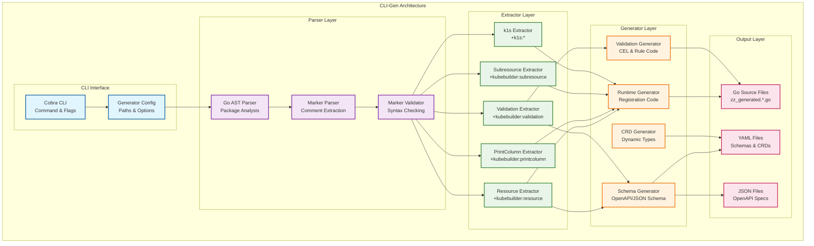

# CLI-Gen Tool Documentation

**Related Documentation:**
- [Architecture](Architecture.md) - Complete k1s system architecture
- [Controller-Runtime Package](Controller-Runtime-Package.md) - Controller runtime integration
- [Project Structure](Project-Structure.md) - Module and package organization

## Overview

**cli-gen** is k1s' equivalent to `controller-gen` - a code generation tool that extracts kubebuilder markers from Go types and generates k1s-specific runtime instrumentation. It maintains a similar signature and workflow to controller-gen while adding k1s-specific functionality.

## Design Goals

### 1. **Controller-gen Compatibility**
- Maintain similar command-line interface and patterns
- Support standard kubebuilder markers without modification
- Familiar workflow for existing Kubernetes developers

### 2. **Modular Architecture** 
- Pluggable extractor system for different marker types
- Easy addition of new generators and extractors
- Clean separation between parsing, processing, and generation

### 3. **k1s Runtime Integration**
- Generate k1s-specific runtime registration code
- Support both static Go types and dynamic schema definitions
- Integration with k1s resource registry and validation system

## Supported Kubebuilder Markers

### Core Resource Markers
```go
// +kubebuilder:object:root=true
// +kubebuilder:subresource:status
// +kubebuilder:subresource:scale:specpath=.spec.replicas,statuspath=.status.replicas
// +kubebuilder:resource:scope=Namespaced,shortName=item,singular=item,categories=inventory;goods
// +kubebuilder:resource:path=items
```

### Validation Markers
```go
// Basic validation
// +kubebuilder:validation:Required
// +kubebuilder:validation:Optional

// String validation
// +kubebuilder:validation:MinLength=1
// +kubebuilder:validation:MaxLength=255
// +kubebuilder:validation:Pattern="^[a-zA-Z0-9-]+$"
// +kubebuilder:validation:Enum=Available;Reserved;Sold;Discontinued

// Numeric validation
// +kubebuilder:validation:Minimum=0
// +kubebuilder:validation:Maximum=100
// +kubebuilder:validation:ExclusiveMinimum=false
// +kubebuilder:validation:ExclusiveMaximum=false
// +kubebuilder:validation:MultipleOf=5

// Array/Object validation
// +kubebuilder:validation:MinItems=1
// +kubebuilder:validation:MaxItems=10
// +kubebuilder:validation:UniqueItems=true
// +kubebuilder:validation:MinProperties=1
// +kubebuilder:validation:MaxProperties=50

// Format validation
// +kubebuilder:validation:Format=email
// +kubebuilder:validation:Format=date-time
// +kubebuilder:validation:Format=uri
```

### Display and CLI Markers
```go
// Table display columns
// +kubebuilder:printcolumn:name="Quantity",type="integer",JSONPath=".spec.quantity"
// +kubebuilder:printcolumn:name="Price",type="string",JSONPath=".spec.price"
// +kubebuilder:printcolumn:name="Status",type="string",JSONPath=".status.phase"
// +kubebuilder:printcolumn:name="Age",type="date",JSONPath=".metadata.creationTimestamp"

// Default values
// +kubebuilder:default=0
// +kubebuilder:default="Available"
// +kubebuilder:default={replicas:1,enabled:true}
```

### Advanced Validation (CEL)
```go
// CEL expressions for complex validation
// +kubebuilder:validation:XValidation:rule="self.spec.quantity >= 0",message="quantity must be non-negative"
// +kubebuilder:validation:XValidation:rule="self.spec.price != '' && self.spec.price.matches('^\\d+\\.\\d{2}$')",message="price must be in format XX.XX"
```

### k1s-Specific Extensions
```go
// k1s-specific markers for enhanced functionality
// +k1s:storage:index=name,status.phase
// +k1s:cache:ttl=5m
// +k1s:tenant:isolation=strict
// +k1s:cli:alias=i,items
// +k1s:controller:reconcile=immediate
```

## Architecture

### Modular Extractor System



## Command Line Interface

### Controller-gen Compatible Signature

```bash
# Basic usage (similar to controller-gen)
cli-gen paths=./api/v1alpha1/... output:dir=./api/v1alpha1/

# Multiple generators (like controller-gen)
cli-gen \
  runtime:headerFile=hack/boilerplate.go.txt \
  validation:headerFile=hack/boilerplate.go.txt \
  paths=./api/v1alpha1/... \
  output:dir=./api/v1alpha1/

# k1s-specific generators
cli-gen \
  runtime+schema+validation \
  paths=./api/v1alpha1/... \
  output:dir=./api/v1alpha1/ \
  output:schema:dir=./schemas/ \
  output:crd:dir=./config/crds/

# Verbose output (like controller-gen)  
cli-gen -v runtime paths=./api/v1alpha1/... output:dir=./api/v1alpha1/
```

### Available Generators

| Generator | Description | Output Files | Controller-gen Equivalent |
|-----------|-------------|--------------|---------------------------|
| `runtime` | k1s runtime registration | `zz_generated.k1s_runtime.go` | `object` |
| `validation` | Validation strategies | `zz_generated.validation.go` | Part of `crd` |
| `schema` | OpenAPI/JSON schemas | `*.schema.json` | Part of `crd` |
| `crd` | Dynamic CRD definitions | `*.crd.yaml` | `crd` |
| `deepcopy` | DeepCopy methods | `zz_generated.deepcopy.go` | `object` |
| `printcolumn` | CLI display columns | Part of runtime | Part of `crd` |

### Generator Options

```bash
# Runtime generator options
runtime:headerFile=hack/boilerplate.go.txt    # License header
runtime:year=2024                             # Copyright year

# Validation generator options  
validation:cel=true                           # Enable CEL validation
validation:strict=false                       # Strict mode validation

# Schema generator options
schema:format=json                            # Output format (json/yaml)
schema:version=v1                            # Schema version

# CRD generator options
crd:trivialVersions=true                     # Single version CRDs
crd:preserveUnknownFields=false              # Strict schema validation

# Output options
output:dir=./generated/                      # Default output directory
output:runtime:dir=./api/v1alpha1/           # Runtime-specific output
output:schema:dir=./schemas/                 # Schema output directory
output:crd:dir=./config/crds/               # CRD output directory
```

## Implementation Architecture

### 1. CLI Interface (Cobra-based)

```go
// tools/cmd/cli-gen/main.go
package main

import (
    "github.com/spf13/cobra"
    "github.com/dtomasi/k1s/tools/pkg/generators"
    "github.com/dtomasi/k1s/tools/pkg/config"
)

func main() {
    var cfg config.Config
    
    rootCmd := &cobra.Command{
        Use:   "cli-gen [generators] [flags]",
        Short: "Generate k1s runtime code from kubebuilder markers",
        Long: `cli-gen is k1s' equivalent to controller-gen.
It extracts kubebuilder markers from Go types and generates
k1s-specific runtime instrumentation.

Examples:
  # Generate runtime registration
  cli-gen runtime paths=./api/v1alpha1/... output:dir=./api/v1alpha1/
  
  # Generate multiple outputs
  cli-gen runtime+schema+validation paths=./api/... output:dir=./generated/`,
        RunE: func(cmd *cobra.Command, args []string) error {
            return generators.Run(cfg, args)
        },
    }
    
    // Add flags
    rootCmd.Flags().BoolVarP(&cfg.Verbose, "verbose", "v", false, "Enable verbose output")
    rootCmd.Flags().StringVar(&cfg.HeaderFile, "h", "", "Header file for generated code")
    
    if err := rootCmd.Execute(); err != nil {
        os.Exit(1)
    }
}
```

### 2. Modular Generator System

```go
// tools/pkg/generators/registry.go
package generators

type Generator interface {
    Name() string
    Generate(ctx *GenerationContext) error
    Validate(ctx *GenerationContext) error
}

type GeneratorRegistry struct {
    generators map[string]Generator
}

func NewRegistry() *GeneratorRegistry {
    r := &GeneratorRegistry{
        generators: make(map[string]Generator),
    }
    
    // Register built-in generators
    r.Register(&RuntimeGenerator{})
    r.Register(&ValidationGenerator{}) 
    r.Register(&SchemaGenerator{})
    r.Register(&CRDGenerator{})
    r.Register(&DeepCopyGenerator{})
    
    return r
}

func (r *GeneratorRegistry) Register(gen Generator) {
    r.generators[gen.Name()] = gen
}

func (r *GeneratorRegistry) Get(name string) (Generator, bool) {
    gen, exists := r.generators[name]
    return gen, exists
}
```

### 3. Extractor System

```go
// tools/pkg/extractors/interface.go
package extractors

type MarkerExtractor interface {
    Name() string
    SupportedMarkers() []string
    Extract(pkg *packages.Package, typ *types.Named) (ExtractedData, error)
}

type ExtractedData interface {
    GetType() string
    Validate() error
}

// Resource extractor
type ResourceExtractor struct{}

func (e *ResourceExtractor) Name() string {
    return "resource"
}

func (e *ResourceExtractor) SupportedMarkers() []string {
    return []string{
        "kubebuilder:resource:scope",
        "kubebuilder:resource:shortName", 
        "kubebuilder:resource:singular",
        "kubebuilder:resource:plural",
        "kubebuilder:resource:categories",
        "kubebuilder:resource:path",
    }
}

func (e *ResourceExtractor) Extract(pkg *packages.Package, typ *types.Named) (ExtractedData, error) {
    var data ResourceData
    
    // Parse markers from type comments
    markers := extractMarkersFromType(typ)
    
    for _, marker := range markers {
        if strings.HasPrefix(marker, "kubebuilder:resource:") {
            if err := e.parseResourceMarker(marker, &data); err != nil {
                return nil, err
            }
        }
    }
    
    return &data, nil
}

type ResourceData struct {
    Scope      string   `json:"scope"`       // Namespaced/Cluster
    ShortNames []string `json:"shortNames"`
    Singular   string   `json:"singular"`
    Plural     string   `json:"plural"`
    Categories []string `json:"categories"`
    Path       string   `json:"path"`
}
```

### 4. Code Generation Templates

```go
// tools/pkg/generators/runtime.go
package generators

const runtimeTemplate = `// Code generated by cli-gen. DO NOT EDIT.

package {{ .Package }}

import (
    "k8s.io/apimachinery/pkg/runtime/schema"
    "github.com/dtomasi/k1s/core/pkg/registry"
)

// Register{{ .TypeName }}WithRuntime registers {{ .TypeName }} with the k1s runtime
func Register{{ .TypeName }}WithRuntime(r registry.Registry) error {
    return r.RegisterResource(
        schema.GroupVersionResource{
            Group:    "{{ .Group }}",
            Version:  "{{ .Version }}",
            Resource: "{{ .Resource }}",
        },
        registry.ResourceConfig{
            Scope:       registry.{{ .Scope }},
            ShortNames:  {{ .ShortNames }},
            PrintColumns: {{ .PrintColumns }},
            Categories:  {{ .Categories }},
        },
    )
}

// Get{{ .TypeName }}GVK returns the GroupVersionKind for {{ .TypeName }}
func Get{{ .TypeName }}GVK() schema.GroupVersionKind {
    return schema.GroupVersionKind{
        Group:   "{{ .Group }}",
        Version: "{{ .Version }}",
        Kind:    "{{ .TypeName }}",
    }
}
`

type RuntimeGenerator struct{}

func (g *RuntimeGenerator) Name() string {
    return "runtime"
}

func (g *RuntimeGenerator) Generate(ctx *GenerationContext) error {
    for _, typeInfo := range ctx.Types {
        data := struct {
            Package      string
            TypeName     string
            Group        string
            Version      string
            Resource     string
            Scope        string
            ShortNames   string
            PrintColumns string
            Categories   string
        }{
            Package:      typeInfo.Package,
            TypeName:     typeInfo.Name,
            Group:        typeInfo.ResourceData.Group,
            Version:      typeInfo.ResourceData.Version,
            Resource:     typeInfo.ResourceData.Resource,
            Scope:        typeInfo.ResourceData.Scope,
            ShortNames:   formatStringSlice(typeInfo.ResourceData.ShortNames),
            PrintColumns: formatPrintColumns(typeInfo.PrintColumnData),
            Categories:   formatStringSlice(typeInfo.ResourceData.Categories),
        }
        
        if err := g.generateFile(ctx, "zz_generated.k1s_runtime.go", runtimeTemplate, data); err != nil {
            return err
        }
    }
    
    return nil
}
```

## Generated Code Examples

### Runtime Registration
```go
// zz_generated.k1s_runtime.go
// Code generated by cli-gen. DO NOT EDIT.

package v1alpha1

import (
    "k8s.io/apimachinery/pkg/runtime/schema"
    "github.com/dtomasi/k1s/core/pkg/registry"
)

// RegisterItemWithRuntime registers Item with the k1s runtime
func RegisterItemWithRuntime(r registry.Registry) error {
    return r.RegisterResource(
        schema.GroupVersionResource{
            Group:    "inventory.k1s.dev",
            Version:  "v1alpha1", 
            Resource: "items",
        },
        registry.ResourceConfig{
            Scope:       registry.NamespaceScoped,
            ShortNames:  []string{"item"},
            Categories:  []string{"inventory", "goods"},
            PrintColumns: []registry.PrintColumn{
                {
                    Name:     "Quantity",
                    Type:     "integer",
                    JSONPath: ".spec.quantity",
                },
                {
                    Name:     "Price", 
                    Type:     "string",
                    JSONPath: ".spec.price",
                },
                {
                    Name:     "Status",
                    Type:     "string",
                    JSONPath: ".status.phase",
                },
                {
                    Name:     "Age",
                    Type:     "date",
                    JSONPath: ".metadata.creationTimestamp",
                },
            },
        },
    )
}

// GetItemGVK returns the GroupVersionKind for Item
func GetItemGVK() schema.GroupVersionKind {
    return schema.GroupVersionKind{
        Group:   "inventory.k1s.dev",
        Version: "v1alpha1",
        Kind:    "Item",
    }
}
```

### Validation Code Generation
```go
// zz_generated.validation.go  
// Code generated by cli-gen. DO NOT EDIT.

package v1alpha1

import (
    "context"
    "fmt"
    "regexp"
    "k8s.io/apimachinery/pkg/runtime"
)

// ValidateItem validates an Item object
func ValidateItem(ctx context.Context, obj runtime.Object) error {
    item, ok := obj.(*Item)
    if !ok {
        return fmt.Errorf("expected Item, got %T", obj)
    }
    
    // +kubebuilder:validation:Required
    if item.Spec.Name == "" {
        return fmt.Errorf("spec.name is required")
    }
    
    // +kubebuilder:validation:MinLength=1
    if len(item.Spec.Name) < 1 {
        return fmt.Errorf("spec.name must be at least 1 character")
    }
    
    // +kubebuilder:validation:Minimum=0
    if item.Spec.Quantity < 0 {
        return fmt.Errorf("spec.quantity must be >= 0")
    }
    
    // +kubebuilder:validation:Pattern="^\\d+\\.\\d{2}$"
    priceRegex := regexp.MustCompile(`^\d+\.\d{2}$`)
    if !priceRegex.MatchString(item.Spec.Price) {
        return fmt.Errorf("spec.price must match format XX.XX")
    }
    
    return nil
}
```

### JSON Schema Generation
```json
{
  "$schema": "https://json-schema.org/draft/2020-12/schema",
  "type": "object",
  "title": "Item",
  "description": "Item represents an inventory item",
  "properties": {
    "apiVersion": {
      "type": "string",
      "enum": ["inventory.k1s.dev/v1alpha1"]
    },
    "kind": {
      "type": "string", 
      "enum": ["Item"]
    },
    "metadata": {
      "$ref": "#/definitions/ObjectMeta"
    },
    "spec": {
      "type": "object",
      "required": ["name", "quantity", "price"],
      "properties": {
        "name": {
          "type": "string",
          "minLength": 1
        },
        "description": {
          "type": "string"
        },
        "quantity": {
          "type": "integer",
          "minimum": 0
        },
        "price": {
          "type": "string",
          "pattern": "^\\d+\\.\\d{2}$"
        },
        "category": {
          "type": "string"
        }
      }
    },
    "status": {
      "type": "object",
      "properties": {
        "phase": {
          "type": "string",
          "enum": ["Available", "Reserved", "Sold", "Discontinued"]
        }
      }
    }
  },
  "required": ["apiVersion", "kind", "metadata", "spec"]
}
```

## Integration with k1s Runtime

### Runtime Registration
```go
// examples/cmd/k1s-demo/main.go
func main() {
    runtime, err := k1s.NewRuntime(k1s.Config{...})
    if err != nil {
        log.Fatal(err)
    }
    
    // Register types with generated functions
    if err := v1alpha1.RegisterItemWithRuntime(runtime.GetRegistry()); err != nil {
        log.Fatal(err)
    }
    
    if err := v1alpha1.RegisterCategoryWithRuntime(runtime.GetRegistry()); err != nil {
        log.Fatal(err)
    }
    
    // Runtime is now ready with proper metadata
}
```

### CLI Integration
```go
// CLI automatically gets print columns and short names
$ k1s-demo get items
NAME        QUANTITY   PRICE    STATUS      AGE
laptop-123  5          999.99   Available   2m
mouse-456   20         29.99    Available   1m

$ k1s-demo get item laptop-123  # Short name works
NAME        QUANTITY   PRICE    STATUS      AGE
laptop-123  5          999.99   Available   2m
```

## Extension Points

### Custom Extractors
```go
// Add custom k1s-specific extractors
type K1SExtractor struct{}

func (e *K1SExtractor) SupportedMarkers() []string {
    return []string{
        "k1s:storage:index",
        "k1s:cache:ttl", 
        "k1s:tenant:isolation",
        "k1s:cli:alias",
        "k1s:controller:reconcile",
    }
}
```

### Custom Generators
```go
// Add custom generators for specific needs
type CustomGenerator struct{}

func (g *CustomGenerator) Name() string {
    return "custom"
}

func (g *CustomGenerator) Generate(ctx *GenerationContext) error {
    // Custom generation logic
    return nil
}

// Register in main
registry.Register(&CustomGenerator{})
```

## Build Integration

### Makefile Integration
```makefile
# Generate k1s runtime code
.PHONY: generate
generate:
	cli-gen runtime+validation+schema \
		paths=./api/v1alpha1/... \
		output:dir=./api/v1alpha1/ \
		output:schema:dir=./schemas/

# Integration with existing workflows  
.PHONY: manifests
manifests: generate
	cli-gen crd paths=./api/v1alpha1/... output:crd:dir=./config/crds/
```

### Go Generate Integration
```go
//go:generate cli-gen runtime+validation paths=./... output:dir=./
```

## Testing Strategy

### Generator Tests
```go
// tools/pkg/generators/runtime_test.go
func TestRuntimeGenerator(t *testing.T) {
    // Test with sample types
    ctx := &GenerationContext{
        Types: []TypeInfo{
            {
                Name:    "Item",
                Package: "v1alpha1",
                ResourceData: ResourceData{
                    Group:    "inventory.k1s.dev",
                    Version:  "v1alpha1", 
                    Resource: "items",
                },
            },
        },
    }
    
    gen := &RuntimeGenerator{}
    err := gen.Generate(ctx)
    assert.NoError(t, err)
    
    // Verify generated code compiles and works
}
```

### Integration Tests  
```bash
# Test full workflow
./test-cli-gen.sh \
  --input ./testdata/api/v1alpha1/ \
  --expected ./testdata/expected/ \
  --generators runtime+validation+schema
```

This comprehensive cli-gen tool provides k1s with powerful code generation capabilities while maintaining familiar controller-gen patterns. The modular architecture allows easy extension while the generated code integrates seamlessly with k1s runtime systems.