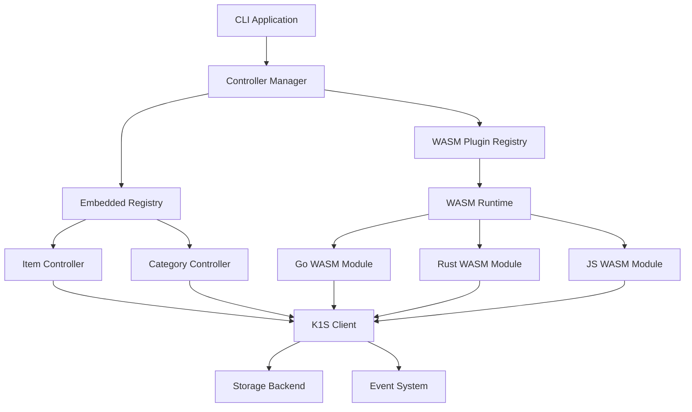
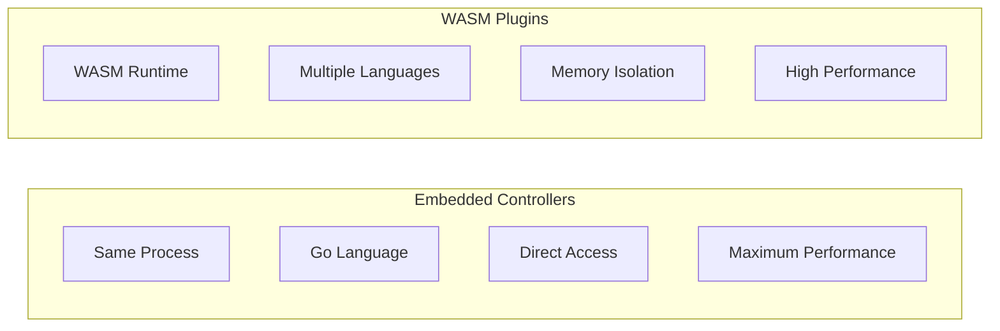
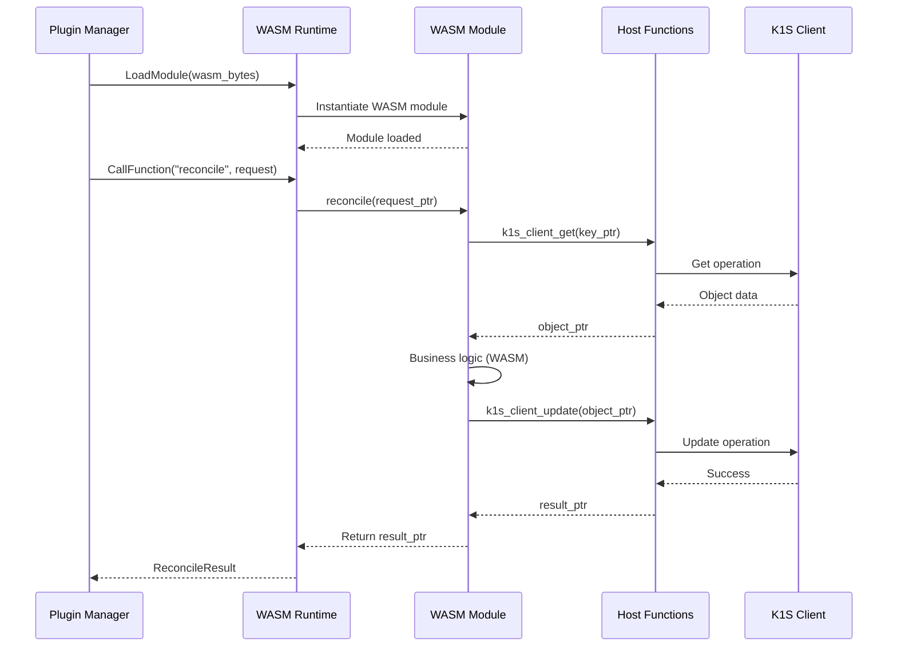
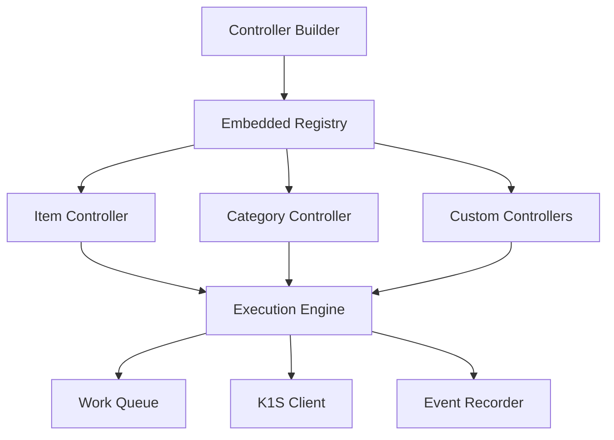
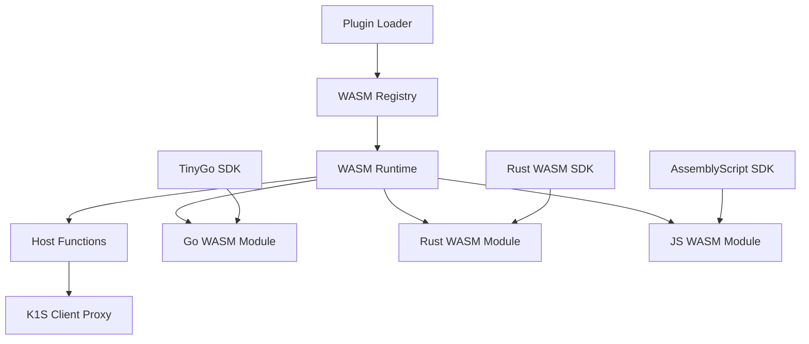
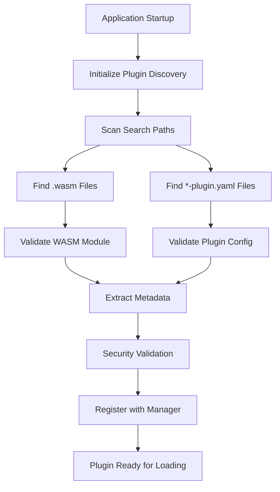
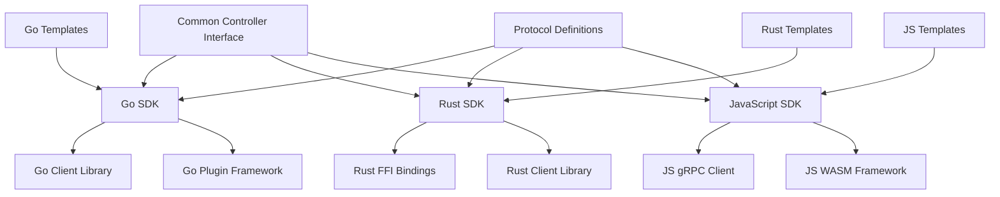
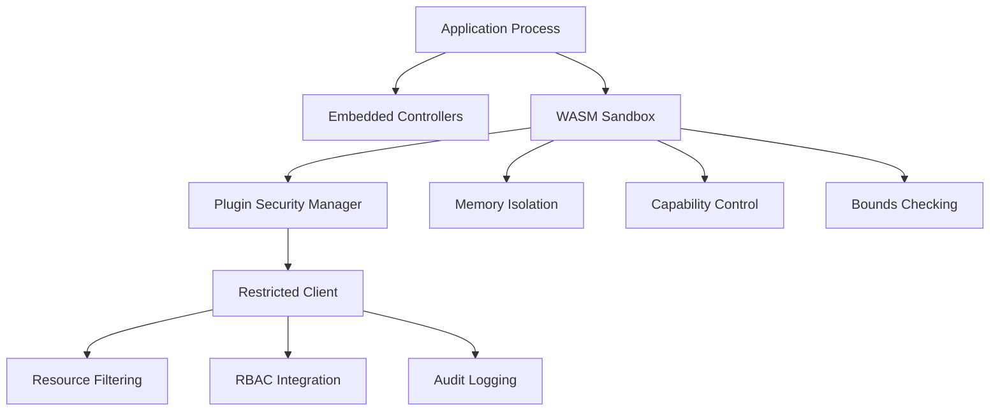
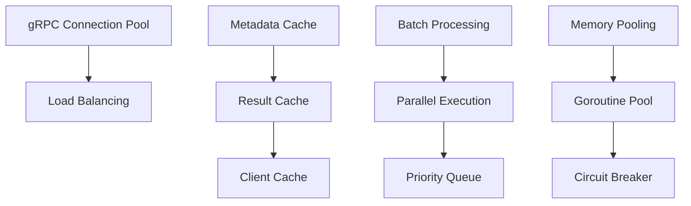

# K1S Controller Plugin Architecture

**Related Documentation:**
- [Controller-Runtime Package](Controller-Runtime-Package.md) - Base controller runtime system  
- [SDK Documentation](Controller-SDK-Guide.md) - Plugin development guide
- [Architecture](Architecture.md) - Overall k1s system architecture

## Overview

The k1s controller plugin architecture supports both **embedded controllers** (compiled into the application) and **WASM plugins** (loaded as WebAssembly modules). This design provides the best balance of performance, security, and flexibility while maintaining compatibility with standard controller-runtime patterns.

> **📋 Architecture Decision**: We focus on **Embedded + WASM** only, removing gRPC/go-plugin complexity due to WASM's superior performance, lower resource usage, and simpler deployment model.

## Architecture Components

### High-Level Architecture



### Controller Types Overview



## Controller Types Comparison

| Aspect | Embedded Controllers | WASM Plugins |
|--------|---------------------|--------------|
| **Process** | Same process as application | Same process (WASM runtime) |
| **Language** | Go only | Go (TinyGo), Rust, C/C++, AssemblyScript |
| **Performance** | Fastest (direct calls) | High (WASM overhead ~10-30%) |
| **Isolation** | No isolation | Memory isolation (WASM sandbox) |
| **Deployment** | Compiled into binary | Separate .wasm files |
| **Development** | Standard Go development | WASM SDK development |
| **Debugging** | Direct Go debugging | WASM debugging tools |
| **Memory** | Shared memory space | Isolated linear memory |
| **Security** | Application security model | Memory-safe sandbox |
| **Updates** | Requires application rebuild | Hot-swappable WASM modules |
| **Startup Time** | Instant | ~5-20ms module loading |
| **Resource Usage** | Minimal (~100KB) | Low (~1-10MB per module) |

## WASM Plugin Communication Protocol



## Embedded Controller Architecture



### Embedded Controller Interface

```go
// Embedded controller registration and execution
type EmbeddedController interface {
    reconcile.Reconciler
    
    // Metadata
    GetName() string
    GetForTypes() []schema.GroupVersionKind
    
    // Configuration
    GetConfig() EmbeddedConfig
    SetConfig(EmbeddedConfig) error
    
    // Lifecycle
    Start(ctx context.Context) error
    Stop() error
    
    // Execution
    TriggerReconciliation(requests ...reconcile.Request) error
    
    // Monitoring
    GetMetrics() ControllerMetrics
    GetHealth() HealthStatus
}

type EmbeddedConfig struct {
    MaxConcurrentReconciles int
    RecoverPanic           bool
    RateLimiter            workqueue.RateLimiter
    Predicates             []predicate.Predicate
    EventFilters           []EventFilter
}
```

## WASM Plugin Architecture



### WASM Plugin Interface

```go
// WASM controller plugin interface
type WASMController interface {
    // Plugin metadata
    GetMetadata() PluginMetadata
    GetCapabilities() []PluginCapability
    
    // WASM lifecycle
    Initialize(config WASMConfig) error
    Shutdown() error
    
    // Controller operations via WASM calls
    Reconcile(requestPtr uint32) (resultPtr uint32, error)
    
    // Optional hooks via WASM exports
    ValidateCreate(objPtr uint32) error
    ValidateUpdate(oldObjPtr, newObjPtr uint32) error
    SetDefaults(objPtr uint32) error
}

type PluginMetadata struct {
    Name         string
    Version      string
    Author       string
    Description  string
    
    // Resource handling
    ForTypes     []GroupVersionKind
    
    // Plugin properties  
    Language     string      // tinygo, rust, assemblyscript
    Runtime      RuntimeReq  // Minimum runtime requirements
    
    // Capabilities
    Capabilities []PluginCapability
    
    // Configuration schema
    ConfigSchema json.RawMessage
}

type PluginCapability string

const (
    CapabilityReconcile     PluginCapability = "reconcile"
    CapabilityValidation    PluginCapability = "validation"
    CapabilityDefaulting    PluginCapability = "defaulting"
    CapabilityStatusUpdate  PluginCapability = "status_update"
    CapabilityFinalization  PluginCapability = "finalization"
    CapabilityAdmission     PluginCapability = "admission"
)
```

## Plugin Loading and Discovery

### Pragmatic Plugin Discovery (go-plugin inspired)

K1s uses a simple, proven discovery mechanism inspired by HashiCorp's go-plugin:

```go
// core/pkg/plugins/discovery.go
type PluginDiscovery struct {
    searchPaths []string
    validators  []PluginValidator
}

func NewPluginDiscovery(paths ...string) *PluginDiscovery {
    if len(paths) == 0 {
        paths = []string{"./plugins"} // Default
    }
    return &PluginDiscovery{
        searchPaths: paths,
        validators:  []PluginValidator{&WASMValidator{}, &ConfigValidator{}},
    }
}

func (pd *PluginDiscovery) DiscoverPlugins() ([]PluginInfo, error) {
    var plugins []PluginInfo
    
    for _, path := range pd.searchPaths {
        // WASM plugins
        wasmFiles, _ := filepath.Glob(filepath.Join(path, "*.wasm"))
        for _, file := range wasmFiles {
            if plugin, err := pd.loadWASMPlugin(file); err == nil {
                plugins = append(plugins, plugin)
            }
        }
        
        // Config-based plugins  
        configFiles, _ := filepath.Glob(filepath.Join(path, "*-plugin.yaml"))
        for _, file := range configFiles {
            if plugin, err := pd.loadConfigPlugin(file); err == nil {
                plugins = append(plugins, plugin)
            }
        }
    }
    
    return plugins, nil
}
```

### Plugin Discovery Workflow



### WASM Plugin Configuration

```yaml
# wasm-plugins.yaml
plugins:
  - name: "item-validator"
    path: "./plugins/item-validator.wasm"
    language: "rust"
    config:
      for_types:
        - "inventory.example.com/v1alpha1.Item"
      capabilities:
        - "validation"
        - "defaulting"
      settings:
        validation_level: "strict"
        default_category: "uncategorized"
    
  - name: "category-hierarchy"
    path: "./plugins/category-hierarchy.wasm" 
    language: "tinygo"
    config:
      for_types:
        - "inventory.example.com/v1alpha1.Category"
      capabilities:
        - "reconcile"
        - "status_update"
      settings:
        max_depth: 10
        auto_create_parents: true

  - name: "external-inventory-sync"
    path: "./plugins/external-sync.wasm"
    language: "assemblyscript"
    config:
      for_types:
        - "inventory.example.com/v1alpha1.Item"
        - "inventory.example.com/v1alpha1.Category"
      capabilities:
        - "reconcile"
      settings:
        endpoint: "https://external-inventory.example.com/api"
        sync_interval: "5m"
        batch_size: 100
        
      # WASM-specific settings
      memory_pages: 16  # 1MB initial memory
      max_memory_pages: 64  # 4MB max memory
```

## SDK Architecture

The SDK architecture provides language-specific libraries for developing controller plugins:



## Security and Isolation

### Pragmatic Security Model (Multi-Layer Defense)

K1s uses a practical security approach combining the best patterns from go-plugin, WASM, and Kubernetes:



### Simple Security Implementation

**Phase 1: Basic Security (WASM + Resource Restrictions)**

```go
// core/pkg/plugins/security.go
type PluginSecurityManager struct {
    rbacEnabled bool
    authorizer  auth.Authorizer // nil when RBAC disabled
}

func (psm *PluginSecurityManager) CreateSecureClient(pluginName string, baseClient client.Client) client.Client {
    if !psm.rbacEnabled {
        return baseClient // Passthrough when RBAC disabled
    }
    
    return &RestrictedClient{
        base:       baseClient,
        pluginName: pluginName,
        authorizer: psm.authorizer,
    }
}

// Simple plugin restrictions
type RestrictedClient struct {
    base       client.Client
    pluginName string
    authorizer auth.Authorizer
    
    // Basic security constraints
    allowedResources  []string
    allowedVerbs      []string  
    allowedNamespaces []string
    maxConcurrentOps  int
}

func (rc *RestrictedClient) Get(ctx context.Context, key client.ObjectKey, obj client.Object) error {
    // 1. Check resource allowlist
    if !rc.isResourceAllowed(obj) {
        return fmt.Errorf("plugin %s: resource %T not allowed", rc.pluginName, obj)
    }
    
    // 2. Check verb allowlist
    if !rc.isVerbAllowed("get") {
        return fmt.Errorf("plugin %s: verb 'get' not allowed", rc.pluginName)
    }
    
    // 3. Optional RBAC check (when enabled)
    if rc.authorizer != nil {
        if !rc.checkRBACPermission(ctx, "get", obj, key.Namespace) {
            return fmt.Errorf("plugin %s: RBAC denied", rc.pluginName)
        }
    }
    
    return rc.base.Get(ctx, key, obj)
}
```

### Plugin Security Configuration

```yaml
# plugins/item-validator-plugin.yaml
name: "item-validator"
type: "wasm"
path: "./item-validator.wasm"
version: "v1.0.0"

# Simple security config
security:
  allowedResources:
    - "items"
    - "events"
  allowedVerbs:
    - "get" 
    - "list"
    - "create" # For events only
  allowedNamespaces:
    - "default"
    - "inventory"
  maxConcurrentRequests: 10
```

### Security Layers Overview

**Layer 1: WASM Sandbox (Automatic)**
- Memory isolation via linear memory
- Control flow integrity
- Bounds checking
- Capability-based host function access

**Layer 2: Resource Restrictions (Simple Allowlists)**
- Allowed resource types
- Allowed operations (verbs)
- Namespace scoping
- Concurrency limits

**Layer 3: RBAC Integration (Optional)**
- Standard Kubernetes RBAC when enabled
- Plugin-aware authorization context
- ServiceAccount-based plugin identity

**Layer 4: Monitoring & Auditing (Future)**
- Plugin action logging
- Anomaly detection
- Rate limiting enforcement

## Performance Considerations

### Performance Architecture



### Performance Targets

| Metric | Embedded Controllers | WASM Plugins |
|--------|---------------------|-------------|
| **Startup Time** | <1ms | 5-20ms |
| **Reconcile Latency** | <0.1ms | 0.5-2ms |
| **Memory per Plugin** | ~100KB | 1-10MB |
| **CPU Overhead** | <1% | 1-3% |
| **Throughput** | >10k ops/sec | >2k ops/sec |
| **Max Concurrent Plugins** | 500+ | 50-200 |
| **Process Isolation** | ❌ None | 🔶 Memory Sandbox |
| **Language Support** | Go only | TinyGo, Rust, C/C++, AssemblyScript |
| **Hot Reload** | ❌ Rebuild required | ✅ Module swap |
| **Binary Size** | Part of main binary | ~100KB-2MB per .wasm |

### Performance Analysis

#### **WASM Plugin Performance Characteristics**

```go
// Example: WASM call overhead measurement  
func measureWASMOverhead() {
    start := time.Now()
    
    // 1. Serialize to JSON/MessagePack - ~0.05-0.2ms
    requestBytes := serializeRequest(request)
    
    // 2. Copy data to WASM linear memory - ~0.05-0.1ms
    requestPtr := copyToWASMMemory(requestBytes)
    
    // 3. Call WASM exported function - ~0.2-1ms
    resultPtr := wasmModule.Call("reconcile", requestPtr)
    
    // 4. Copy result from WASM memory - ~0.05-0.1ms  
    resultBytes := copyFromWASMMemory(resultPtr)
    
    // 5. Deserialize result - ~0.05-0.2ms
    result := deserializeResult(resultBytes)
    
    overhead := time.Since(start) // Total: ~0.4-1.6ms
}
```

#### **Why WASM is Superior to gRPC**

**Memory Efficiency:**
- ✅ **WASM**: 1-10MB per plugin (linear memory only)
- ❌ **gRPC**: 10-50MB per plugin (full process overhead)

**Performance:**
- ✅ **WASM**: ~0.5-2ms latency (in-process calls)
- ❌ **gRPC**: ~1-5ms latency (IPC overhead)

**Deployment:**
- ✅ **WASM**: Single .wasm file, hot-swappable
- ❌ **gRPC**: Separate binary, process management required

**Security:**
- ✅ **WASM**: Memory-safe sandbox, capability-based security
- 🔶 **gRPC**: Process isolation but higher resource cost

### **Resource Consumption Analysis**

#### **WASM Plugin Resource Details**

**Efficiency Advantages:**
```go
// Per Plugin Resource Footprint (WASM)
type WASMResources struct {
    ModuleMemory     int64  // 1-10MB (WASM module + linear memory)
    HostMemory       int64  // ~1MB (shared with host process) 
    CPUOverhead      float64 // 1-3% (WASM runtime overhead)
    StartupTime      time.Duration // 5-20ms
    
    // Shared process space
    NoSeparateProcess bool   // true
    MemoryIsolation   bool   // true (WASM sandbox)
    
    // Hot reload capabilities
    HotSwappable      bool   // true (module replacement)
    NoFileDescriptors bool   // true (no additional FDs)
}
```

#### **Real-World Resource Comparison**

```bash
# Example system with 10 controllers

# WASM Plugins:
# - 1 process + 10 × 5MB modules = 50MB total memory  
# - 1 process × 15% CPU = 15% total CPU (worst case)
# - 3 file descriptors (main process only)
# - 50ms total startup time (all modules)
# - Hot reload: ~5ms per module swap

# Embedded Controllers:
# - 1 process + 10 × 100KB = 1MB total memory
# - 1 process × 5% CPU = 5% total CPU
# - 3 file descriptors (main process only) 
# - 1ms total startup time
# - Hot reload: Not possible (rebuild required)
```

#### **WASM Runtime Overhead Analysis**

```go
// WASM runtime performance characteristics
type WASMRuntimeMetrics struct {
    // Memory overhead per module
    LinearMemorySize    int64  // 1-16MB (configurable)  
    ModuleCodeSize      int64  // 100KB-2MB (compiled code)
    RuntimeDataSize     int64  // ~100KB (runtime metadata)
    
    // Execution overhead
    CallOverhead        time.Duration // ~0.1-0.3ms per call
    MemoryAccessSpeed   float64       // ~90% of native speed
    ComputeSpeed        float64       // ~70-90% of native speed
    
    // Startup performance  
    ModuleLoadTime      time.Duration // ~2-10ms
    InstantiationTime   time.Duration // ~1-5ms
    FirstCallTime       time.Duration // ~0.5-2ms (JIT warmup)
}
```

### **When to Use Which System**

#### **Use WASM Plugins When:**
- 🎯 **Multi-Language Teams**: Need Rust/C++/AssemblyScript support
- 🎯 **Hot Reload Required**: Plugin updates without restart
- 🎯 **Performance + Security**: Need sandboxing with low overhead
- 🎯 **Portable Deployment**: Single binary + .wasm files
- 🎯 **Memory Safety**: Prevent plugin crashes affecting main app
- 🎯 **Medium Complexity Logic**: Business logic that benefits from different languages
- 🎯 **Plugin Marketplace**: Want to distribute/load third-party plugins

#### **Use Embedded Controllers When:**
- 🎯 **Maximum Performance**: Every microsecond counts
- 🎯 **Simple Deployment**: Single binary preferred
- 🎯 **Go-Focused Team**: Team expertise is primarily Go
- 🎯 **Minimal Resources**: IoT/edge deployments with <100MB RAM
- 🎯 **Simple Logic**: Basic validation/transformation/defaulting
- 🎯 **Static Configuration**: Controllers don't change post-deployment
- 🎯 **Development Speed**: Fastest development cycle

#### **Architecture Decision Matrix**

| Requirement | Embedded | WASM |
|-------------|----------|------|
| **Performance** | ✅ Best | 🔶 High |
| **Memory Usage** | ✅ Minimal | 🔶 Low |
| **Language Choice** | ❌ Go only | ✅ Multiple |
| **Hot Reload** | ❌ No | ✅ Yes |
| **Development Speed** | ✅ Fast | 🔶 Moderate |
| **Plugin Distribution** | ❌ Not possible | ✅ Easy |
| **Security Isolation** | ❌ None | ✅ Memory sandbox |
| **Complex Logic** | 🔶 Possible | ✅ Better suited |

## Benefits Summary

### Embedded Controllers
- **✅ Best Performance**: Direct function calls, no IPC overhead
- **✅ Simple Development**: Standard Go development practices
- **✅ Easy Debugging**: Native Go debugging tools
- **✅ Minimal Resource Usage**: Shared memory and process space
- **❌ Limited Flexibility**: Must rebuild application for changes
- **❌ Language Lock-in**: Go only

### External Controllers (gRPC)
- **✅ Language Agnostic**: Support for any language with gRPC
- **✅ Process Isolation**: Full security and resource isolation
- **✅ Hot Swappable**: Update plugins without application restart
- **✅ Version Independence**: Plugins can have independent release cycles
- **❌ Performance Overhead**: gRPC communication costs
- **❌ Complexity**: More complex deployment and debugging

### External Controllers (WASM)
- **✅ Security Sandbox**: Memory-safe execution environment  
- **✅ Fast Startup**: Quick module instantiation
- **✅ Portable**: Platform-independent execution
- **✅ Multiple Languages**: JavaScript, Rust, Go (via TinyGo), C/C++
- **❌ Limited Ecosystem**: Fewer available libraries
- **❌ Debugging Challenges**: Limited debugging tools

This architecture provides maximum flexibility while maintaining performance and security. Teams can choose the approach that best fits their needs, from simple embedded controllers for basic operations to sophisticated external plugins for complex, multi-language scenarios.