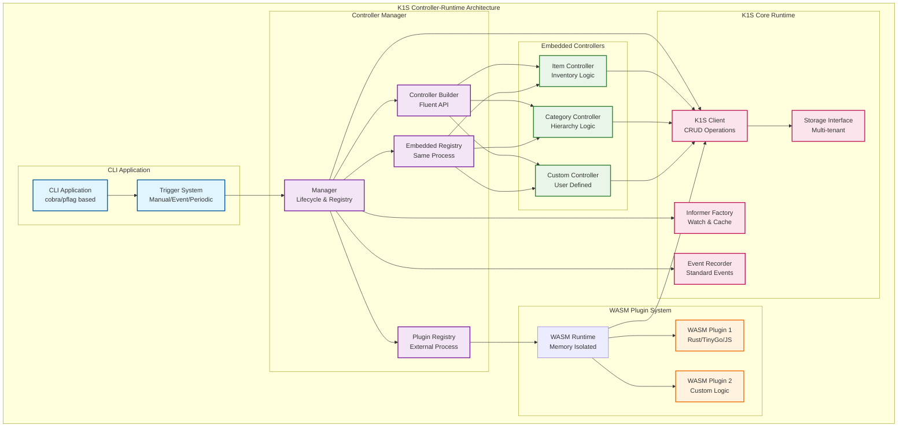
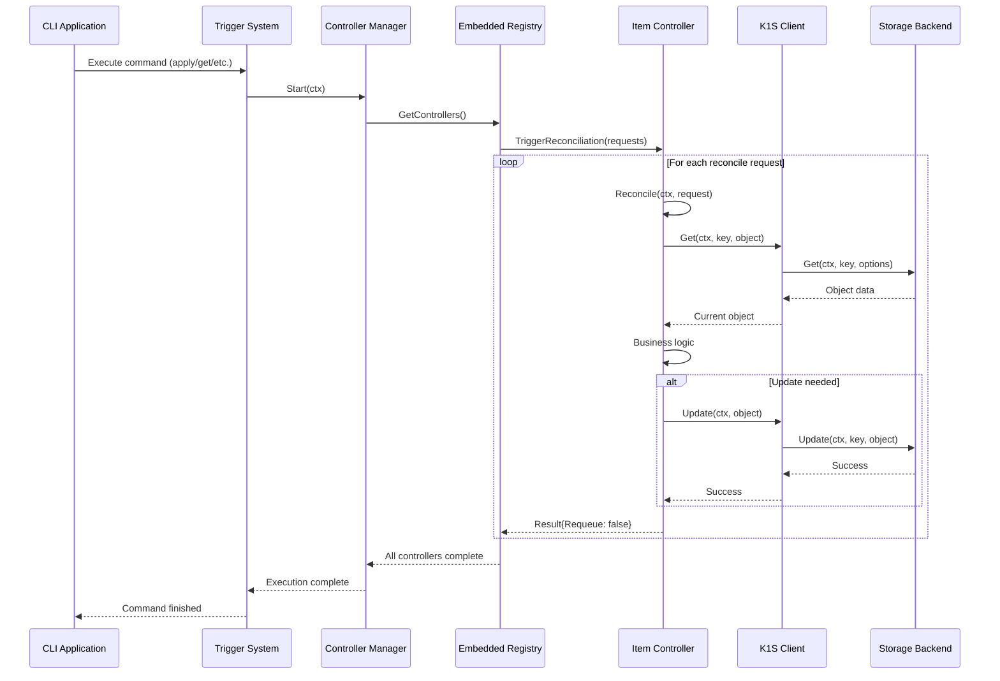
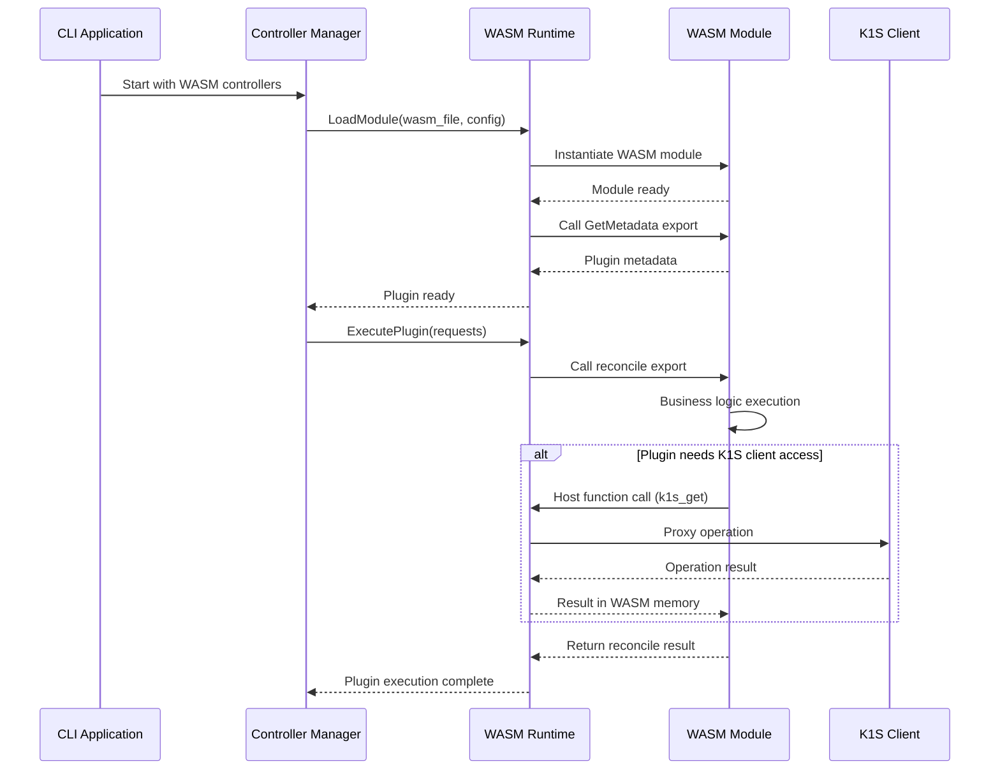
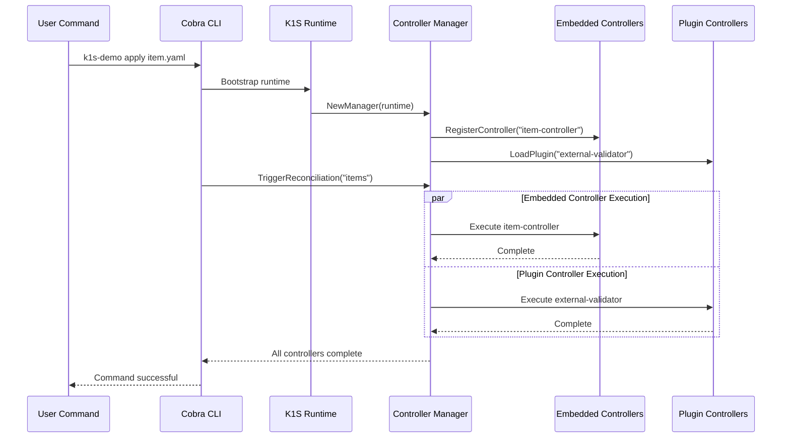

# K1S Controller-Runtime Package Specification

**Related Documentation:**
- [CLI-Runtime Package](CLI-Runtime-Package.md) - CLI instrumentation package  
- [Controller Plugin Architecture](Controller-Plugin-Architecture.md) - Detailed plugin system architecture
- [Controller SDK Guide](Controller-SDK-Guide.md) - SDK documentation for plugin development
- [Architecture](Architecture.md) - Overall k1s system architecture

## Overview

The Controller-Runtime package (`core/pkg/controller/`) provides a controller-runtime compatible interface optimized for CLI environments. It supports both embedded controllers (same process) and WASM plugins (WebAssembly modules in the same process with memory isolation).

> **📖 For Detailed Information:**
> - **Plugin Architecture**: See [Controller Plugin Architecture](Controller-Plugin-Architecture.md) for comprehensive plugin system design
> - **SDK Development**: See [Controller SDK Guide](Controller-SDK-Guide.md) for multi-language plugin development guides
> - **Implementation Examples**: Both documents contain extensive code examples and best practices

## Architecture Overview



## Core Objectives

1. **Maximum Compatibility:** Implement standard controller-runtime interfaces where applicable
2. **CLI-Optimized:** Triggered execution instead of continuous loops
3. **Dual Mode Support:** Embedded and WASM plugin controller architectures
4. **Event-Driven:** Leverage k1s event system for watch-based reconciliation

## Controller Execution Workflows

### Embedded Controller Sequence



### WASM Plugin Controller Sequence



### CLI Integration Workflow



## Package Structure

```
core/pkg/controller/
├── manager.go              # Manager implementation
├── controller.go           # Controller implementation  
├── builder.go              # Builder pattern for setup
├── reconcile.go            # Reconciler interfaces
├── request.go              # Request/Result types
├── runtime.go              # Runtime integration
├── embedded/               # Embedded controller support
│   ├── registry.go         # Embedded controller registry
│   └── lifecycle.go        # Lifecycle management
├── plugins/                # WASM plugin support
│   ├── manager.go          # Plugin manager
│   └── wasm/              # WASM plugin implementation
│       ├── runtime.go      # WASM runtime integration
│       ├── host.go         # Host functions
│       └── module.go       # Module loading/instantiation
└── client/                 # Controller-runtime client compatibility
    ├── client.go           # client.Client implementation
    └── interfaces.go       # Standard interfaces
```

## 1. Core Controller-Runtime Interfaces

### Manager Interface (Controller-Runtime Compatible)

```go
// core/pkg/controller/manager.go
package controller

import (
    "context"
    "time"
    
    "k8s.io/apimachinery/pkg/runtime"
    "sigs.k8s.io/controller-runtime/pkg/client"
    "sigs.k8s.io/controller-runtime/pkg/manager"
    "sigs.k8s.io/controller-runtime/pkg/reconcile"
    
    k1sclient "github.com/dtomasi/k1s/core/pkg/client"
    "github.com/dtomasi/k1s/core/pkg/runtime" as k1sruntime
)

// Manager is compatible with controller-runtime manager.Manager
type Manager interface {
    // Core controller-runtime compatibility
    Add(manager.Runnable) error
    SetFields(interface{}) error
    AddHealthzCheck(name string, check healthz.Checker) error
    AddReadyzCheck(name string, check healthz.Checker) error
    Start(ctx context.Context) error
    
    // Accessors (controller-runtime compatible)
    GetConfig() *rest.Config  // Returns nil - not applicable for k1s
    GetScheme() *runtime.Scheme
    GetClient() client.Client
    GetFieldIndexer() client.FieldIndexer
    GetCache() cache.Cache    // Returns nil - k1s doesn't use cache
    GetEventRecorderFor(name string) record.EventRecorder
    GetRESTMapper() meta.RESTMapper
    GetAPIReader() client.Reader
    GetWebhookServer() *webhook.Server // Returns nil - not supported
    
    // K1s-specific extensions
    GetK1sClient() k1sclient.Client
    GetK1sRuntime() k1sruntime.Runtime
    
    // Controller builder
    NewControllerManagedBy(mgr Manager) *Builder
    
    // WASM plugin support
    RegisterWASMPlugin(name string, plugin WASMPlugin) error
    ListControllers() []ControllerInfo
}

// ControllerInfo provides information about registered controllers
type ControllerInfo struct {
    Name        string
    Type        ControllerType // Embedded or Plugin
    Status      ControllerStatus
    LastRun     time.Time
    RunCount    int64
    Errors      []error
}

type ControllerType string
type ControllerStatus string

const (
    ControllerTypeEmbedded ControllerType = "embedded"
    ControllerTypeWASM     ControllerType = "wasm"
    
    ControllerStatusIdle    ControllerStatus = "idle"
    ControllerStatusRunning ControllerStatus = "running"
    ControllerStatusError   ControllerStatus = "error"
)

// NewManager creates a new k1s controller manager
func NewManager(k1sRuntime k1sruntime.Runtime, options Options) (Manager, error) {
    return &manager{
        k1sRuntime: k1sRuntime,
        client:     k1sRuntime.GetClient(),
        scheme:     k1sRuntime.GetScheme(),
        options:    options,
        controllers: make(map[string]Controller),
        plugins:     make(map[string]PluginController),
        eventRecorders: make(map[string]record.EventRecorder),
    }, nil
}

type Options struct {
    // Controller execution mode
    Mode ExecutionMode
    
    // WASM plugin configuration
    WASMDir      string        // Directory for .wasm files
    WASMConfig   WASMConfig    // WASM-specific configuration
    
    // Reconciliation settings
    DefaultReconcilePeriod time.Duration  // For periodic reconciliation
    MaxConcurrentReconciles int           // Max concurrent reconcilers per controller
    
    // Event system
    EventBroadcaster events.EventBroadcaster
    
    // Health checks
    HealthProbeBindAddress string
}

type ExecutionMode string

const (
    ExecutionModeTriggered   ExecutionMode = "triggered"   // CLI-triggered execution
    ExecutionModePeriodic    ExecutionMode = "periodic"    // Periodic execution
    ExecutionModeEvent       ExecutionMode = "event"       // Event-driven execution
)
```

### Controller Interface

```go
// core/pkg/controller/controller.go
package controller

import (
    "context"
    "sigs.k8s.io/controller-runtime/pkg/reconcile"
    "sigs.k8s.io/controller-runtime/pkg/predicate"
)

// Controller represents a single controller
type Controller interface {
    // Core functionality
    Reconcile(ctx context.Context, req reconcile.Request) (reconcile.Result, error)
    Start(ctx context.Context) error
    Stop() error
    
    // Configuration
    GetName() string
    GetReconciler() reconcile.Reconciler
    GetMaxConcurrentReconciles() int
    
    // K1s-specific
    TriggerReconciliation(ctx context.Context, requests ...reconcile.Request) error
    GetLastReconciliation() ReconciliationInfo
    GetMetrics() ControllerMetrics
}

// ReconciliationInfo contains information about the last reconciliation
type ReconciliationInfo struct {
    Request      reconcile.Request
    Result       reconcile.Result
    Duration     time.Duration
    Error        error
    Timestamp    time.Time
}

// ControllerMetrics contains controller performance metrics
type ControllerMetrics struct {
    ReconciliationCount int64
    ErrorCount         int64
    AverageDuration    time.Duration
    LastReconciliation time.Time
}
```

### Builder Pattern (Controller-Runtime Compatible)

```go
// core/pkg/controller/builder.go
package controller

import (
    "sigs.k8s.io/controller-runtime/pkg/predicate"
    "sigs.k8s.io/controller-runtime/pkg/reconcile"
    "sigs.k8s.io/controller-runtime/pkg/source"
)

// Builder is compatible with controller-runtime controller builder
type Builder struct {
    mgr              Manager
    name             string
    reconciler       reconcile.Reconciler
    watchedObjects   []watchedObject
    predicates       []predicate.Predicate
    options          ControllerOptions
}

type watchedObject struct {
    object    runtime.Object
    opts      []WatchOption
}

type ControllerOptions struct {
    MaxConcurrentReconciles int
    Predicates             []predicate.Predicate
    RecoverPanic           bool
    LogConstructor         func(*reconcile.Request) logr.Logger
}

// NewControllerManagedBy creates a new controller builder
func NewControllerManagedBy(mgr Manager) *Builder {
    return &Builder{
        mgr:     mgr,
        options: ControllerOptions{
            MaxConcurrentReconciles: 1,
            RecoverPanic:           true,
        },
    }
}

// For sets the primary resource to watch
func (blder *Builder) For(object client.Object, opts ...ForOption) *Builder {
    blder.watchedObjects = append(blder.watchedObjects, watchedObject{
        object: object,
        opts:   opts,
    })
    return blder
}

// Owns sets secondary resources owned by the primary resource
func (blder *Builder) Owns(object client.Object, opts ...OwnsOption) *Builder {
    // Implementation for owned resource watching
    return blder
}

// Watches allows watching arbitrary resources
func (blder *Builder) Watches(src source.Source, eventhandler handler.EventHandler, opts ...WatchesOption) *Builder {
    // Implementation for custom watches
    return blder
}

// WithOptions configures controller options
func (blder *Builder) WithOptions(options ControllerOptions) *Builder {
    blder.options = options
    return blder
}

// Named sets the controller name
func (blder *Builder) Named(name string) *Builder {
    blder.name = name
    return blder
}

// Complete finalizes and registers the controller
func (blder *Builder) Complete(r reconcile.Reconciler) error {
    blder.reconciler = r
    return blder.Build(r)
}

// Build creates and registers the controller
func (blder *Builder) Build(r reconcile.Reconciler) error {
    if blder.name == "" {
        blder.name = fmt.Sprintf("%T", r)
    }
    
    ctrl, err := newController(blder.name, blder.mgr, controllerConfig{
        Reconciler: r,
        Options:    blder.options,
        Watched:    blder.watchedObjects,
        Predicates: blder.predicates,
    })
    if err != nil {
        return err
    }
    
    return blder.mgr.Add(ctrl)
}
```

## 2. Embedded Controller Support

### Embedded Controller Registry

```go
// core/pkg/controller/embedded/registry.go
package embedded

import (
    "context"
    "reflect"
    "sync"
    
    "sigs.k8s.io/controller-runtime/pkg/reconcile"
    "github.com/dtomasi/k1s/core/pkg/controller"
)

// EmbeddedRegistry manages embedded controllers in the same process
type EmbeddedRegistry interface {
    // Register an embedded controller
    Register(name string, reconciler reconcile.Reconciler, config EmbeddedConfig) error
    
    // Get registered controller
    Get(name string) (EmbeddedController, bool)
    
    // List all registered controllers
    List() []EmbeddedController
    
    // Execute specific controller
    Execute(ctx context.Context, name string, requests ...reconcile.Request) error
    
    // Execute all controllers
    ExecuteAll(ctx context.Context) error
}

// EmbeddedController wraps a reconciler with metadata
type EmbeddedController interface {
    GetName() string
    GetReconciler() reconcile.Reconciler
    GetConfig() EmbeddedConfig
    Execute(ctx context.Context, requests ...reconcile.Request) error
    GetMetrics() controller.ControllerMetrics
}

// EmbeddedConfig contains configuration for embedded controllers
type EmbeddedConfig struct {
    // Resource to watch
    ForType reflect.Type
    
    // Execution triggers
    Triggers []TriggerType
    
    // Reconciliation settings
    MaxConcurrentReconciles int
    RecoverPanic           bool
    
    // Predicates for filtering events
    Predicates []predicate.Predicate
}

type TriggerType string

const (
    TriggerTypeManual   TriggerType = "manual"    // Manually triggered via CLI
    TriggerTypeEvent    TriggerType = "event"     // Triggered by k1s events
    TriggerTypePeriodic TriggerType = "periodic"  // Periodic execution
    TriggerTypeStartup  TriggerType = "startup"   // Execute on startup
)

// NewEmbeddedRegistry creates a new embedded controller registry
func NewEmbeddedRegistry(mgr controller.Manager) EmbeddedRegistry {
    return &embeddedRegistry{
        manager:     mgr,
        controllers: make(map[string]EmbeddedController),
        mu:          sync.RWMutex{},
    }
}

type embeddedRegistry struct {
    manager     controller.Manager
    controllers map[string]EmbeddedController
    mu          sync.RWMutex
}

func (r *embeddedRegistry) Register(name string, reconciler reconcile.Reconciler, config EmbeddedConfig) error {
    r.mu.Lock()
    defer r.mu.Unlock()
    
    if _, exists := r.controllers[name]; exists {
        return fmt.Errorf("controller %s already registered", name)
    }
    
    ctrl := &embeddedController{
        name:       name,
        reconciler: reconciler,
        config:     config,
        manager:    r.manager,
        metrics:    controller.ControllerMetrics{},
    }
    
    r.controllers[name] = ctrl
    return nil
}
```

## 3. Pluggable Controller Support

### Plugin Manager

```go
// core/pkg/controller/plugins/manager.go
package plugins

import (
    "context"
    "path/filepath"
    "plugin"
    
    "github.com/hashicorp/go-plugin"
    "sigs.k8s.io/controller-runtime/pkg/reconcile"
    
    "github.com/dtomasi/k1s/core/pkg/controller"
)

// PluginManager manages external controller plugins
type PluginManager interface {
    // Load plugin from file
    LoadPlugin(path string) error
    
    // Load all plugins from directory
    LoadPluginsFromDir(dir string) error
    
    // Get loaded plugin
    GetPlugin(name string) (PluginController, bool)
    
    // List all loaded plugins
    ListPlugins() []PluginController
    
    // Unload plugin
    UnloadPlugin(name string) error
    
    // Execute plugin controller
    ExecutePlugin(ctx context.Context, name string, requests ...reconcile.Request) error
}

// PluginController represents a controller loaded from a plugin
type PluginController interface {
    GetName() string
    GetVersion() string
    GetType() PluginType
    
    // Execute reconciliation
    Reconcile(ctx context.Context, req reconcile.Request) (reconcile.Result, error)
    
    // Plugin lifecycle
    Initialize(config PluginConfig) error
    Shutdown() error
    
    // Health check
    HealthCheck() error
    
    // Metadata
    GetMetadata() PluginMetadata
}

type PluginType string

const (
    PluginTypeGRPC PluginType = "grpc"
    PluginTypeWASM PluginType = "wasm"
)

type PluginConfig struct {
    // k1s client configuration
    ClientConfig ClientConfig
    
    // Plugin-specific configuration
    Settings map[string]interface{}
    
    // Resource types this plugin handles
    ForTypes []string
    
    // Event configuration
    EventConfig EventConfig
}

type PluginMetadata struct {
    Name        string
    Version     string
    Author      string
    Description string
    ForTypes    []string
    
    // Plugin capabilities
    Capabilities []PluginCapability
}

type PluginCapability string

const (
    CapabilityReconcile    PluginCapability = "reconcile"
    CapabilityValidation   PluginCapability = "validation"
    CapabilityDefaulting   PluginCapability = "defaulting"
    CapabilityStatusUpdate PluginCapability = "status_update"
)
```

### gRPC Plugin Implementation

```go
// core/pkg/controller/plugins/grpc/plugin.go
package grpc

import (
    "context"
    "os/exec"
    
    "github.com/hashicorp/go-plugin"
    "google.golang.org/grpc"
    "sigs.k8s.io/controller-runtime/pkg/reconcile"
    
    "github.com/dtomasi/k1s/core/pkg/controller/plugins"
)

// GRPCPlugin implements the go-plugin interface for controller plugins
type GRPCPlugin struct {
    plugin.Plugin
    Impl ControllerPlugin
}

// ControllerPlugin is the interface that plugin implementations must satisfy
type ControllerPlugin interface {
    Reconcile(ctx context.Context, req reconcile.Request) (reconcile.Result, error)
    Initialize(config plugins.PluginConfig) error
    Shutdown() error
    GetMetadata() plugins.PluginMetadata
}

// GRPCClient implements the client side of the gRPC plugin
type GRPCClient struct {
    client ControllerPluginClient
    broker *plugin.GRPCBroker
}

func (c *GRPCClient) Reconcile(ctx context.Context, req reconcile.Request) (reconcile.Result, error) {
    resp, err := c.client.Reconcile(ctx, &ReconcileRequest{
        NamespacedName: &NamespacedName{
            Namespace: req.Namespace,
            Name:      req.Name,
        },
    })
    if err != nil {
        return reconcile.Result{}, err
    }
    
    return reconcile.Result{
        Requeue:      resp.Requeue,
        RequeueAfter: time.Duration(resp.RequeueAfter),
    }, nil
}

// GRPCServer implements the server side of the gRPC plugin
type GRPCServer struct {
    Impl   ControllerPlugin
    broker *plugin.GRPCBroker
}

func (s *GRPCServer) Reconcile(ctx context.Context, req *ReconcileRequest) (*ReconcileResponse, error) {
    reconcileReq := reconcile.Request{
        NamespacedName: types.NamespacedName{
            Namespace: req.NamespacedName.Namespace,
            Name:      req.NamespacedName.Name,
        },
    }
    
    result, err := s.Impl.Reconcile(ctx, reconcileReq)
    if err != nil {
        return nil, err
    }
    
    return &ReconcileResponse{
        Requeue:      result.Requeue,
        RequeueAfter: int64(result.RequeueAfter),
    }, nil
}

// Plugin handshake configuration
var Handshake = plugin.HandshakeConfig{
    ProtocolVersion:  1,
    MagicCookieKey:   "K1S_CONTROLLER_PLUGIN",
    MagicCookieValue: "controller",
}

// PluginMap for go-plugin
var PluginMap = map[string]plugin.Plugin{
    "controller": &GRPCPlugin{},
}

// LoadGRPCPlugin loads a controller plugin via gRPC
func LoadGRPCPlugin(path string) (plugins.PluginController, error) {
    client := plugin.NewClient(&plugin.ClientConfig{
        HandshakeConfig: Handshake,
        Plugins:         PluginMap,
        Cmd:            exec.Command(path),
        AllowedProtocols: []plugin.Protocol{plugin.ProtocolGRPC},
    })
    
    rpcClient, err := client.Client()
    if err != nil {
        return nil, err
    }
    
    raw, err := rpcClient.Dispense("controller")
    if err != nil {
        return nil, err
    }
    
    return &grpcPluginController{
        client: raw.(*GRPCClient),
        plugin: client,
    }, nil
}

type grpcPluginController struct {
    client *GRPCClient
    plugin *plugin.Client
}

func (p *grpcPluginController) Reconcile(ctx context.Context, req reconcile.Request) (reconcile.Result, error) {
    return p.client.Reconcile(ctx, req)
}

func (p *grpcPluginController) Shutdown() error {
    p.plugin.Kill()
    return nil
}
```

## 4. Usage Examples

### Embedded Controller Example

```go
// Example: Embedded controller for Items
type ItemController struct {
    client.Client
    Scheme   *runtime.Scheme
    Recorder record.EventRecorder
}

func (r *ItemController) Reconcile(ctx context.Context, req reconcile.Request) (reconcile.Result, error) {
    item := &v1alpha1.Item{}
    err := r.Get(ctx, req.NamespacedName, item)
    if err != nil {
        return reconcile.Result{}, client.IgnoreNotFound(err)
    }
    
    // Business logic here
    if item.Spec.Quantity < 0 {
        r.Recorder.Event(item, "Warning", "InvalidQuantity", "Quantity cannot be negative")
        item.Spec.Quantity = 0
        return reconcile.Result{}, r.Update(ctx, item)
    }
    
    return reconcile.Result{}, nil
}

// Setup embedded controller
func SetupItemController(mgr controller.Manager) error {
    return controller.NewControllerManagedBy(mgr).
        For(&v1alpha1.Item{}).
        Complete(&ItemController{
            Client:   mgr.GetClient(),
            Scheme:   mgr.GetScheme(),
            Recorder: mgr.GetEventRecorderFor("item-controller"),
        })
}
```

### Plugin Controller Example

```go
// Example: Plugin controller setup
func SetupPluginControllers(mgr controller.Manager, pluginDir string) error {
    pluginMgr := plugins.NewPluginManager()
    
    // Load all plugins from directory
    if err := pluginMgr.LoadPluginsFromDir(pluginDir); err != nil {
        return err
    }
    
    // Register each plugin with the manager
    for _, plugin := range pluginMgr.ListPlugins() {
        if err := mgr.RegisterPluginController(plugin.GetName(), plugin); err != nil {
            return err
        }
    }
    
    return nil
}
```

### CLI Integration Example

```go
// Example: CLI command to trigger controller execution
func NewControllerCommand(mgr controller.Manager) *cobra.Command {
    cmd := &cobra.Command{
        Use:   "controller",
        Short: "Manage controllers",
    }
    
    // Subcommand to list controllers
    listCmd := &cobra.Command{
        Use:   "list",
        Short: "List registered controllers",
        RunE: func(cmd *cobra.Command, args []string) error {
            controllers := mgr.ListControllers()
            for _, ctrl := range controllers {
                fmt.Printf("%s\t%s\t%s\n", ctrl.Name, ctrl.Type, ctrl.Status)
            }
            return nil
        },
    }
    
    // Subcommand to trigger controller
    runCmd := &cobra.Command{
        Use:   "run [controller-name]",
        Short: "Trigger controller execution",
        Args:  cobra.ExactArgs(1),
        RunE: func(cmd *cobra.Command, args []string) error {
            controllerName := args[0]
            
            // Trigger reconciliation for all resources of the controller's type
            return mgr.TriggerController(cmd.Context(), controllerName)
        },
    }
    
    cmd.AddCommand(listCmd, runCmd)
    return cmd
}
```

## Benefits of this Architecture

### 1. **Maximum Compatibility**
- Implements standard controller-runtime interfaces
- Familiar development patterns for Kubernetes developers
- Easy migration from existing controller-runtime projects

### 2. **CLI-Optimized**
- Triggered execution instead of continuous loops
- Perfect for short-lived CLI processes
- Event-driven reconciliation via k1s event system

### 3. **Flexible Deployment**
- **Embedded:** Controllers in same binary for simplicity
- **Plugin:** External controllers for modularity and language diversity
- **Mixed:** Combine both approaches as needed

### 4. **Enterprise Ready**
- Plugin sandboxing via separate processes
- Versioned plugin interfaces
- Health checks and monitoring
- Graceful error handling

## Testing Strategy

### Unit Tests
- Interface compliance tests
- Manager lifecycle tests
- Controller reconcile loop tests
- Builder API tests
- Plugin loading tests

### Integration Tests
- End-to-end controller execution
- Plugin communication tests
- CLI trigger system tests
- Performance benchmarks

### Example Controllers
- Item controller for inventory system
- Category hierarchy controller
- Plugin-based external controller

## Quality Gates

### Phase Completion Criteria
- ✅ All tests passing (`just work-test`)
- ✅ Zero golangci-lint errors (`just work-lint`)
- ✅ Successful build (`just work-build`)
- ✅ Example controller working
- ✅ Documentation updated

### Performance Targets
- Controller startup: <50ms
- Reconcile latency: <10ms for simple operations
- Plugin communication overhead: <5ms per call
- Memory usage: <10MB per controller

## Risk Mitigation

### High Risk Items
1. **Plugin System Complexity**: Start with simple gRPC interface, expand gradually
2. **Work Queue Performance**: Benchmark early, optimize queue processing
3. **CLI Integration**: Keep integration simple, avoid over-engineering

### Fallback Plans
- If plugin system proves too complex, focus on embedded controllers first
- If performance targets not met, implement controller pooling
- If CLI integration too complex, provide simple programmatic API

## Dependencies

### Required k1s Components
- **Client**: For CRUD operations and object access
- **Informers**: For watch and cache functionality  
- **Event Recorder**: For standard Kubernetes event recording
- **Runtime**: For scheme and lifecycle management

### External Dependencies
- **go-plugin**: For pluggable controller support
- **workqueue**: For rate limiting and queuing (can reuse controller-runtime's)
- **gRPC**: For plugin communication protocol

## Success Metrics

### Functional Success
- ✅ Controller-runtime compatibility achieved
- ✅ Embedded controllers working with examples
- ✅ Plugin system functional with external controller
- ✅ CLI integration seamless with k1s cli-runtime

### Performance Success  
- ✅ Fast controller startup for CLI environments
- ✅ Minimal overhead for CLI-triggered execution
- ✅ Plugin communication performance acceptable
- ✅ Memory footprint optimized for short-lived processes

This architecture provides the best of both worlds: familiar controller-runtime patterns with CLI-optimized execution and flexible deployment options.

---

## 🔄 Architecture Update (2025)

**Important:** This document provides a high-level overview of the controller-runtime architecture. Due to recent architectural decisions, detailed implementation information has been moved to specialized documents:

### 📋 Key Changes
- **Removed gRPC/go-plugin complexity** due to performance and resource concerns
- **Focused on Embedded + WASM architecture** for optimal performance and developer experience
- **Simplified deployment model** with better security and hot-reload capabilities

### 📖 For Detailed Implementation Information:

#### **Plugin Architecture & Performance Analysis**
👉 **[Controller Plugin Architecture](Controller-Plugin-Architecture.md)**
- Complete WASM vs Embedded comparison
- Performance benchmarks and resource analysis  
- Security and isolation models
- When to use which approach

#### **SDK Development & Language Support**
👉 **[Controller SDK Guide](Controller-SDK-Guide.md)**  
- TinyGo, Rust, and AssemblyScript SDKs
- WASM plugin development workflows
- Testing frameworks and best practices
- CLI tools and templates

#### **Legacy Implementation References**
The detailed gRPC/go-plugin implementation examples in this document are **deprecated** and maintained only for historical reference. New implementations should follow the patterns in the specialized documents above.

### 🎯 Recommended Reading Order
1. **Start here** for controller-runtime API compatibility
2. **[Plugin Architecture](Controller-Plugin-Architecture.md)** for deployment decisions  
3. **[SDK Guide](Controller-SDK-Guide.md)** for development workflows

This simplified architecture delivers **better performance**, **lower resource usage**, and **easier deployment** while maintaining full compatibility with controller-runtime patterns.