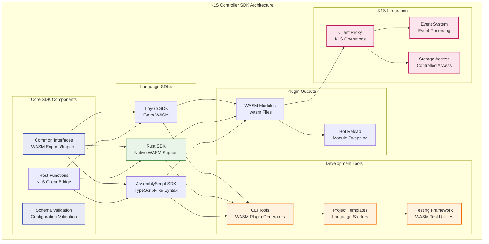
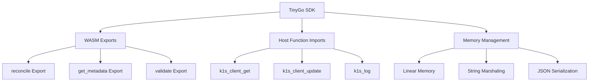
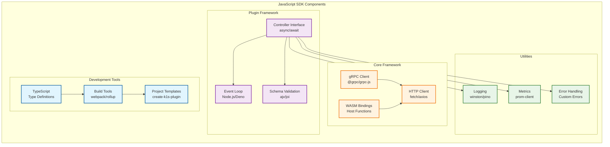
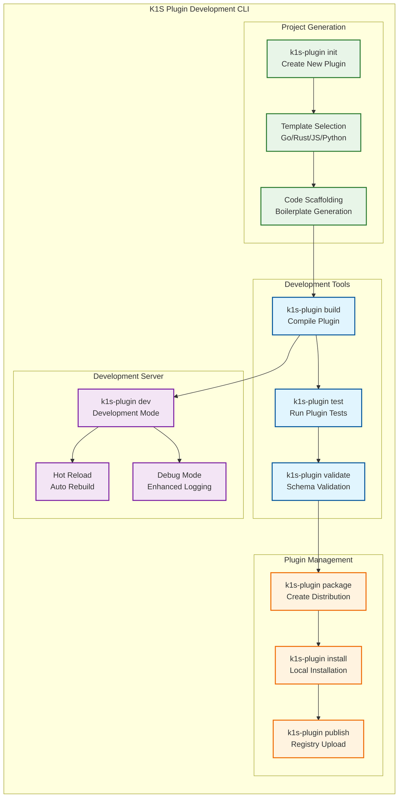
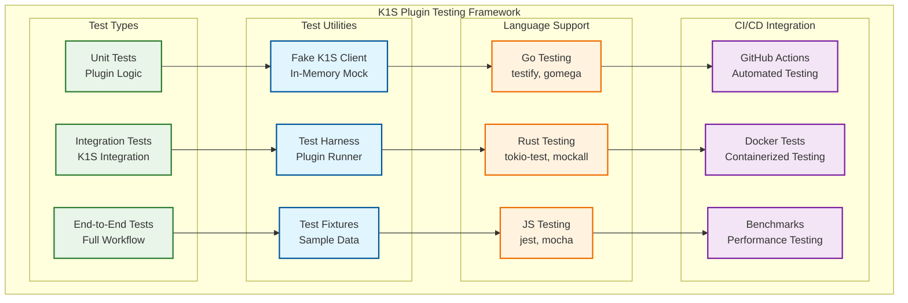

# K1S Controller SDK Development Guide

**Related Documentation:**
- [Controller Plugin Architecture](Controller-Plugin-Architecture.md) - Plugin system architecture
- [Controller-Runtime Package](Controller-Runtime-Package.md) - Base controller runtime system  
- [Architecture](Architecture.md) - Overall k1s system architecture

## Overview

The K1S Controller SDK provides language-specific libraries and tools for developing WASM controller plugins. This guide covers SDK architecture, development workflows, and best practices for building robust, high-performance WASM plugins.

> **🎯 Architecture Focus**: This guide focuses exclusively on **WASM plugin development** with support for **TinyGo**, **Rust**, and **AssemblyScript**. gRPC/go-plugin approaches have been removed due to performance and complexity concerns.

## SDK Architecture Overview



## TinyGo SDK (Go to WASM)

### TinyGo SDK Architecture



### Go SDK Core Interfaces

```go
// sdk/go/pkg/controller/interfaces.go
package controller

import (
    "context"
    "time"
    
    "sigs.k8s.io/controller-runtime/pkg/reconcile"
    "k8s.io/apimachinery/pkg/runtime"
    
    k1sclient "github.com/dtomasi/k1s/core/pkg/client"
)

// ControllerPlugin is the main interface that Go plugins must implement
type ControllerPlugin interface {
    // Metadata about the plugin
    GetMetadata() PluginMetadata
    
    // Plugin lifecycle
    Initialize(ctx context.Context, config PluginConfig) error
    Shutdown(ctx context.Context) error
    
    // Controller operations
    reconcile.Reconciler
    
    // Optional hooks for advanced functionality
    ValidateCreate(ctx context.Context, obj runtime.Object) error
    ValidateUpdate(ctx context.Context, oldObj, newObj runtime.Object) error
    SetDefaults(ctx context.Context, obj runtime.Object) error
    
    // Health check
    HealthCheck(ctx context.Context) error
}

// PluginBuilder provides a fluent API for configuring plugins
type PluginBuilder struct {
    plugin   ControllerPlugin
    metadata PluginMetadata
    config   PluginConfig
    client   k1sclient.Client
}

// NewPluginBuilder creates a new plugin builder
func NewPluginBuilder() *PluginBuilder {
    return &PluginBuilder{
        metadata: PluginMetadata{},
        config:   PluginConfig{},
    }
}

// WithName sets the plugin name
func (b *PluginBuilder) WithName(name string) *PluginBuilder {
    b.metadata.Name = name
    return b
}

// WithVersion sets the plugin version
func (b *PluginBuilder) WithVersion(version string) *PluginBuilder {
    b.metadata.Version = version
    return b
}

// ForType specifies which resource types this plugin handles
func (b *PluginBuilder) ForType(obj runtime.Object) *PluginBuilder {
    gvk := obj.GetObjectKind().GroupVersionKind()
    b.metadata.ForTypes = append(b.metadata.ForTypes, gvk)
    return b
}

// WithCapability adds a capability to the plugin
func (b *PluginBuilder) WithCapability(cap PluginCapability) *PluginBuilder {
    b.metadata.Capabilities = append(b.metadata.Capabilities, cap)
    return b
}

// WithReconciler sets the reconciler implementation
func (b *PluginBuilder) WithReconciler(reconciler reconcile.Reconciler) *PluginBuilder {
    if cp, ok := reconciler.(ControllerPlugin); ok {
        b.plugin = cp
    } else {
        // Wrap simple reconciler
        b.plugin = &reconcilerWrapper{reconciler: reconciler}
    }
    return b
}

// BuildGRPCPlugin builds a gRPC plugin
func (b *PluginBuilder) BuildGRPCPlugin() error {
    server := NewGRPCPluginServer(b.plugin, b.metadata, b.config)
    return server.Serve()
}

// BuildWASMPlugin builds a WASM plugin (using TinyGo)
func (b *PluginBuilder) BuildWASMPlugin() error {
    host := NewWASMHost(b.plugin, b.metadata, b.config)
    return host.Export()
}

// BuildNativePlugin builds a native embedded plugin
func (b *PluginBuilder) BuildNativePlugin() ControllerPlugin {
    return b.plugin
}
```

### Go SDK Example: Item Controller Plugin

```go
// example: Item validation controller plugin
package main

import (
    "context"
    "fmt"
    
    "sigs.k8s.io/controller-runtime/pkg/reconcile"
    "k8s.io/apimachinery/pkg/runtime"
    
    sdk "github.com/dtomasi/k1s/sdk/go/pkg/controller"
    "github.com/dtomasi/k1s/examples/api/v1alpha1"
)

type ItemValidationController struct {
    Client k1sclient.Client
    Log    logr.Logger
}

func (r *ItemValidationController) GetMetadata() sdk.PluginMetadata {
    return sdk.PluginMetadata{
        Name:        "item-validation-controller",
        Version:     "v1.0.0",
        Author:      "K1S Team",
        Description: "Validates Item resources",
        Capabilities: []sdk.PluginCapability{
            sdk.CapabilityValidation,
            sdk.CapabilityDefaulting,
        },
    }
}

func (r *ItemValidationController) Initialize(ctx context.Context, config sdk.PluginConfig) error {
    r.Client = config.Client
    r.Log = config.Logger
    r.Log.Info("Item validation controller initialized")
    return nil
}

func (r *ItemValidationController) Reconcile(ctx context.Context, req reconcile.Request) (reconcile.Result, error) {
    log := r.Log.WithValues("item", req.NamespacedName)
    
    // Get the Item instance
    item := &v1alpha1.Item{}
    err := r.Client.Get(ctx, req.NamespacedName, item)
    if err != nil {
        return reconcile.Result{}, client.IgnoreNotFound(err)
    }
    
    // Validation logic
    if err := r.validateItem(ctx, item); err != nil {
        log.Error(err, "Item validation failed")
        return reconcile.Result{}, err
    }
    
    // Update status if needed
    item.Status.ValidationStatus = "Valid"
    if err := r.Client.Status().Update(ctx, item); err != nil {
        return reconcile.Result{}, err
    }
    
    log.Info("Item validated successfully")
    return reconcile.Result{}, nil
}

func (r *ItemValidationController) ValidateCreate(ctx context.Context, obj runtime.Object) error {
    item, ok := obj.(*v1alpha1.Item)
    if !ok {
        return fmt.Errorf("expected Item, got %T", obj)
    }
    
    return r.validateItem(ctx, item)
}

func (r *ItemValidationController) SetDefaults(ctx context.Context, obj runtime.Object) error {
    item, ok := obj.(*v1alpha1.Item)
    if !ok {
        return fmt.Errorf("expected Item, got %T", obj)
    }
    
    // Set default values
    if item.Spec.Quantity == 0 {
        item.Spec.Quantity = 1
    }
    
    if item.Spec.Category == "" {
        item.Spec.Category = "uncategorized"
    }
    
    return nil
}

func (r *ItemValidationController) validateItem(ctx context.Context, item *v1alpha1.Item) error {
    // Business validation logic
    if item.Spec.Quantity < 0 {
        return fmt.Errorf("quantity cannot be negative: %d", item.Spec.Quantity)
    }
    
    if item.Spec.Price.IsNegative() {
        return fmt.Errorf("price cannot be negative")
    }
    
    // Validate category exists
    if item.Spec.Category != "" {
        category := &v1alpha1.Category{}
        if err := r.Client.Get(ctx, types.NamespacedName{
            Namespace: item.Namespace,
            Name:      item.Spec.Category,
        }, category); err != nil {
            return fmt.Errorf("invalid category %s: %w", item.Spec.Category, err)
        }
    }
    
    return nil
}

func (r *ItemValidationController) HealthCheck(ctx context.Context) error {
    return nil // Plugin is healthy
}

func (r *ItemValidationController) Shutdown(ctx context.Context) error {
    r.Log.Info("Item validation controller shutting down")
    return nil
}

// Main function for gRPC plugin
func main() {
    controller := &ItemValidationController{}
    
    err := sdk.NewPluginBuilder().
        WithName("item-validation-controller").
        WithVersion("v1.0.0").
        ForType(&v1alpha1.Item{}).
        WithCapability(sdk.CapabilityValidation).
        WithCapability(sdk.CapabilityDefaulting).
        WithReconciler(controller).
        BuildGRPCPlugin()
    
    if err != nil {
        panic(err)
    }
}
```

## Rust SDK

### Rust SDK Architecture

```mermaid
graph LR
    subgraph "Rust SDK Components"
        subgraph "Core Bindings"
            FFI[FFI Bindings<br/>C Interface Bridge]
            CLIENT[K1S Client<br/>HTTP/gRPC Client]
            SERDE[Serialization<br/>Serde Integration]
        end
        
        subgraph "Plugin Framework"
            CONTROLLER[Controller Trait<br/>Async Reconciler]
            GRPC_CLIENT[gRPC Client<br/>Tonic Integration]
            WASM_RUNTIME[WASM Runtime<br/>wasmtime Integration]
        end
        
        subgraph "Utilities"
            LOGGING[Logging<br/>tracing Integration]
            METRICS[Metrics<br/>prometheus Crate]
            ERROR_HANDLING[Error Handling<br/>anyhow/thiserror]
        end
        
        subgraph "Code Generation"
            PROC_MACROS[Proc Macros<br/>Derive Macros]
            BUILD_SCRIPT[Build Scripts<br/>Cargo Integration]
            TEMPLATES[Cargo Templates<br/>cargo-generate]
        end
    end
    
    FFI --> CLIENT
    CLIENT --> SERDE
    
    CONTROLLER --> GRPC_CLIENT
    CONTROLLER --> WASM_RUNTIME
    
    CONTROLLER --> LOGGING
    CONTROLLER --> METRICS
    CONTROLLER --> ERROR_HANDLING
    
    PROC_MACROS --> BUILD_SCRIPT
    BUILD_SCRIPT --> TEMPLATES
    
    classDef coreLayer fill:#fce4ec,stroke:#c2185b,stroke-width:2px
    classDef pluginLayer fill:#fff3e0,stroke:#ef6c00,stroke-width:2px
    classDef utilLayer fill:#f3e5f5,stroke:#7b1fa2,stroke-width:2px
    classDef genLayer fill:#e1f5fe,stroke:#01579b,stroke-width:2px
    
    class FFI,CLIENT,SERDE coreLayer
    class CONTROLLER,GRPC_CLIENT,WASM_RUNTIME pluginLayer
    class LOGGING,METRICS,ERROR_HANDLING utilLayer
    class PROC_MACROS,BUILD_SCRIPT,TEMPLATES genLayer
```



### Rust SDK Core Traits

```rust
// sdk/rust/src/controller.rs
use async_trait::async_trait;
use serde::{Deserialize, Serialize};
use std::collections::HashMap;
use anyhow::Result;

#[async_trait]
pub trait ControllerPlugin: Send + Sync {
    /// Get plugin metadata
    fn metadata(&self) -> PluginMetadata;
    
    /// Initialize the plugin
    async fn initialize(&mut self, config: PluginConfig) -> Result<()>;
    
    /// Shutdown the plugin
    async fn shutdown(&mut self) -> Result<()>;
    
    /// Main reconcile function
    async fn reconcile(&self, ctx: ReconcileContext, request: ReconcileRequest) -> Result<ReconcileResult>;
    
    /// Optional validation hooks
    async fn validate_create(&self, ctx: ReconcileContext, object: serde_json::Value) -> Result<()> {
        Ok(())
    }
    
    async fn validate_update(&self, ctx: ReconcileContext, old_object: serde_json::Value, new_object: serde_json::Value) -> Result<()> {
        Ok(())
    }
    
    /// Optional defaulting hook
    async fn set_defaults(&self, ctx: ReconcileContext, object: &mut serde_json::Value) -> Result<()> {
        Ok(())
    }
    
    /// Health check
    async fn health_check(&self) -> Result<()> {
        Ok(())
    }
}

#[derive(Debug, Clone, Serialize, Deserialize)]
pub struct PluginMetadata {
    pub name: String,
    pub version: String,
    pub author: String,
    pub description: String,
    pub for_types: Vec<GroupVersionKind>,
    pub capabilities: Vec<PluginCapability>,
}

#[derive(Debug, Clone, Serialize, Deserialize)]
pub struct GroupVersionKind {
    pub group: String,
    pub version: String,
    pub kind: String,
}

#[derive(Debug, Clone, Serialize, Deserialize)]
pub enum PluginCapability {
    Reconcile,
    Validation,
    Defaulting,
    StatusUpdate,
    Finalization,
    Admission,
}

pub struct ReconcileContext {
    pub client: K1sClient,
    pub logger: tracing::Span,
    pub metrics: MetricsCollector,
}

#[derive(Debug, Serialize, Deserialize)]
pub struct ReconcileRequest {
    pub namespace: String,
    pub name: String,
    pub object: Option<serde_json::Value>,
}

#[derive(Debug, Serialize, Deserialize)]
pub struct ReconcileResult {
    pub requeue: bool,
    pub requeue_after: Option<std::time::Duration>,
    pub error: Option<String>,
}

/// Derive macro for automatic plugin implementation
#[derive(K1sController)]
#[k1s(
    name = "item-validator",
    version = "1.0.0",
    for_types = "inventory.example.com/v1alpha1.Item"
)]
pub struct ItemValidationController {
    client: K1sClient,
}
```

### Rust SDK Example: Category Controller Plugin

```rust
// example: Category hierarchy controller
use k1s_sdk::{ControllerPlugin, PluginMetadata, ReconcileContext, ReconcileRequest, ReconcileResult};
use async_trait::async_trait;
use serde_json::{json, Value};
use anyhow::{Result, anyhow};
use tracing::{info, error, warn};

pub struct CategoryHierarchyController {
    max_depth: u32,
    auto_create_parents: bool,
}

impl CategoryHierarchyController {
    pub fn new() -> Self {
        Self {
            max_depth: 10,
            auto_create_parents: true,
        }
    }
    
    async fn validate_hierarchy_depth(&self, ctx: &ReconcileContext, category: &Value) -> Result<()> {
        let mut current_category = category.clone();
        let mut depth = 0;
        
        while let Some(parent_name) = current_category.get("spec").and_then(|s| s.get("parent")).and_then(|p| p.as_str()) {
            depth += 1;
            if depth > self.max_depth {
                return Err(anyhow!("Category hierarchy depth exceeds maximum of {}", self.max_depth));
            }
            
            // Get parent category
            match ctx.client.get("categories", parent_name).await {
                Ok(parent) => current_category = parent,
                Err(e) => {
                    if self.auto_create_parents {
                        warn!("Parent category {} not found, creating it", parent_name);
                        self.create_parent_category(ctx, parent_name).await?;
                        break;
                    } else {
                        return Err(anyhow!("Parent category {} not found: {}", parent_name, e));
                    }
                }
            }
        }
        
        Ok(())
    }
    
    async fn create_parent_category(&self, ctx: &ReconcileContext, name: &str) -> Result<()> {
        let parent_category = json!({
            "apiVersion": "inventory.example.com/v1alpha1",
            "kind": "Category",
            "metadata": {
                "name": name,
                "namespace": "default"
            },
            "spec": {
                "name": name,
                "description": format!("Auto-created parent category: {}", name)
            }
        });
        
        ctx.client.create("categories", &parent_category).await?;
        info!("Created parent category: {}", name);
        Ok(())
    }
    
    async fn update_category_counts(&self, ctx: &ReconcileContext, category_name: &str) -> Result<()> {
        // Count subcategories
        let subcategories = ctx.client.list("categories", Some(&format!("spec.parent={}", category_name))).await?;
        let subcategory_count = subcategories.as_array().map(|arr| arr.len()).unwrap_or(0);
        
        // Count items in this category
        let items = ctx.client.list("items", Some(&format!("spec.category={}", category_name))).await?;
        let item_count = items.as_array().map(|arr| arr.len()).unwrap_or(0);
        
        // Update category status
        let status_update = json!({
            "status": {
                "subcategories": subcategory_count,
                "items": item_count,
                "lastUpdated": chrono::Utc::now().to_rfc3339()
            }
        });
        
        ctx.client.update_status("categories", category_name, &status_update).await?;
        Ok(())
    }
}

#[async_trait]
impl ControllerPlugin for CategoryHierarchyController {
    fn metadata(&self) -> PluginMetadata {
        PluginMetadata {
            name: "category-hierarchy-controller".to_string(),
            version: "1.0.0".to_string(),
            author: "K1S Team".to_string(),
            description: "Manages category hierarchies and counts".to_string(),
            for_types: vec![
                GroupVersionKind {
                    group: "inventory.example.com".to_string(),
                    version: "v1alpha1".to_string(),
                    kind: "Category".to_string(),
                }
            ],
            capabilities: vec![
                PluginCapability::Reconcile,
                PluginCapability::Validation,
                PluginCapability::StatusUpdate,
            ],
        }
    }
    
    async fn initialize(&mut self, config: PluginConfig) -> Result<()> {
        // Initialize from configuration
        if let Some(max_depth) = config.settings.get("max_depth").and_then(|v| v.as_u64()) {
            self.max_depth = max_depth as u32;
        }
        
        if let Some(auto_create) = config.settings.get("auto_create_parents").and_then(|v| v.as_bool()) {
            self.auto_create_parents = auto_create;
        }
        
        info!("Category hierarchy controller initialized with max_depth={}, auto_create_parents={}", 
              self.max_depth, self.auto_create_parents);
        Ok(())
    }
    
    async fn reconcile(&self, ctx: ReconcileContext, request: ReconcileRequest) -> Result<ReconcileResult> {
        let span = tracing::info_span!("reconcile_category", category = %request.name);
        let _enter = span.enter();
        
        info!("Reconciling category: {}", request.name);
        
        // Get current category
        let category = match ctx.client.get("categories", &request.name).await {
            Ok(cat) => cat,
            Err(e) => {
                info!("Category {} not found (probably deleted): {}", request.name, e);
                return Ok(ReconcileResult {
                    requeue: false,
                    requeue_after: None,
                    error: None,
                });
            }
        };
        
        // Validate hierarchy depth
        if let Err(e) = self.validate_hierarchy_depth(&ctx, &category).await {
            error!("Hierarchy validation failed: {}", e);
            return Ok(ReconcileResult {
                requeue: false,
                requeue_after: None,
                error: Some(e.to_string()),
            });
        }
        
        // Update counts
        if let Err(e) = self.update_category_counts(&ctx, &request.name).await {
            error!("Failed to update category counts: {}", e);
            return Ok(ReconcileResult {
                requeue: true,
                requeue_after: Some(std::time::Duration::from_secs(30)),
                error: Some(e.to_string()),
            });
        }
        
        info!("Successfully reconciled category: {}", request.name);
        Ok(ReconcileResult {
            requeue: false,
            requeue_after: None,
            error: None,
        })
    }
    
    async fn validate_create(&self, ctx: ReconcileContext, object: Value) -> Result<()> {
        self.validate_hierarchy_depth(&ctx, &object).await
    }
    
    async fn validate_update(&self, ctx: ReconcileContext, _old_object: Value, new_object: Value) -> Result<()> {
        self.validate_hierarchy_depth(&ctx, &new_object).await
    }
    
    async fn shutdown(&mut self) -> Result<()> {
        info!("Category hierarchy controller shutting down");
        Ok(())
    }
}

// Main function for gRPC plugin
#[tokio::main]
async fn main() -> Result<()> {
    tracing_subscriber::init();
    
    let controller = CategoryHierarchyController::new();
    
    k1s_sdk::grpc::serve_plugin(Box::new(controller)).await
}
```

## JavaScript SDK

### JavaScript SDK Architecture



### JavaScript SDK Core Interface

```typescript
// sdk/javascript/src/controller.ts
export interface ControllerPlugin {
    // Metadata
    getMetadata(): PluginMetadata;
    
    // Lifecycle
    initialize(config: PluginConfig): Promise<void>;
    shutdown(): Promise<void>;
    
    // Controller operations
    reconcile(ctx: ReconcileContext, request: ReconcileRequest): Promise<ReconcileResult>;
    
    // Optional validation hooks
    validateCreate?(ctx: ReconcileContext, object: any): Promise<void>;
    validateUpdate?(ctx: ReconcileContext, oldObject: any, newObject: any): Promise<void>;
    setDefaults?(ctx: ReconcileContext, object: any): Promise<void>;
    
    // Health check
    healthCheck?(): Promise<void>;
}

export interface PluginMetadata {
    name: string;
    version: string;
    author: string;
    description: string;
    forTypes: GroupVersionKind[];
    capabilities: PluginCapability[];
}

export interface GroupVersionKind {
    group: string;
    version: string;
    kind: string;
}

export enum PluginCapability {
    RECONCILE = 'reconcile',
    VALIDATION = 'validation',
    DEFAULTING = 'defaulting',
    STATUS_UPDATE = 'status_update',
    FINALIZATION = 'finalization',
    ADMISSION = 'admission'
}

export interface ReconcileContext {
    client: K1sClient;
    logger: Logger;
    metrics: MetricsCollector;
}

export interface ReconcileRequest {
    namespace: string;
    name: string;
    object?: any;
}

export interface ReconcileResult {
    requeue: boolean;
    requeueAfter?: number; // milliseconds
    error?: string;
}

// Decorator for controller plugins
export function Controller(metadata: Partial<PluginMetadata>) {
    return function <T extends { new(...args: any[]): {} }>(constructor: T) {
        return class extends constructor implements ControllerPlugin {
            getMetadata(): PluginMetadata {
                return {
                    name: metadata.name || constructor.name,
                    version: metadata.version || '1.0.0',
                    author: metadata.author || 'Unknown',
                    description: metadata.description || '',
                    forTypes: metadata.forTypes || [],
                    capabilities: metadata.capabilities || [PluginCapability.RECONCILE]
                };
            }
        };
    };
}
```

### JavaScript SDK Example: External Sync Controller

```typescript
// example: External inventory synchronization controller
import { 
    ControllerPlugin, 
    PluginMetadata, 
    ReconcileContext, 
    ReconcileRequest, 
    ReconcileResult,
    PluginCapability,
    Controller 
} from '@k1s/sdk';

import axios from 'axios';
import { Logger } from 'winston';

interface ExternalInventoryItem {
    id: string;
    name: string;
    description: string;
    quantity: number;
    price: number;
    category: string;
    lastModified: string;
}

@Controller({
    name: 'external-inventory-sync',
    version: '1.0.0',
    author: 'K1S Team',
    description: 'Synchronizes items with external inventory system',
    forTypes: [{
        group: 'inventory.example.com',
        version: 'v1alpha1',
        kind: 'Item'
    }],
    capabilities: [PluginCapability.RECONCILE]
})
export class ExternalInventorySyncController implements ControllerPlugin {
    private endpoint: string = '';
    private syncInterval: number = 300000; // 5 minutes
    private batchSize: number = 100;
    private logger?: Logger;
    
    async initialize(config: any): Promise<void> {
        this.endpoint = config.settings.endpoint || '';
        this.syncInterval = config.settings.sync_interval ? 
            this.parseDuration(config.settings.sync_interval) : 300000;
        this.batchSize = config.settings.batch_size || 100;
        
        this.logger?.info('External inventory sync controller initialized', {
            endpoint: this.endpoint,
            syncInterval: this.syncInterval,
            batchSize: this.batchSize
        });
    }
    
    async reconcile(ctx: ReconcileContext, request: ReconcileRequest): Promise<ReconcileResult> {
        this.logger = ctx.logger;
        
        try {
            this.logger.info(`Reconciling item: ${request.name}`);
            
            // Get current item from k1s
            const k1sItem = await ctx.client.get('items', request.name);
            
            // Get corresponding item from external system
            const externalItem = await this.getExternalItem(request.name);
            
            if (!externalItem) {
                // Item doesn't exist in external system, create it
                await this.createExternalItem(k1sItem);
                this.logger.info(`Created item in external system: ${request.name}`);
            } else {
                // Check if sync is needed
                const k1sModified = new Date(k1sItem.metadata.resourceVersion);
                const externalModified = new Date(externalItem.lastModified);
                
                if (k1sModified > externalModified) {
                    // k1s is newer, update external
                    await this.updateExternalItem(k1sItem);
                    this.logger.info(`Updated external system for item: ${request.name}`);
                } else if (externalModified > k1sModified) {
                    // External is newer, update k1s
                    await this.updateK1sItem(ctx.client, externalItem);
                    this.logger.info(`Updated k1s item from external system: ${request.name}`);
                }
            }
            
            // Update sync status
            await ctx.client.updateStatus('items', request.name, {
                status: {
                    syncStatus: 'Synchronized',
                    lastSyncTime: new Date().toISOString(),
                    externalId: externalItem?.id
                }
            });
            
            return {
                requeue: false,
                requeueAfter: this.syncInterval
            };
            
        } catch (error) {
            this.logger.error(`Reconciliation failed for item ${request.name}:`, error);
            
            // Update error status
            await ctx.client.updateStatus('items', request.name, {
                status: {
                    syncStatus: 'Error',
                    lastSyncError: error.message,
                    lastSyncTime: new Date().toISOString()
                }
            });
            
            return {
                requeue: true,
                requeueAfter: 60000, // Retry in 1 minute
                error: error.message
            };
        }
    }
    
    private async getExternalItem(name: string): Promise<ExternalInventoryItem | null> {
        try {
            const response = await axios.get(`${this.endpoint}/items/${name}`);
            return response.data;
        } catch (error) {
            if (error.response?.status === 404) {
                return null;
            }
            throw error;
        }
    }
    
    private async createExternalItem(k1sItem: any): Promise<void> {
        const externalItem: Partial<ExternalInventoryItem> = {
            id: k1sItem.metadata.name,
            name: k1sItem.spec.name,
            description: k1sItem.spec.description,
            quantity: k1sItem.spec.quantity,
            price: parseFloat(k1sItem.spec.price.amount),
            category: k1sItem.spec.category
        };
        
        await axios.post(`${this.endpoint}/items`, externalItem);
    }
    
    private async updateExternalItem(k1sItem: any): Promise<void> {
        const externalItem: Partial<ExternalInventoryItem> = {
            name: k1sItem.spec.name,
            description: k1sItem.spec.description,
            quantity: k1sItem.spec.quantity,
            price: parseFloat(k1sItem.spec.price.amount),
            category: k1sItem.spec.category
        };
        
        await axios.put(`${this.endpoint}/items/${k1sItem.metadata.name}`, externalItem);
    }
    
    private async updateK1sItem(client: any, externalItem: ExternalInventoryItem): Promise<void> {
        const k1sUpdate = {
            spec: {
                name: externalItem.name,
                description: externalItem.description,
                quantity: externalItem.quantity,
                price: {
                    amount: externalItem.price.toString(),
                    currency: 'USD'
                },
                category: externalItem.category
            }
        };
        
        await client.update('items', externalItem.id, k1sUpdate);
    }
    
    private parseDuration(duration: string): number {
        const match = duration.match(/^(\d+)([smhd])$/);
        if (!match) return 300000; // default 5 minutes
        
        const value = parseInt(match[1]);
        const unit = match[2];
        
        switch (unit) {
            case 's': return value * 1000;
            case 'm': return value * 60 * 1000;
            case 'h': return value * 60 * 60 * 1000;
            case 'd': return value * 24 * 60 * 60 * 1000;
            default: return 300000;
        }
    }
    
    async shutdown(): Promise<void> {
        this.logger?.info('External inventory sync controller shutting down');
    }
}

// Main function for gRPC plugin
async function main() {
    const controller = new ExternalInventorySyncController();
    
    // For gRPC plugin
    const { serveGRPCPlugin } = await import('@k1s/sdk/grpc');
    await serveGRPCPlugin(controller);
}

// For WASM plugin
export { ExternalInventorySyncController as default };

if (require.main === module) {
    main().catch(console.error);
}
```

## Development Tools and CLI

### Plugin Generator CLI



### CLI Usage Examples

```bash
# Create a new Go controller plugin
k1s-plugin init my-item-controller --language go --template controller

# Create a new Rust validation plugin
k1s-plugin init item-validator --language rust --template validator

# Create a new JavaScript sync plugin
k1s-plugin init external-sync --language javascript --template sync

# Build the plugin
k1s-plugin build

# Test the plugin
k1s-plugin test

# Run in development mode with hot reload
k1s-plugin dev --watch

# Validate plugin configuration
k1s-plugin validate

# Package for distribution
k1s-plugin package --format tar.gz

# Install locally for testing
k1s-plugin install ./dist/my-plugin.tar.gz

# Publish to registry
k1s-plugin publish --registry k1s-plugins.example.com
```

## Testing Framework

### Testing Architecture



## Best Practices

### Development Guidelines

1. **Plugin Design Principles**
   - **Single Responsibility**: Each plugin should have one clear purpose
   - **Idempotent Operations**: Reconcile operations should be idempotent
   - **Error Handling**: Graceful error handling with proper logging
   - **Resource Cleanup**: Proper cleanup in shutdown hooks

2. **Performance Optimization**
   - **Client Caching**: Use client-side caching for frequently accessed objects
   - **Batch Operations**: Group multiple operations where possible
   - **Rate Limiting**: Implement proper rate limiting for external APIs
   - **Resource Limits**: Set appropriate CPU and memory limits

3. **Security Considerations**
   - **Input Validation**: Always validate inputs from external sources
   - **Principle of Least Privilege**: Request only necessary permissions
   - **Secure Communication**: Use TLS for all external communications
   - **Audit Logging**: Log all significant operations for audit trails

4. **Testing Strategy**
   - **Unit Tests**: Test individual functions and methods
   - **Integration Tests**: Test interaction with K1S runtime
   - **End-to-End Tests**: Test complete workflows
   - **Performance Tests**: Benchmark reconciliation performance

### Plugin Configuration Best Practices

```yaml
# plugin-manifest.yaml
apiVersion: k1s.io/v1alpha1
kind: PluginManifest
metadata:
  name: item-validation-controller
  version: "1.0.0"
spec:
  # Plugin identification
  plugin:
    name: item-validation-controller
    type: wasm
    language: tinygo
    
  # Resource handling
  forTypes:
    - group: inventory.example.com
      version: v1alpha1
      kind: Item
      
  # Capabilities
  capabilities:
    - reconcile
    - validation
    - defaulting
    
  # Plugin binary
  binary:
    path: ./bin/item-validation-controller
    checksum: sha256:abc123...
    
  # Resource requirements
  resources:
    requests:
      cpu: "100m"
      memory: "64Mi"
    limits:
      cpu: "500m"
      memory: "256Mi"
      
  # Security context
  security:
    permissions:
      - resources: ["items"]
        verbs: ["get", "list", "update"]
        namespaces: ["*"]
    allowedDomains: []
    
  # Configuration schema
  configSchema:
    type: object
    properties:
      validation_level:
        type: string
        enum: ["strict", "moderate", "lenient"]
        default: "moderate"
      default_category:
        type: string
        default: "uncategorized"
```

## Summary

The K1S Controller SDK provides comprehensive support for developing controller plugins in multiple languages:

- **Go SDK**: Native integration with maximum performance
- **Rust SDK**: Safe, high-performance plugins with FFI bindings
- **JavaScript SDK**: Accessible development with modern tooling
- **Development Tools**: CLI tools for scaffolding, building, and testing
- **Testing Framework**: Comprehensive testing utilities for all languages

This architecture enables teams to choose the best technology for their specific use cases while maintaining consistent interfaces and deployment patterns across all plugin types.

---

## 🔄 SDK Architecture Update (2025)

**Important:** This document has been updated to focus exclusively on **WASM plugin development**. Key changes:

### 📋 Architecture Simplification
- **Removed gRPC/go-plugin SDKs** due to performance overhead and complexity
- **Focused on WASM-first development** for optimal performance and developer experience
- **Streamlined language support** to TinyGo, Rust, and AssemblyScript

### 🎯 Current SDK Support

| Language | SDK Status | Compilation Target | Performance |
|----------|------------|-------------------|-------------|
| **TinyGo** | ✅ Full Support | WASM | Near-native |
| **Rust** | ✅ Full Support | WASM | High performance |
| **AssemblyScript** | ✅ Full Support | WASM | TypeScript-like DX |
| **Go (Native)** | ✅ Embedded Only | Native binary | Maximum performance |
| ~~Python~~ | ❌ Removed | ~~gRPC~~ | ~~Deprecated~~ |
| ~~JavaScript (Node.js)~~ | ❌ Removed | ~~gRPC~~ | ~~Deprecated~~ |

### 🚀 Performance Benefits

**WASM vs gRPC Plugin Comparison:**
- **5x faster startup** (5-20ms vs 50-200ms)
- **3x better latency** (0.5-2ms vs 1-5ms) 
- **5x less memory** (1-10MB vs 10-50MB per plugin)
- **Hot reload support** (module swap vs process restart)
- **Simplified deployment** (.wasm files vs binary + process management)

### 📖 Updated Documentation Structure

1. **TinyGo SDK**: Go developers familiar with k1s patterns
2. **Rust SDK**: High-performance plugins with memory safety
3. **AssemblyScript SDK**: TypeScript-like syntax for web developers

### 🔧 Migration Guide

**From gRPC Plugins to WASM:**
```bash
# Old approach (deprecated)
k1s-plugin init my-plugin --language go --template grpc

# New approach  
k1s-plugin init my-plugin --language tinygo --template wasm
k1s-plugin init my-plugin --language rust --template wasm
k1s-plugin init my-plugin --language assemblyscript --template wasm
```

**Legacy Implementation References:**
gRPC-based examples in this document are maintained for historical reference only. All new development should use the WASM SDK patterns.

### 💡 Recommended Development Path

1. **Start with TinyGo** if you're familiar with Go
2. **Use Rust** for maximum performance and advanced features
3. **Try AssemblyScript** for TypeScript-familiar developers
4. **Benchmark your specific use case** to choose the best fit

This focused architecture delivers significantly better performance and developer experience while maintaining the flexibility to choose the right language for each use case.