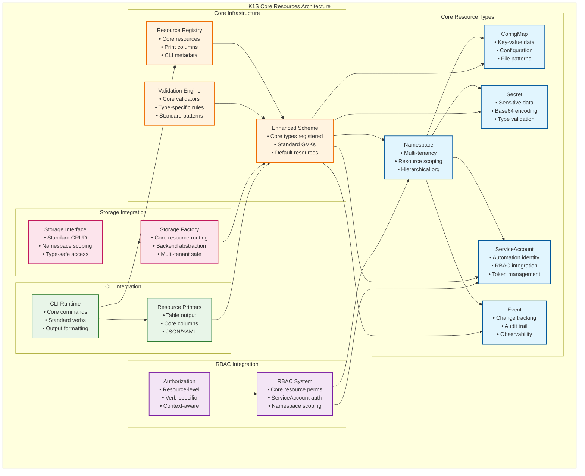

# K1S Core Resources Architecture

**Related Documentation:**
- [Architecture](Architecture.md) - Complete k1s system architecture
- [RBAC Architecture](RBAC-Architecture.md) - RBAC integration with core resources
- [Kubernetes Compatibility](Kubernetes-Compatibility.md) - Kubernetes interface compatibility

## Overview

K1S provides a set of **core resources** that are automatically available in every k1s runtime instance without additional registration. These resources follow standard Kubernetes APIs and provide essential infrastructure functionality for CLI applications, RBAC, configuration management, and observability.

## Core Resource Types

### 1. **Namespace** (`v1/namespaces`)
- **Purpose**: Multi-tenancy and resource organization
- **Standard Kubernetes API**: `v1.Namespace`
- **Key Features**: Hierarchical organization, resource scoping, isolation

### 2. **ConfigMap** (`v1/configmaps`)  
- **Purpose**: Non-sensitive configuration data storage
- **Standard Kubernetes API**: `v1.ConfigMap`
- **Key Features**: Key-value data, file mounting patterns, validation

### 3. **Secret** (`v1/secrets`)
- **Purpose**: Sensitive data storage with encoding
- **Standard Kubernetes API**: `v1.Secret`  
- **Key Features**: Base64 encoding, type-specific validation, secure handling

### 4. **ServiceAccount** (`v1/serviceaccounts`)
- **Purpose**: Identity and authentication for automated processes
- **Standard Kubernetes API**: `v1.ServiceAccount`
- **Key Features**: RBAC integration, token management, automation identity

### 5. **Event** (`v1/events`)
- **Purpose**: System observability and audit trail
- **Standard Kubernetes API**: `v1.Event`
- **Key Features**: Resource change tracking, debugging, compliance

## Architecture Overview



## Core Resource Implementations

### 1. Namespace Resource

```go
// core/pkg/resources/v1/namespace.go
package v1

import (
    corev1 "k8s.io/api/core/v1"
    metav1 "k8s.io/apimachinery/pkg/apis/meta/v1"
    "k8s.io/apimachinery/pkg/runtime"
    "k8s.io/apimachinery/pkg/runtime/schema"
)

// Namespace represents a standard Kubernetes namespace with k1s extensions
type Namespace struct {
    metav1.TypeMeta   `json:",inline"`
    metav1.ObjectMeta `json:"metadata,omitempty"`
    
    // Spec defines the behavior of the Namespace
    Spec NamespaceSpec `json:"spec,omitempty"`
    
    // Status represents information about the status of a namespace
    Status NamespaceStatus `json:"status,omitempty"`
}

// NamespaceSpec describes the attributes on a Namespace
type NamespaceSpec struct {
    // Finalizers is an opaque list of values that must be empty to permanently remove object from storage
    Finalizers []NamespaceFinalizerName `json:"finalizers,omitempty"`
    
    // K1S Extensions
    // TenantPrefix for multi-tenant storage isolation (optional)
    TenantPrefix string `json:"tenantPrefix,omitempty"`
    
    // Description provides human-readable namespace purpose
    Description string `json:"description,omitempty"`
}

// NamespaceStatus is information about the current status of a Namespace
type NamespaceStatus struct {
    // Phase is the current lifecycle phase of the namespace
    Phase NamespacePhase `json:"phase,omitempty"`
    
    // Conditions represent the latest available observations of a namespace's current state
    Conditions []NamespaceCondition `json:"conditions,omitempty"`
    
    // K1S Extensions
    // ResourceCounts provides statistics about resources in namespace
    ResourceCounts map[string]int32 `json:"resourceCounts,omitempty"`
}

type NamespacePhase string
type NamespaceFinalizerName string

const (
    NamespaceActive      NamespacePhase = "Active"
    NamespaceTerminating NamespacePhase = "Terminating"
    
    FinalizerKubernetes NamespaceFinalizerName = "kubernetes"
)

// NamespaceCondition contains details about state transitions
type NamespaceCondition struct {
    Type               NamespaceConditionType `json:"type"`
    Status             corev1.ConditionStatus `json:"status"`
    LastTransitionTime metav1.Time            `json:"lastTransitionTime,omitempty"`
    Reason             string                 `json:"reason,omitempty"`
    Message            string                 `json:"message,omitempty"`
}

type NamespaceConditionType string

const (
    NamespaceReady NamespaceConditionType = "Ready"
)

// DeepCopyObject implements runtime.Object
func (n *Namespace) DeepCopyObject() runtime.Object {
    return n.DeepCopy()
}

// GetObjectKind implements runtime.Object
func (n *Namespace) GetObjectKind() schema.ObjectKind {
    return &n.TypeMeta
}

// NamespaceList contains a list of Namespace
type NamespaceList struct {
    metav1.TypeMeta `json:",inline"`
    metav1.ListMeta `json:"metadata,omitempty"`
    Items           []Namespace `json:"items"`
}

// DeepCopyObject implements runtime.Object
func (nl *NamespaceList) DeepCopyObject() runtime.Object {
    return nl.DeepCopy()
}
```

### 2. ConfigMap Resource

```go
// core/pkg/resources/v1/configmap.go
package v1

import (
    corev1 "k8s.io/api/core/v1"
    metav1 "k8s.io/apimachinery/pkg/apis/meta/v1"
    "k8s.io/apimachinery/pkg/runtime"
    "k8s.io/apimachinery/pkg/runtime/schema"
)

// ConfigMap holds configuration data for pods to consume
type ConfigMap struct {
    metav1.TypeMeta   `json:",inline"`
    metav1.ObjectMeta `json:"metadata,omitempty"`
    
    // Immutable, if set to true, ensures that data stored in the ConfigMap cannot
    // be updated (only object metadata can be modified)
    Immutable *bool `json:"immutable,omitempty"`
    
    // Data contains the configuration data
    // Each key must consist of alphanumeric characters, '-', '_' or '.'
    Data map[string]string `json:"data,omitempty"`
    
    // BinaryData contains the binary data
    // Each key must consist of alphanumeric characters, '-', '_' or '.'
    // Values are base64 encoded strings
    BinaryData map[string][]byte `json:"binaryData,omitempty"`
}

// DeepCopyObject implements runtime.Object
func (cm *ConfigMap) DeepCopyObject() runtime.Object {
    return cm.DeepCopy()
}

// GetObjectKind implements runtime.Object
func (cm *ConfigMap) GetObjectKind() schema.ObjectKind {
    return &cm.TypeMeta
}

// ConfigMapList is a resource containing a list of ConfigMap objects
type ConfigMapList struct {
    metav1.TypeMeta `json:",inline"`
    metav1.ListMeta `json:"metadata,omitempty"`
    Items           []ConfigMap `json:"items"`
}

// DeepCopyObject implements runtime.Object
func (cml *ConfigMapList) DeepCopyObject() runtime.Object {
    return cml.DeepCopy()
}
```

### 3. Secret Resource

```go
// core/pkg/resources/v1/secret.go
package v1

import (
    corev1 "k8s.io/api/core/v1"
    metav1 "k8s.io/apimachinery/pkg/apis/meta/v1"
    "k8s.io/apimachinery/pkg/runtime"
    "k8s.io/apimachinery/pkg/runtime/schema"
)

// Secret holds secret data of a certain type
type Secret struct {
    metav1.TypeMeta   `json:",inline"`
    metav1.ObjectMeta `json:"metadata,omitempty"`
    
    // Immutable, if set to true, ensures that data stored in the Secret cannot
    // be updated (only object metadata can be modified)
    Immutable *bool `json:"immutable,omitempty"`
    
    // Data contains the secret data. Each key must consist of alphanumeric
    // characters, '-', '_' or '.'. The serialized form of the secret data is a
    // base64 encoded string, representing the arbitrary (possibly non-string)
    // data value here.
    Data map[string][]byte `json:"data,omitempty"`
    
    // StringData allows specifying non-binary secret data in string form
    // It is provided as a write-only convenience method
    // All keys and values are merged into the data field on write, overwriting any existing values
    StringData map[string]string `json:"stringData,omitempty"`
    
    // Used to facilitate programmatic handling of secret data
    Type SecretType `json:"type,omitempty"`
}

// SecretType represents different secret types
type SecretType string

const (
    // SecretTypeOpaque is the default type for arbitrary user-defined data
    SecretTypeOpaque SecretType = "Opaque"
    
    // SecretTypeServiceAccountToken contains a token that identifies a service account to the API
    SecretTypeServiceAccountToken SecretType = "kubernetes.io/service-account-token"
    
    // SecretTypeDockercfg contains a serialized ~/.dockercfg file
    SecretTypeDockercfg SecretType = "kubernetes.io/dockercfg"
    
    // SecretTypeDockerConfigJSON contains a serialized ~/.docker/config.json file
    SecretTypeDockerConfigJSON SecretType = "kubernetes.io/dockerconfigjson"
    
    // SecretTypeBasicAuth contains basic authentication credentials
    SecretTypeBasicAuth SecretType = "kubernetes.io/basic-auth"
    
    // SecretTypeSSHAuth contains SSH authentication credentials
    SecretTypeSSHAuth SecretType = "kubernetes.io/ssh-auth"
    
    // SecretTypeTLS contains TLS certificate and key data
    SecretTypeTLS SecretType = "kubernetes.io/tls"
    
    // SecretTypeBootstrapToken contains bootstrap token data
    SecretTypeBootstrapToken SecretType = "bootstrap.kubernetes.io/token"
)

// DeepCopyObject implements runtime.Object
func (s *Secret) DeepCopyObject() runtime.Object {
    return s.DeepCopy()
}

// GetObjectKind implements runtime.Object
func (s *Secret) GetObjectKind() schema.ObjectKind {
    return &s.TypeMeta
}

// SecretList is a list of Secret objects
type SecretList struct {
    metav1.TypeMeta `json:",inline"`
    metav1.ListMeta `json:"metadata,omitempty"`
    Items           []Secret `json:"items"`
}

// DeepCopyObject implements runtime.Object
func (sl *SecretList) DeepCopyObject() runtime.Object {
    return sl.DeepCopy()
}
```

### 4. ServiceAccount Resource

```go
// core/pkg/resources/v1/serviceaccount.go
package v1

import (
    corev1 "k8s.io/api/core/v1"
    metav1 "k8s.io/apimachinery/pkg/apis/meta/v1"
    "k8s.io/apimachinery/pkg/runtime"
    "k8s.io/apimachinery/pkg/runtime/schema"
)

// ServiceAccount binds together:
// * a name, understood by users, and perhaps by peripheral systems, for an identity
// * a principal that can be authenticated and authorized
// * a set of secrets
type ServiceAccount struct {
    metav1.TypeMeta   `json:",inline"`
    metav1.ObjectMeta `json:"metadata,omitempty"`
    
    // Secrets is the list of secrets allowed to be used by pods running using this ServiceAccount
    Secrets []ObjectReference `json:"secrets,omitempty"`
    
    // ImagePullSecrets is a list of references to secrets in the same namespace to use for pulling any images
    ImagePullSecrets []LocalObjectReference `json:"imagePullSecrets,omitempty"`
    
    // AutomountServiceAccountToken indicates whether pods running as this service account should have an API token automatically mounted
    AutomountServiceAccountToken *bool `json:"automountServiceAccountToken,omitempty"`
}

// ObjectReference contains enough information to let you inspect or modify the referred object
type ObjectReference struct {
    Kind            string `json:"kind,omitempty"`
    Namespace       string `json:"namespace,omitempty"`
    Name            string `json:"name,omitempty"`
    UID             string `json:"uid,omitempty"`
    APIVersion      string `json:"apiVersion,omitempty"`
    ResourceVersion string `json:"resourceVersion,omitempty"`
    FieldPath       string `json:"fieldPath,omitempty"`
}

// LocalObjectReference contains enough information to let you locate the referenced object inside the same namespace
type LocalObjectReference struct {
    Name string `json:"name,omitempty"`
}

// DeepCopyObject implements runtime.Object
func (sa *ServiceAccount) DeepCopyObject() runtime.Object {
    return sa.DeepCopy()
}

// GetObjectKind implements runtime.Object
func (sa *ServiceAccount) GetObjectKind() schema.ObjectKind {
    return &sa.TypeMeta
}

// ServiceAccountList is a list of ServiceAccount objects
type ServiceAccountList struct {
    metav1.TypeMeta `json:",inline"`
    metav1.ListMeta `json:"metadata,omitempty"`
    Items           []ServiceAccount `json:"items"`
}

// DeepCopyObject implements runtime.Object
func (sal *ServiceAccountList) DeepCopyObject() runtime.Object {
    return sal.DeepCopy()
}
```

### 5. Event Resource

```go
// core/pkg/resources/v1/event.go
package v1

import (
    corev1 "k8s.io/api/core/v1"
    metav1 "k8s.io/apimachinery/pkg/apis/meta/v1"
    "k8s.io/apimachinery/pkg/runtime"
    "k8s.io/apimachinery/pkg/runtime/schema"
)

// Event is a report of an event somewhere in the cluster
type Event struct {
    metav1.TypeMeta   `json:",inline"`
    metav1.ObjectMeta `json:"metadata"`
    
    // The object that this event is about
    InvolvedObject ObjectReference `json:"involvedObject"`
    
    // This should be a short, machine understandable string that gives the reason
    // for the transition into the object's current status
    Reason string `json:"reason,omitempty"`
    
    // A human-readable description of the status of this operation
    Message string `json:"message,omitempty"`
    
    // The component reporting this event. Should be a short machine understandable string
    Source EventSource `json:"source,omitempty"`
    
    // The time at which the event was first recorded
    FirstTimestamp metav1.Time `json:"firstTimestamp,omitempty"`
    
    // The time at which the most recent occurrence of this event was recorded
    LastTimestamp metav1.Time `json:"lastTimestamp,omitempty"`
    
    // The number of times this event has occurred
    Count int32 `json:"count,omitempty"`
    
    // Type of this event (Normal, Warning)
    Type string `json:"type,omitempty"`
    
    // Time when this Event was first observed
    EventTime metav1.MicroTime `json:"eventTime,omitempty"`
    
    // Data about the Event series this event represents or nil if it's a singleton Event
    Series *EventSeries `json:"series,omitempty"`
    
    // What action was taken/failed regarding to the Regarding object
    Action string `json:"action,omitempty"`
    
    // Optional secondary object for more complex actions
    Related *ObjectReference `json:"related,omitempty"`
    
    // Name of the controller that emitted this Event
    ReportingController string `json:"reportingController,omitempty"`
    
    // ID of the controller instance
    ReportingInstance string `json:"reportingInstance,omitempty"`
}

// EventSource contains information for an event
type EventSource struct {
    // Component from which the event is generated
    Component string `json:"component,omitempty"`
    
    // Node name on which the event is generated
    Host string `json:"host,omitempty"`
}

// EventSeries contain information on series of events
type EventSeries struct {
    // Number of occurrences in this series up to the last heartbeat time
    Count int32 `json:"count,omitempty"`
    
    // Time of the last occurrence observed
    LastObservedTime metav1.MicroTime `json:"lastObservedTime,omitempty"`
}

// DeepCopyObject implements runtime.Object
func (e *Event) DeepCopyObject() runtime.Object {
    return e.DeepCopy()
}

// GetObjectKind implements runtime.Object
func (e *Event) GetObjectKind() schema.ObjectKind {
    return &e.TypeMeta
}

// EventList is a list of events
type EventList struct {
    metav1.TypeMeta `json:",inline"`
    metav1.ListMeta `json:"metadata,omitempty"`
    Items           []Event `json:"items"`
}

// DeepCopyObject implements runtime.Object
func (el *EventList) DeepCopyObject() runtime.Object {
    return el.DeepCopy()
}
```

## Core Resource Registration

### 1. Scheme Registration

```go
// core/pkg/resources/v1/register.go
package v1

import (
    "k8s.io/apimachinery/pkg/runtime"
    "k8s.io/apimachinery/pkg/runtime/schema"
)

const GroupName = ""
const Version = "v1"

// SchemeGroupVersion is group version used to register these objects
var SchemeGroupVersion = schema.GroupVersion{Group: GroupName, Version: Version}

// Resource takes an unqualified resource and returns a Group qualified GroupResource
func Resource(resource string) schema.GroupResource {
    return SchemeGroupVersion.WithResource(resource).GroupResource()
}

var (
    // SchemeBuilder initializes a scheme builder
    SchemeBuilder = runtime.NewSchemeBuilder(addKnownTypes)
    // AddToScheme is a global function that registers this API group & version to a scheme
    AddToScheme = SchemeBuilder.AddToScheme
)

// addKnownTypes adds all core resource types to the scheme
func addKnownTypes(scheme *runtime.Scheme) error {
    scheme.AddKnownTypes(SchemeGroupVersion,
        &Namespace{},
        &NamespaceList{},
        &ConfigMap{},
        &ConfigMapList{},
        &Secret{},
        &SecretList{},
        &ServiceAccount{},
        &ServiceAccountList{},
        &Event{},
        &EventList{},
    )
    
    // Register GVK metadata
    metav1.AddToGroupVersion(scheme, SchemeGroupVersion)
    return nil
}
```

### 2. Resource Registry Integration

```go
// core/pkg/registry/core.go
package registry

import (
    "k8s.io/apimachinery/pkg/runtime/schema"
    corev1 "github.com/dtomasi/k1s/core/pkg/resources/v1"
)

// RegisterCoreResources registers all core resources with the registry
func (r *Registry) RegisterCoreResources() error {
    // Namespace
    if err := r.RegisterResource(ResourceInfo{
        GVK: schema.GroupVersionKind{
            Group:   "",
            Version: "v1", 
            Kind:    "Namespace",
        },
        GVR: schema.GroupVersionResource{
            Group:    "",
            Version:  "v1",
            Resource: "namespaces",
        },
        Namespaced: false,
        ShortNames: []string{"ns"},
        PrintColumns: []PrintColumn{
            {Name: "NAME", Type: "string", Description: "Name of the namespace", JSONPath: ".metadata.name"},
            {Name: "STATUS", Type: "string", Description: "The status of the namespace", JSONPath: ".status.phase"},
            {Name: "AGE", Type: "date", Description: "Age of the namespace", JSONPath: ".metadata.creationTimestamp"},
        },
        NewObject:     func() runtime.Object { return &corev1.Namespace{} },
        NewListObject: func() runtime.Object { return &corev1.NamespaceList{} },
    }); err != nil {
        return fmt.Errorf("failed to register Namespace: %w", err)
    }
    
    // ConfigMap
    if err := r.RegisterResource(ResourceInfo{
        GVK: schema.GroupVersionKind{
            Group:   "",
            Version: "v1",
            Kind:    "ConfigMap",
        },
        GVR: schema.GroupVersionResource{
            Group:    "",
            Version:  "v1",
            Resource: "configmaps",
        },
        Namespaced: true,
        ShortNames: []string{"cm"},
        PrintColumns: []PrintColumn{
            {Name: "NAME", Type: "string", Description: "Name of the configmap", JSONPath: ".metadata.name"},
            {Name: "DATA", Type: "integer", Description: "Number of data items", JSONPath: ".data.*"},
            {Name: "AGE", Type: "date", Description: "Age of the configmap", JSONPath: ".metadata.creationTimestamp"},
        },
        NewObject:     func() runtime.Object { return &corev1.ConfigMap{} },
        NewListObject: func() runtime.Object { return &corev1.ConfigMapList{} },
    }); err != nil {
        return fmt.Errorf("failed to register ConfigMap: %w", err)
    }
    
    // Secret
    if err := r.RegisterResource(ResourceInfo{
        GVK: schema.GroupVersionKind{
            Group:   "",
            Version: "v1",
            Kind:    "Secret",
        },
        GVR: schema.GroupVersionResource{
            Group:    "",
            Version:  "v1",
            Resource: "secrets",
        },
        Namespaced: true,
        ShortNames: []string{},
        PrintColumns: []PrintColumn{
            {Name: "NAME", Type: "string", Description: "Name of the secret", JSONPath: ".metadata.name"},
            {Name: "TYPE", Type: "string", Description: "Type of the secret", JSONPath: ".type"},
            {Name: "DATA", Type: "integer", Description: "Number of data items", JSONPath: ".data.*"},
            {Name: "AGE", Type: "date", Description: "Age of the secret", JSONPath: ".metadata.creationTimestamp"},
        },
        NewObject:     func() runtime.Object { return &corev1.Secret{} },
        NewListObject: func() runtime.Object { return &corev1.SecretList{} },
    }); err != nil {
        return fmt.Errorf("failed to register Secret: %w", err)
    }
    
    // ServiceAccount  
    if err := r.RegisterResource(ResourceInfo{
        GVK: schema.GroupVersionKind{
            Group:   "",
            Version: "v1",
            Kind:    "ServiceAccount",
        },
        GVR: schema.GroupVersionResource{
            Group:    "",
            Version:  "v1",
            Resource: "serviceaccounts",
        },
        Namespaced: true,
        ShortNames: []string{"sa"},
        PrintColumns: []PrintColumn{
            {Name: "NAME", Type: "string", Description: "Name of the service account", JSONPath: ".metadata.name"},
            {Name: "SECRETS", Type: "integer", Description: "Number of secrets", JSONPath: ".secrets.*"},
            {Name: "AGE", Type: "date", Description: "Age of the service account", JSONPath: ".metadata.creationTimestamp"},
        },
        NewObject:     func() runtime.Object { return &corev1.ServiceAccount{} },
        NewListObject: func() runtime.Object { return &corev1.ServiceAccountList{} },
    }); err != nil {
        return fmt.Errorf("failed to register ServiceAccount: %w", err)
    }
    
    // Event
    if err := r.RegisterResource(ResourceInfo{
        GVK: schema.GroupVersionKind{
            Group:   "",
            Version: "v1",
            Kind:    "Event",
        },
        GVR: schema.GroupVersionResource{
            Group:    "",
            Version:  "v1",
            Resource: "events",
        },
        Namespaced: true,
        ShortNames: []string{"ev"},
        PrintColumns: []PrintColumn{
            {Name: "LAST SEEN", Type: "date", Description: "Time of last occurrence", JSONPath: ".lastTimestamp"},
            {Name: "TYPE", Type: "string", Description: "Event type", JSONPath: ".type"},
            {Name: "REASON", Type: "string", Description: "Event reason", JSONPath: ".reason"},
            {Name: "OBJECT", Type: "string", Description: "Involved object", JSONPath: ".involvedObject.kind/.involvedObject.name"},
            {Name: "MESSAGE", Type: "string", Description: "Event message", JSONPath: ".message"},
        },
        NewObject:     func() runtime.Object { return &corev1.Event{} },
        NewListObject: func() runtime.Object { return &corev1.EventList{} },
    }); err != nil {
        return fmt.Errorf("failed to register Event: %w", err)
    }
    
    return nil
}
```

### 3. Runtime Integration

```go
// core/pkg/runtime/core.go
package runtime

import (
    corev1 "github.com/dtomasi/k1s/core/pkg/resources/v1"
)

// NewRuntimeWithCoreResources creates a new runtime with core resources pre-registered
func NewRuntimeWithCoreResources(opts ...Option) (*Runtime, error) {
    rt, err := NewRuntime(opts...)
    if err != nil {
        return nil, fmt.Errorf("failed to create runtime: %w", err)
    }
    
    // Register core resource scheme
    if err := corev1.AddToScheme(rt.scheme); err != nil {
        return nil, fmt.Errorf("failed to register core resources to scheme: %w", err)
    }
    
    // Register core resources with registry
    if err := rt.registry.RegisterCoreResources(); err != nil {
        return nil, fmt.Errorf("failed to register core resources: %w", err)
    }
    
    return rt, nil
}
```

## Validation Rules

### Core Resource Validation

```go
// core/pkg/validation/core.go
package validation

import (
    "fmt"
    corev1 "github.com/dtomasi/k1s/core/pkg/resources/v1"
)

// CoreResourceValidator validates core k1s resources
type CoreResourceValidator struct{}

func NewCoreResourceValidator() *CoreResourceValidator {
    return &CoreResourceValidator{}
}

func (v *CoreResourceValidator) ValidateNamespace(ns *corev1.Namespace) error {
    if ns.Name == "" {
        return fmt.Errorf("namespace name cannot be empty")
    }
    
    // Kubernetes DNS-1123 label validation
    if !isDNS1123Label(ns.Name) {
        return fmt.Errorf("namespace name must be a valid DNS-1123 label")
    }
    
    // Reserved namespace validation
    if isReservedNamespace(ns.Name) {
        return fmt.Errorf("namespace name %q is reserved", ns.Name)
    }
    
    return nil
}

func (v *CoreResourceValidator) ValidateConfigMap(cm *corev1.ConfigMap) error {
    if cm.Name == "" {
        return fmt.Errorf("configmap name cannot be empty")
    }
    
    // Validate data keys
    for key := range cm.Data {
        if !isConfigMapKey(key) {
            return fmt.Errorf("configmap data key %q is invalid", key)
        }
    }
    
    // Validate binary data keys
    for key := range cm.BinaryData {
        if !isConfigMapKey(key) {
            return fmt.Errorf("configmap binaryData key %q is invalid", key)
        }
    }
    
    return nil
}

func (v *CoreResourceValidator) ValidateSecret(secret *corev1.Secret) error {
    if secret.Name == "" {
        return fmt.Errorf("secret name cannot be empty")
    }
    
    // Validate data keys
    for key := range secret.Data {
        if !isConfigMapKey(key) {
            return fmt.Errorf("secret data key %q is invalid", key)
        }
    }
    
    // Type-specific validation
    switch secret.Type {
    case corev1.SecretTypeBasicAuth:
        return v.validateBasicAuthSecret(secret)
    case corev1.SecretTypeSSHAuth:
        return v.validateSSHAuthSecret(secret)
    case corev1.SecretTypeTLS:
        return v.validateTLSSecret(secret)
    }
    
    return nil
}

func (v *CoreResourceValidator) ValidateServiceAccount(sa *corev1.ServiceAccount) error {
    if sa.Name == "" {
        return fmt.Errorf("service account name cannot be empty")
    }
    
    // Validate secret references
    for _, secret := range sa.Secrets {
        if secret.Name == "" {
            return fmt.Errorf("service account secret reference name cannot be empty")
        }
    }
    
    return nil
}

func (v *CoreResourceValidator) ValidateEvent(event *corev1.Event) error {
    if event.InvolvedObject.Kind == "" {
        return fmt.Errorf("event must have an involved object kind")
    }
    
    if event.InvolvedObject.Name == "" {
        return fmt.Errorf("event must have an involved object name")
    }
    
    if event.Reason == "" {
        return fmt.Errorf("event must have a reason")
    }
    
    return nil
}

// Helper functions
func isDNS1123Label(value string) bool {
    // Implementation of Kubernetes DNS-1123 validation
    // regex: ^[a-z0-9]([-a-z0-9]*[a-z0-9])?$
    // length: 1-63 characters
    return true // Simplified for example
}

func isReservedNamespace(name string) bool {
    reserved := []string{"kube-system", "kube-public", "kube-node-lease", "default"}
    for _, r := range reserved {
        if name == r {
            return true
        }
    }
    return false
}

func isConfigMapKey(key string) bool {
    // ConfigMap and Secret keys must consist of alphanumeric characters, '-', '_' or '.'
    // regex: ^[-._a-zA-Z0-9]+$
    return true // Simplified for example
}
```

## CLI Integration Examples

### Basic CLI Commands

```go
// CLI commands automatically work with core resources

// List namespaces
k1s get namespaces
k1s get ns

// Create configmap
k1s create configmap app-config --from-literal=key1=value1 --from-literal=key2=value2

// Create secret
k1s create secret generic app-secret --from-literal=username=admin --from-literal=password=secret

// Create service account
k1s create serviceaccount automation-sa

// List events
k1s get events
k1s get events --sort-by='.lastTimestamp'
```

## Integration Benefits

### 1. **Standard Kubernetes Compatibility**
- All core resources use standard Kubernetes APIs
- Familiar resource patterns and field names
- Compatible with existing Kubernetes tooling and knowledge

### 2. **Automatic Registration**
- Core resources available in every k1s runtime without configuration
- Standard CLI commands work immediately
- No additional setup or plugin installation required

### 3. **RBAC Integration**
- ServiceAccount resources integrate with RBAC system
- Namespace scoping works with multi-tenant storage
- Standard Kubernetes permission patterns

### 4. **Observability Foundation**
- Event resources provide audit trail and debugging
- ConfigMap/Secret resources support application configuration
- Standard kubectl-style viewing and filtering

### 5. **Extensibility Ready**
- Clean foundation for additional core resources
- Plugin resources can reference core resources
- Standard validation and serialization patterns established

Diese Architektur gibt uns eine solide Basis mit den wichtigsten Kubernetes core resources, die automatisch in jeder k1s installation verfügbar sind.

<function_calls>
<invoke name="TodoWrite">
<parameter name="todos">[{"content": "Design core resource architecture for k1s", "status": "completed", "activeForm": "Designing core resource architecture for k1s"}, {"content": "Implement Namespace resource type with validation", "status": "pending", "activeForm": "Implementing Namespace resource type with validation"}, {"content": "Implement ConfigMap resource type with data validation", "status": "pending", "activeForm": "Implementing ConfigMap resource type with data validation"}, {"content": "Implement Secret resource type with encoding support", "status": "pending", "activeForm": "Implementing Secret resource type with encoding support"}, {"content": "Implement ServiceAccount resource type", "status": "pending", "activeForm": "Implementing ServiceAccount resource type"}, {"content": "Implement Event resource type for audit trail", "status": "pending", "activeForm": "Implementing Event resource type for audit trail"}, {"content": "Create core resources registration system", "status": "pending", "activeForm": "Creating core resources registration system"}, {"content": "Update scheme registration for core resources", "status": "pending", "activeForm": "Updating scheme registration for core resources"}]