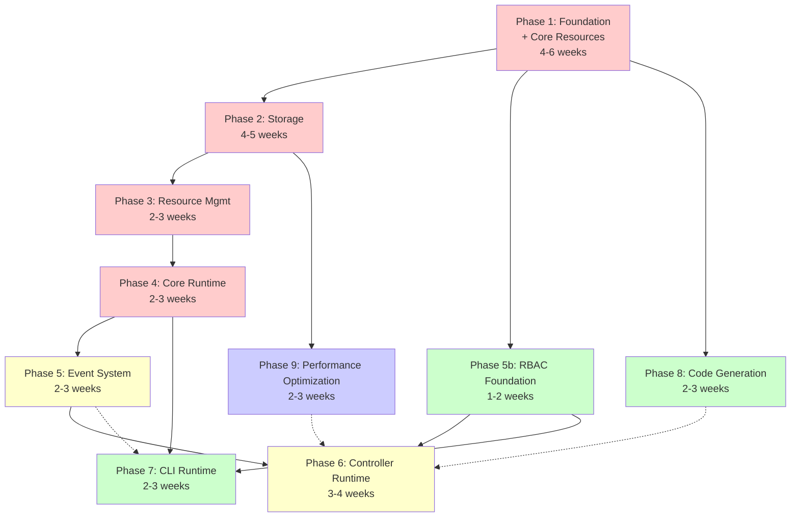

# K1S Implementation Plan

**Related Documentation:**
- [Architecture](Architecture.md) - Main architecture specification
- [Core Resources Architecture](Core-Resources-Architecture.md) - Core resources specification
- [RBAC Architecture](RBAC-Architecture.md) - RBAC integration specification
- [CLI-Runtime Package](CLI-Runtime-Package.md) - CLI runtime specification
- [Controller-Runtime Package](Controller-Runtime-Package.md) - Controller runtime specification

## Implementation Phases

### Phase 1: Foundation (4-6 weeks)
**Dependencies:** None
**Priority:** Critical

**Components:**
- Runtime scheme and type system (`core/pkg/runtime/`)
- Core resources implementation (`core/pkg/resources/v1/`)
- Serialization infrastructure (`core/pkg/codec/`)
- Multi-tenant storage interface definition (`core/pkg/storage/`)
- Basic testing framework (Ginkgo v2 setup)

**Deliverables:**
- Object registration and GVK handling
- **Core resources**: Namespace, ConfigMap, Secret, ServiceAccount, Event
- JSON/YAML serialization with versioning
- Storage interface compatible with kubernetes storage.Interface
- Multi-tenant configuration structure
- Test suite foundation

**Success Criteria:**
- [ ] Basic object serialization/deserialization works
- [ ] Scheme can register and retrieve types
- [ ] **Core resources are registered and functional**
- [ ] Storage interface defined with tenant support
- [ ] Zero golangci-lint errors
- [ ] Basic test coverage >80%

### Phase 2: Multi-Tenant Storage (4-5 weeks)
**Dependencies:** Phase 1 completed
**Priority:** High

**Components:**
- Memory storage with tenant isolation (`storage/memory/`)
- Pebble storage with high performance (`storage/pebble/`)
- Storage factory with tenant configuration (`core/pkg/storage/`)

**Deliverables:**
- Memory storage backend with >10K ops/sec
- Pebble storage backend with >3K ops/sec
- Tenant-aware key generation strategies
- Storage factory for backend selection

**Success Criteria:**
- [ ] Memory and Pebble storage fully functional
- [ ] Multi-tenant key isolation verified
- [ ] Storage factory creates correct backends
- [ ] Performance targets met
- [ ] Zero golangci-lint errors

### Phase 3: Resource Management (2-3 weeks)
**Dependencies:** Phase 2 completed
**Priority:** High

**Components:**
- Resource registry (`core/pkg/registry/`)
- Validation engine with kubebuilder markers (`core/pkg/validation/`)
- Defaulting engine (`core/pkg/defaulting/`)
- Integration testing

**Deliverables:**
- Dynamic resource type registration
- Validation based on kubebuilder markers
- Automatic defaulting of resource fields
- End-to-end resource lifecycle

**Success Criteria:**
- [ ] Resources can be dynamically registered
- [ ] Validation works with kubebuilder markers
- [ ] Defaulting applied correctly
- [ ] Integration tests pass
- [ ] Zero golangci-lint errors

### Phase 4: Core Runtime (2-3 weeks)
**Dependencies:** Phase 3 completed
**Priority:** High

**Components:**
- Main runtime orchestration (`core/pkg/runtime/`)
- Client implementation (`core/pkg/client/`)
- Informer system foundation (`core/pkg/informers/`)
- End-to-end basic operations

**Deliverables:**
- Kubernetes controller-runtime compatible client
- Runtime orchestration and lifecycle management
- Basic informer factory
- CRUD operations working end-to-end

**Success Criteria:**
- [ ] Client implements controller-runtime interfaces
- [ ] Basic CRUD operations work
- [ ] Runtime manages component lifecycle
- [ ] Informers provide watch capability
- [ ] Zero golangci-lint errors

### Phase 5: Event System (2-3 weeks)
**Dependencies:** Phase 4 completed
**Priority:** High

**Components:**
- Event recorder implementation (`core/pkg/events/`)
- Event broadcaster with sinks
- Storage sink for event persistence
- Client integration

**Deliverables:**
- Kubernetes-compatible EventRecorder
- Event broadcasting to multiple sinks
- **Events stored using core Event resources**
- Integration with client operations

**Success Criteria:**
- [ ] EventRecorder follows Kubernetes patterns
- [ ] Events are stored and retrievable using core Event resources
- [ ] Broadcasting works to multiple sinks
- [ ] Client automatically records events
- [ ] Zero golangci-lint errors

### Phase 5b: RBAC Foundation (1-2 weeks)  
**Dependencies:** Phase 1 completed (can run parallel to Phase 2-4)
**Priority:** Medium

**Components:**
- Authentication interfaces (`core/pkg/auth/`)
- Authorization interfaces with ServiceAccount integration
- File-based authenticator implementation
- ServiceAccount token authenticator

**Deliverables:**
- RBAC interfaces and foundation types
- ServiceAccount-based authentication
- File-based user authentication
- Integration with core resources (ServiceAccount, Secret, ConfigMap)

**Success Criteria:**
- [ ] Authentication interfaces defined and implemented
- [ ] ServiceAccount token validation works
- [ ] File-based authentication functional
- [ ] Integration with core resources seamless
- [ ] Zero golangci-lint errors

### Phase 6: Controller Runtime (3-4 weeks)
**Dependencies:** Phase 5 completed
**Priority:** High

**Components:**
- Manager implementation (`core/pkg/controller/`)
- Controller with work queue
- Builder API for setup
- Example controllers

**Deliverables:**
- Controller-runtime compatible Manager
- Controller with reconciliation loop
- Builder pattern for controller setup
- Example Item/Category controllers

**Success Criteria:**
- [ ] Manager compatible with controller-runtime patterns
- [ ] Controllers can watch and reconcile resources
- [ ] Builder API provides fluent setup
- [ ] Example controllers demonstrate usage
- [ ] Zero golangci-lint errors

### Phase 7: CLI Runtime Package (2-3 weeks)
**Dependencies:** Phase 4 completed (can run parallel to Phase 5-6)
**Priority:** Medium

**Components:**
- Resource builders and factories (`core/pkg/cli-runtime/`)
- Output formatters (table, JSON, YAML)
- Printer interface
- Demo CLI integration

**Deliverables:**
- kubectl-compatible resource builders
- Standard output formatters
- Extensible printer interface
- Working demo CLI application

**Success Criteria:**
- [ ] Builder pattern works like kubectl
- [ ] All standard output formats supported
- [ ] Demo CLI performs basic operations
- [ ] Integration with k1s client seamless
- [ ] Zero golangci-lint errors

### Phase 8: Code Generation (2-3 weeks)
**Dependencies:** Phase 1-4 completed
**Priority:** Medium

**Components:**
- CLI-gen tool implementation (`tools/cmd/cli-gen/`)
- Generated metadata functions
- Validation strategy generation
- OpenAPI schema support

**Deliverables:**
- Controller-gen compatible tool
- Generated k1s runtime functions
- Validation strategies from markers
- OpenAPI schemas for IDE integration

**Success Criteria:**
- [ ] cli-gen generates correct code
- [ ] Generated functions integrate seamlessly
- [ ] Validation strategies work correctly
- [ ] OpenAPI schemas are valid
- [ ] Zero golangci-lint errors

### Phase 9: Performance Optimization (2-3 weeks)
**Dependencies:** Phase 2 completed
**Priority:** Low

**Components:**
- Advanced performance benchmarking
- Storage optimization and tuning
- Memory usage profiling
- Multi-tenant performance validation

**Deliverables:**
- Comprehensive performance benchmarks
- Performance optimization recommendations
- Memory leak detection and prevention
- Multi-tenant performance isolation verified

**Success Criteria:**
- [ ] All performance targets exceeded
- [ ] Memory usage optimized
- [ ] Multi-tenant performance isolated
- [ ] Benchmarks demonstrate scalability
- [ ] Zero golangci-lint errors

## Quality Requirements (Applied to ALL Phases)

### Code Quality Standards
1. **Linting:** ALL code must pass golangci-lint without errors
2. **Testing:** Minimum 90% test coverage using Ginkgo v2
3. **Documentation:** Complete GoDoc for all exported APIs
4. **Formatting:** Standard Go formatting (gofmt, goimports)

### Performance Targets
1. **Memory Storage:** >10,000 operations/second
2. **Pebble Storage:** >3,000 operations/second
3. **CLI Startup:** <100ms for basic operations

### Testing Requirements
- **Unit Tests:** Each package with comprehensive test coverage
- **Integration Tests:** End-to-end functionality testing
- **Performance Tests:** Benchmarks for all storage backends
- **Multi-tenant Tests:** Isolation and security validation

## Risk Mitigation

### Technical Risks
1. **Storage Performance:** Early benchmarking and optimization
2. **Multi-tenant Isolation:** Security audits and testing
3. **Memory Usage:** Profiling and optimization
4. **Compatibility:** Regular testing against Kubernetes APIs

### Timeline Risks
1. **Scope Creep:** Strict phase completion criteria
2. **Quality Issues:** Mandatory quality gates
3. **Integration Problems:** Early integration testing
4. **Performance Problems:** Continuous benchmarking

## Success Criteria Summary

By completion of all phases:

- [ ] Complete CRUD operations with multi-tenant storage isolation
- [ ] Kubernetes event system recording and broadcasting  
- [ ] Controller-runtime compatible package with manager/reconciler
- [ ] CLI-runtime package with builders, factories, formatters
- [ ] Multi-tenant key strategies (buckets, prefixes, column families)
- [ ] Legacy database migration and compatibility
- [ ] Validation system with kubebuilder marker support
- [ ] Working demo application with inventory system
- [ ] Zero golangci-lint errors across all modules
- [ ] >90% test coverage for core components
- [ ] Performance targets met for all storage backends
- [ ] Complete documentation with examples

**Estimated Total Implementation Time:** 26-34 weeks (6.5-8.5 months)

## Work-Package Based Implementation Strategy

### Work-Package Design Principles

1. **Interface-First**: Each package defines clear interfaces before implementation
2. **Autonomous**: Can be implemented independently once interfaces are defined
3. **Testable**: Complete with comprehensive tests and mocks
4. **Atomic**: Delivers a complete, working component
5. **Contract-Driven**: Clear input/output contracts and error handling

### User Story Format

Each work-package is broken down into user stories following this format:

```
**Title:** [Brief description]

**As a** [role/persona]
**I want** [functionality]  
**So that** [business value/outcome]

**Acceptance Criteria:**
- [ ] Interface definition complete with documentation
- [ ] Implementation passes all tests (>90% coverage)
- [ ] Integration tests with dependent packages pass
- [ ] Zero golangci-lint errors
- [ ] Performance benchmarks meet targets (if applicable)

**Dependencies:** [List of work-packages that must be complete]
**Effort:** [XS/S/M/L/XL] 
**Files:** [Primary files to be created/modified]
**Tests:** [Test files and coverage expectations]
```

### GitHub Issue Labeling Strategy

**Size Labels:**
- `size/xs` - 1-2 hours (interface definition, simple types)
- `size/s` - 1-2 days (simple implementations)
- `size/m` - 3-5 days (moderate complexity)
- `size/l` - 1-2 weeks (complex implementations)
- `size/xl` - 2-3 weeks (major components)

**Type Labels:**
- `type/interface` - Interface definition work-packages
- `type/implementation` - Implementation work-packages
- `type/integration` - Integration and testing work-packages
- `type/documentation` - Documentation work-packages

**Priority Labels:**
- `priority/critical` - Blocks other work-packages
- `priority/high` - Important for phase completion
- `priority/medium` - Standard priority
- `priority/low` - Nice to have

**Phase Labels:**
- `phase/1-foundation` - Foundation and core resources
- `phase/2-storage` - Storage layer implementation
- `phase/3-resource-mgmt` - Resource management layer
- `phase/4-runtime` - Core runtime implementation
- `phase/5-events` - Event system
- `phase/5b-rbac` - RBAC foundation (parallel)
- `phase/6-controllers` - Controller runtime
- `phase/7-cli` - CLI runtime package
- `phase/8-codegen` - Code generation tools

**Component Labels:**
- `component/core` - Core k1s runtime
- `component/storage` - Storage backends
- `component/cli` - CLI runtime functionality
- `component/auth` - Authentication/authorization
- `component/events` - Event system
- `component/controllers` - Controller runtime
- `component/codegen` - Code generation

**Status Labels:**
- `status/interface-design` - Interface being designed
- `status/ready` - Ready for implementation
- `status/in-progress` - Currently being worked on
- `status/review` - Ready for code review
- `status/blocked` - Blocked by dependencies

## Work-Package Definitions

### WP-001: Runtime Interfaces & Types
**Phase:** 1-Foundation | **Priority:** Critical | **Size:** M

**As a** k1s framework developer
**I want** core runtime interfaces and type system defined
**So that** all other components can build on stable contracts

**Acceptance Criteria:**
- [ ] `runtime.Scheme` interface with registration/retrieval methods
- [ ] `runtime.Object` interface implementation requirements
- [ ] GVK/GVR mapping utilities and types
- [ ] Serialization interfaces (JSON/YAML)
- [ ] Deep copy interface contracts
- [ ] Version conversion interface skeleton
- [ ] Complete GoDoc for all interfaces
- [ ] Mock implementations for testing

**Dependencies:** None
**Files:** `core/pkg/runtime/interfaces.go`, `core/pkg/runtime/scheme.go`, `core/pkg/runtime/gvk.go`
**Tests:** Interface contract tests, mock validation

### WP-002: Core Resource Type Definitions
**Phase:** 1-Foundation | **Priority:** Critical | **Size:** L

**As a** k1s user and developer
**I want** standard Kubernetes core resources available
**So that** I can manage basic infrastructure resources

**Acceptance Criteria:**
- [ ] Namespace, ConfigMap, Secret, ServiceAccount, Event types
- [ ] All types implement `runtime.Object` correctly
- [ ] Deep copy methods generated and functional
- [ ] JSON/YAML serialization working
- [ ] Type validation functions defined
- [ ] List types for all resources
- [ ] Status fields properly structured

**Dependencies:** WP-001
**Files:** `core/pkg/resources/v1/*.go`
**Tests:** Type serialization tests, deep copy tests, validation tests

### WP-003: Storage Interface Definition
**Phase:** 1-Foundation | **Priority:** Critical | **Size:** S

**As a** storage backend implementer
**I want** a clear storage interface contract
**So that** multiple backends can be implemented consistently

**Acceptance Criteria:**
- [ ] `storage.Interface` matching Kubernetes apiserver
- [ ] Multi-tenant configuration types
- [ ] Watch interface definition
- [ ] Error types and handling
- [ ] Performance measurement interfaces
- [ ] Transaction interface skeleton
- [ ] Complete interface documentation

**Dependencies:** WP-001
**Files:** `core/pkg/storage/interface.go`, `core/pkg/storage/types.go`
**Tests:** Interface contract tests, mock storage implementation

### WP-004: Codec Interfaces & JSON Implementation
**Phase:** 1-Foundation | **Priority:** High | **Size:** M

**As a** k1s runtime
**I want** serialization/deserialization capabilities
**So that** resources can be persisted and transmitted

**Acceptance Criteria:**
- [ ] `Codec` interface for serialization
- [ ] JSON encoder/decoder implementation
- [ ] YAML encoder/decoder implementation
- [ ] Version conversion framework
- [ ] Unknown field preservation
- [ ] Streaming support interfaces
- [ ] Error handling for malformed data

**Dependencies:** WP-001, WP-002
**Files:** `core/pkg/codec/interfaces.go`, `core/pkg/codec/json.go`, `core/pkg/codec/yaml.go`
**Tests:** Serialization round-trip tests, version conversion tests

### WP-005: Memory Storage Implementation
**Phase:** 2-Storage | **Priority:** High | **Size:** M

**As a** k1s developer
**I want** an in-memory storage backend
**So that** I can test and develop without persistence

**Acceptance Criteria:**
- [ ] Complete `storage.Interface` implementation
- [ ] Thread-safe operations with proper locking
- [ ] Watch implementation with channels
- [ ] Multi-tenant key prefixing
- [ ] Performance >10,000 ops/sec
- [ ] Memory leak prevention
- [ ] Comprehensive test suite

**Dependencies:** WP-003
**Files:** `storage/memory/pkg/storage/memory.go`
**Tests:** Concurrency tests, performance benchmarks, watch tests

### WP-006: Pebble Storage Implementation  
**Phase:** 2-Storage | **Priority:** High | **Size:** L

**As a** k1s user
**I want** high-performance persistent storage with Pebble
**So that** I can handle demanding workloads with fast data access

**Acceptance Criteria:**
- [ ] Complete `storage.Interface` implementation
- [ ] LSM-tree storage with high throughput
- [ ] File locking for multi-process safety
- [ ] Multi-tenant key prefixing isolation
- [ ] Performance >3,000 ops/sec
- [ ] Compression and compaction support
- [ ] Error recovery and corruption handling

**Dependencies:** WP-003
**Files:** `storage/pebble/pkg/storage/pebble.go`
**Tests:** Performance tests, concurrency tests, persistence benchmarks

### WP-007: Storage Factory & Configuration
**Phase:** 2-Storage | **Priority:** Medium | **Size:** S

**As a** k1s runtime
**I want** storage backend selection from configuration
**So that** users can choose their preferred storage

**Acceptance Criteria:**
- [ ] Storage factory with backend registration
- [ ] Configuration validation and parsing
- [ ] Health check interfaces
- [ ] Connection management
- [ ] Error handling for invalid configs
- [ ] Backend-specific configuration options
- [ ] Plugin mechanism for custom backends

**Dependencies:** WP-005 (Memory), WP-006 (Pebble)
**Files:** `core/pkg/storage/factory.go`, `core/pkg/storage/config.go`
**Tests:** Configuration validation tests, factory creation tests

### WP-008: Resource Registry Interface & Implementation
**Phase:** 3-Resource-Mgmt | **Priority:** High | **Size:** M

**As a** k1s plugin developer
**I want** dynamic resource type registration
**So that** I can add custom resources at runtime

**Acceptance Criteria:**
- [ ] Registry interface for resource metadata
- [ ] GVK to GVR mapping and reverse lookup
- [ ] Print column storage and retrieval
- [ ] Short name resolution
- [ ] Namespace scoping information
- [ ] Resource discovery capabilities
- [ ] Thread-safe registration operations

**Dependencies:** WP-001, WP-002
**Files:** `core/pkg/registry/interface.go`, `core/pkg/registry/registry.go`
**Tests:** Registration tests, lookup tests, concurrency tests

### WP-009: Validation Framework
**Phase:** 3-Resource-Mgmt | **Priority:** High | **Size:** L

**As a** k1s developer  
**I want** resource validation based on kubebuilder markers
**So that** invalid resources are rejected automatically

**Acceptance Criteria:**
- [ ] Validation interface definitions
- [ ] Core validators for standard types
- [ ] Kubebuilder marker parsing framework
- [ ] CEL expression evaluation support
- [ ] Validation error aggregation
- [ ] Plugin mechanism for custom validators
- [ ] Performance optimized validation chains

**Dependencies:** WP-008
**Files:** `core/pkg/validation/interface.go`, `core/pkg/validation/validators.go`
**Tests:** Validation rule tests, marker parsing tests, performance tests

### WP-010: Defaulting Framework
**Phase:** 3-Resource-Mgmt | **Priority:** Medium | **Size:** M

**As a** k1s developer
**I want** automatic field defaulting from markers  
**So that** resources have sensible default values

**Acceptance Criteria:**
- [ ] Defaulting interface definitions
- [ ] Core defaulters for standard types
- [ ] Kubebuilder marker parsing
- [ ] Conditional defaulting support
- [ ] Integration with validation pipeline
- [ ] Plugin mechanism for custom defaulters
- [ ] Defaulting order and precedence rules

**Dependencies:** WP-008, WP-009
**Files:** `core/pkg/defaulting/interface.go`, `core/pkg/defaulting/defaulters.go`  
**Tests:** Defaulting rule tests, integration with validation tests

### WP-011: Client Interface Definition
**Phase:** 4-Runtime | **Priority:** Critical | **Size:** S

**As a** k1s developer
**I want** a controller-runtime compatible client interface
**So that** existing patterns and code can be reused

**Acceptance Criteria:**
- [ ] `client.Client` interface matching controller-runtime
- [ ] Reader, Writer, StatusClient interfaces
- [ ] Patch types and operations defined
- [ ] List and watch option types
- [ ] Error types and handling patterns
- [ ] Context integration requirements
- [ ] Interface documentation complete

**Dependencies:** WP-001, WP-003
**Files:** `core/pkg/client/interface.go`
**Tests:** Interface contract tests, mock client implementation

### WP-012: K1S Runtime Orchestrator
**Phase:** 4-Runtime | **Priority:** Critical | **Size:** L

**As a** k1s application developer
**I want** a runtime that orchestrates all components
**So that** I have a single entry point for k1s functionality

**Acceptance Criteria:**
- [ ] Runtime struct with all component management
- [ ] Functional options configuration pattern
- [ ] Component lifecycle (start/stop/health)
- [ ] Graceful shutdown handling
- [ ] Configuration loading and validation
- [ ] Error aggregation and reporting
- [ ] Integration with all work-packages

**Dependencies:** WP-007, WP-008, WP-009, WP-010
**Files:** `core/pkg/runtime/runtime.go`
**Tests:** Integration tests, lifecycle tests, configuration tests

### WP-013: Client Implementation
**Phase:** 4-Runtime | **Priority:** Critical | **Size:** XL

**As a** k1s developer
**I want** a fully functional client implementation
**So that** I can perform CRUD operations on resources

**Acceptance Criteria:**
- [ ] Complete `client.Client` interface implementation
- [ ] Get, List, Create, Update, Delete operations
- [ ] Patch operations (strategic merge, JSON, merge)
- [ ] Status subresource handling
- [ ] Validation and defaulting integration
- [ ] Watch functionality
- [ ] Error handling and retries

**Dependencies:** WP-011, WP-012
**Files:** `core/pkg/client/client.go`
**Tests:** CRUD operation tests, patch tests, integration tests

### WP-014: Event System Interfaces
**Phase:** 5-Events | **Priority:** High | **Size:** S

**As a** k1s component developer
**I want** event recording interfaces
**So that** I can record system events consistently

**Acceptance Criteria:**
- [ ] `EventRecorder` interface matching Kubernetes
- [ ] Event broadcaster interface
- [ ] Event sink interface definitions
- [ ] Event filtering and aggregation interfaces
- [ ] Performance measurement interfaces
- [ ] Error handling patterns
- [ ] Interface documentation

**Dependencies:** WP-002 (Event resource)
**Files:** `core/pkg/events/interface.go`
**Tests:** Interface contract tests, mock implementations

### WP-015: Event Recorder Implementation
**Phase:** 5-Events | **Priority:** High | **Size:** M

**As a** k1s component
**I want** to record events about resource changes
**So that** users can understand what happened

**Acceptance Criteria:**
- [ ] EventRecorder implementation
- [ ] Event creation with proper metadata
- [ ] Event aggregation and deduplication
- [ ] Integration with Event core resource
- [ ] Performance optimizations (batching)
- [ ] Rate limiting for event flooding
- [ ] Error handling and fallbacks

**Dependencies:** WP-014, WP-013
**Files:** `core/pkg/events/recorder.go`
**Tests:** Event creation tests, aggregation tests, performance tests

### WP-016: RBAC Interface Definitions
**Phase:** 5b-RBAC | **Priority:** Medium | **Size:** S

**As a** k1s security developer  
**I want** authentication and authorization interfaces
**So that** security can be implemented consistently

**Acceptance Criteria:**
- [ ] Authenticator interface with multiple implementations
- [ ] Authorizer interface with RBAC support
- [ ] UserInfo and context types
- [ ] Request attribute types
- [ ] Integration with ServiceAccount resources
- [ ] Token validation interfaces
- [ ] Error handling and security patterns

**Dependencies:** WP-002 (ServiceAccount)
**Files:** `core/pkg/auth/interface.go`
**Tests:** Interface contract tests, security tests

### WP-017: ServiceAccount Authentication
**Phase:** 5b-RBAC | **Priority:** Medium | **Size:** M

**As a** k1s automation system
**I want** ServiceAccount-based authentication
**So that** automated processes can authenticate securely

**Acceptance Criteria:**
- [ ] ServiceAccount token authenticator
- [ ] Token validation against ServiceAccount resources
- [ ] Integration with Secret resources for tokens
- [ ] User info generation from ServiceAccounts
- [ ] Token caching and performance optimization
- [ ] Security hardening and validation
- [ ] Integration tests with RBAC

**Dependencies:** WP-016, WP-013
**Files:** `core/pkg/auth/serviceaccount.go`
**Tests:** Authentication tests, token validation tests, security tests

### WP-018: CLI Runtime Interfaces
**Phase:** 7-CLI | **Priority:** Medium | **Size:** S

**As a** CLI developer
**I want** kubectl-style operation interfaces
**So that** I can build familiar CLI experiences

**Acceptance Criteria:**
- [ ] Resource builder interface definitions
- [ ] Printer interface for multiple output formats
- [ ] Operation handler interfaces (CRUD)
- [ ] Filter and selector interfaces
- [ ] Result handling interfaces  
- [ ] Error handling patterns
- [ ] Performance measurement interfaces

**Dependencies:** WP-011
**Files:** `core/pkg/cli-runtime/interface.go`
**Tests:** Interface contract tests, mock implementations

### WP-019: CLI Resource Builders
**Phase:** 7-CLI | **Priority:** Medium | **Size:** M

**As a** CLI developer
**I want** resource builders like kubectl
**So that** I can select and filter resources easily

**Acceptance Criteria:**
- [ ] Fluent builder API implementation
- [ ] Label and field selector support
- [ ] Namespace scoping functionality
- [ ] Resource name and pattern matching
- [ ] Result batching and streaming
- [ ] Error aggregation
- [ ] Performance optimization

**Dependencies:** WP-018, WP-013
**Files:** `core/pkg/cli-runtime/builder.go`
**Tests:** Builder pattern tests, selector tests, performance tests

### WP-020: Output Format System
**Phase:** 7-CLI | **Priority:** Medium | **Size:** M

**As a** CLI user
**I want** multiple output formats for resource data
**So that** I can consume information in my preferred format

**Acceptance Criteria:**
- [ ] Table printer with custom columns
- [ ] JSON and YAML output formatters
- [ ] Name-only and wide output modes
- [ ] Custom column configuration
- [ ] Streaming output support
- [ ] Error handling in output
- [ ] Performance optimization for large datasets

**Dependencies:** WP-018, WP-008
**Files:** `core/pkg/cli-runtime/printers.go`
**Tests:** Output format tests, column tests, streaming tests

## Updated Phase Dependencies

