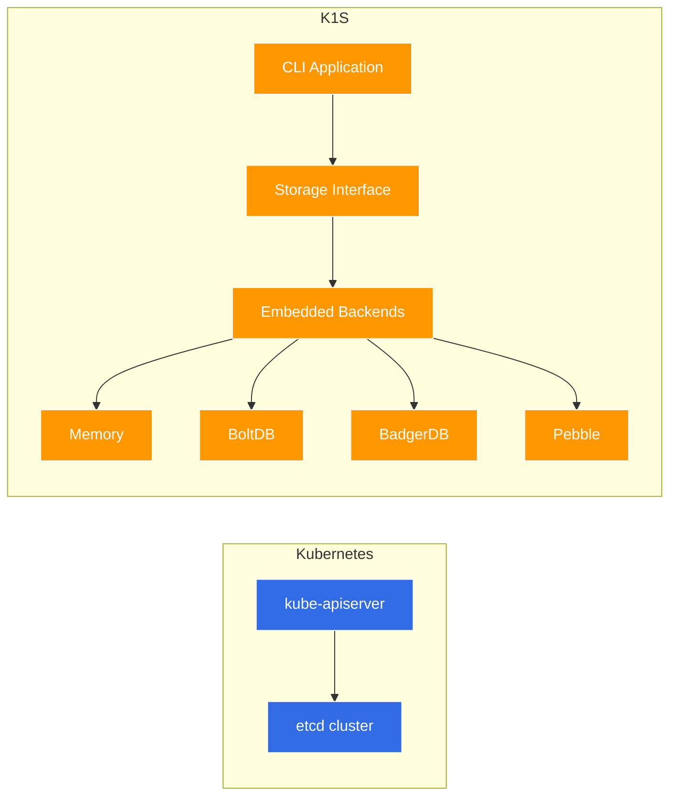
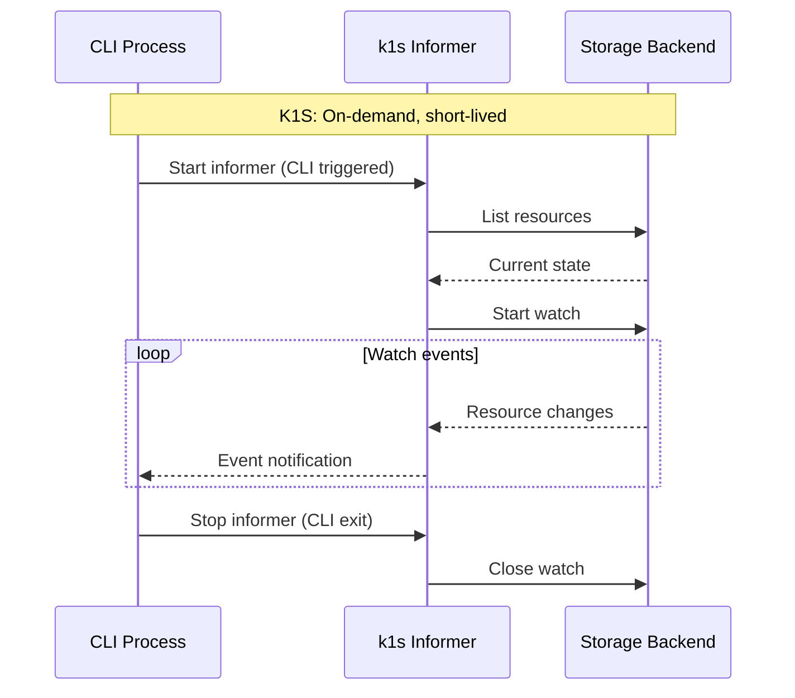
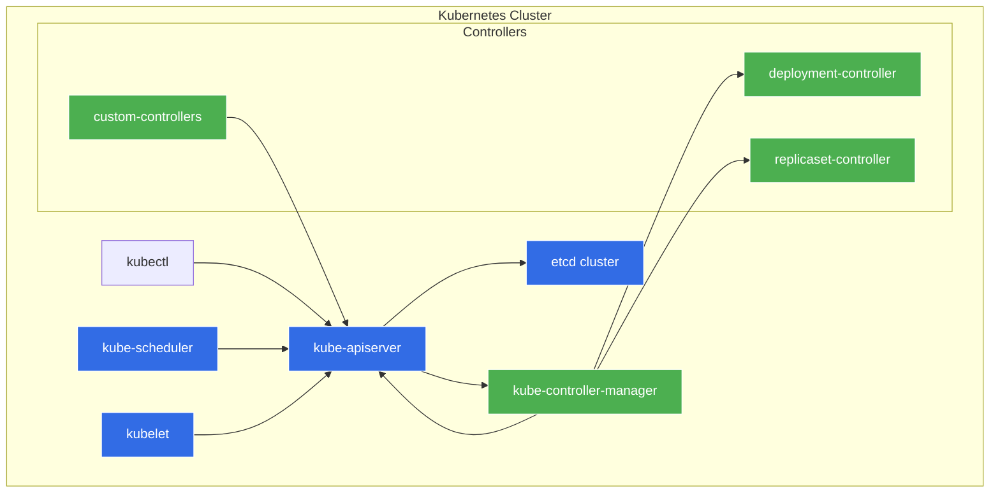
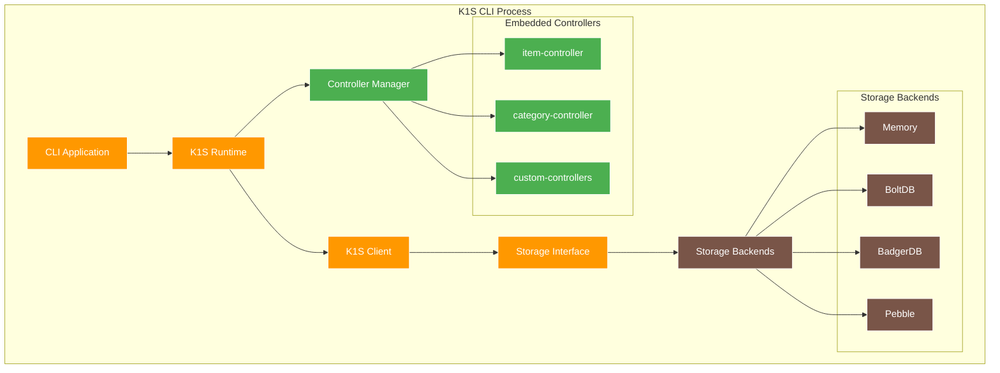

# K1S Kubernetes Compatibility Guide

**Related Documentation:**
- [Architecture](Architecture.md) - Complete k1s system architecture
- [CLI-Optimized Architecture](CLI-Optimized-Architecture.md) - CLI-specific adaptations
- [Controller-Runtime Package](Controller-Runtime-Package.md) - Controller runtime compatibility

## Overview

K1S provides a **Kubernetes-native experience for CLI applications** by implementing standard Kubernetes interfaces while adapting them for short-lived, embedded storage scenarios. This document clarifies what remains the same, what's adapted, and what's fundamentally different from standard Kubernetes.

## Kubernetes Interface Compatibility Matrix

### ✅ **Fully Compatible Interfaces**

These interfaces work exactly as in Kubernetes, enabling drop-in usage of existing tools and libraries:

#### 1. **Client Interface** (`sigs.k8s.io/controller-runtime/pkg/client`)
```go
// 100% compatible - no changes needed
type Client interface {
    Get(ctx context.Context, key client.ObjectKey, obj client.Object) error
    List(ctx context.Context, list client.ObjectList, opts ...client.ListOption) error
    Create(ctx context.Context, obj client.Object, opts ...client.CreateOption) error
    Delete(ctx context.Context, obj client.Object, opts ...client.DeleteOption) error
    Update(ctx context.Context, obj client.Object, opts ...client.UpdateOption) error
    Patch(ctx context.Context, obj client.Object, patch client.Patch, opts ...client.PatchOption) error
    
    // Status subresource support
    Status() client.StatusWriter
}
```

**What's the same:**
- All CRUD operations work identically
- Strategic merge patch support
- Status subresource handling
- Selector and field selector support
- List pagination and continuation

**Example compatibility:**
```go
// This code works unchanged in both Kubernetes and k1s
item := &v1alpha1.Item{}
err := client.Get(ctx, types.NamespacedName{Name: "laptop-123", Namespace: "default"}, item)
```

#### 2. **Controller-Runtime Manager** (`sigs.k8s.io/controller-runtime/pkg/manager`)
```go
// Compatible interface with k1s-specific implementations
type Manager interface {
    Add(manager.Runnable) error
    
    GetConfig() *rest.Config                    // Returns k1s config
    GetScheme() *runtime.Scheme                 // Standard scheme
    GetClient() client.Client                   // k1s client implementation
    GetFieldIndexer() client.FieldIndexer       // k1s indexer
    GetCache() cache.Cache                      // k1s cache
    GetEventRecorderFor(name string) record.EventRecorder // k1s events
    GetRESTMapper() meta.RESTMapper             // k1s mapper
    GetAPIReader() client.Reader                // Direct storage reader
    GetWebhookServer() *webhook.Server          // Not implemented
    
    AddHealthzCheck(name string, check healthz.Checker) error
    AddReadyzCheck(name string, check healthz.Checker) error
    
    Start(ctx context.Context) error
}
```

**What's the same:**
- Standard manager interface and lifecycle
- Component registration patterns
- Health check integration
- Event recorder access

**k1s adaptations:**
- No webhook server (CLI context)
- Cache optimized for short-lived processes
- Direct storage access for API reader

#### 3. **Reconciler Interface** (`sigs.k8s.io/controller-runtime/pkg/reconcile`)
```go
// 100% compatible
type Reconciler interface {
    Reconcile(context.Context, Request) (Result, error)
}

type Request struct {
    NamespacedName types.NamespacedName
}

type Result struct {
    Requeue      bool
    RequeueAfter time.Duration
}
```

**What's the same:**
- Reconciler signature identical
- Request/Result types unchanged
- Error handling patterns preserved

**k1s behavior difference:**
- Triggered execution instead of continuous loops
- No automatic requeue scheduling (CLI context)

#### 4. **Runtime Scheme** (`k8s.io/apimachinery/pkg/runtime`)
```go
// Standard Kubernetes scheme usage
scheme := runtime.NewScheme()
utilruntime.Must(clientgoscheme.AddToScheme(scheme))
utilruntime.Must(v1alpha1.AddToScheme(scheme))
```

**What's the same:**
- Type registration patterns
- GVK/GVR mapping
- Object creation and conversion
- Scheme-based serialization

#### 5. **Event Recording** (`k8s.io/client-go/tools/record`)
```go
// Standard EventRecorder interface
type EventRecorder interface {
    Event(object runtime.Object, eventtype, reason, message string)
    Eventf(object runtime.Object, eventtype, reason, messageFmt string, args ...interface{})
    AnnotatedEventf(object runtime.Object, annotations map[string]string, 
                    eventtype, reason, messageFmt string, args ...interface{})
}
```

**What's the same:**
- Standard Event resources (events/v1)
- Event recording patterns
- Event broadcaster architecture

**k1s adaptations:**
- Direct storage persistence (no etcd)
- CLI-optimized event lifecycle

### 🔄 **Adapted Interfaces**

These interfaces maintain API compatibility but have different implementations optimized for CLI usage:

#### 1. **Storage Interface** (`k8s.io/apiserver/pkg/storage`)



**Interface compatibility:**
```go
// Same interface as Kubernetes apiserver storage
type Interface interface {
    Versioner() storage.Versioner
    Create(ctx context.Context, key string, obj, out runtime.Object, ttl uint64) error
    Delete(ctx context.Context, key string, out runtime.Object, preconditions *storage.Preconditions, 
           validateDeletion storage.ValidateObjectFunc, cachedExistingObject runtime.Object) error
    Watch(ctx context.Context, key string, opts storage.ListOptions) (watch.Interface, error)
    Get(ctx context.Context, key string, opts storage.GetOptions, objPtr runtime.Object) error
    List(ctx context.Context, key string, opts storage.ListOptions, listObj runtime.Object) error
}
```

**What's the same:**
- Storage interface signatures
- Watch semantics and event types
- Optimistic concurrency with resource versions
- Precondition support for safe updates

**k1s differences:**
- **Backend:** Embedded databases instead of etcd
- **Performance:** >10K ops/sec (memory), >1K ops/sec (persistent)
- **Multi-tenancy:** Built-in tenant isolation via key prefixes
- **Deployment:** Single binary instead of distributed cluster

#### 2. **Informers** (`k8s.io/client-go/tools/cache`)



**Interface compatibility:**
```go
// Same SharedInformerFactory interface
type SharedInformerFactory interface {
    ForResource(resource schema.GroupVersionResource) (GenericInformer, error)
    Start(stopCh <-chan struct{})
    Shutdown()
    WaitForCacheSync(stopCh <-chan struct{}) map[reflect.Type]bool
}
```

**What's the same:**
- SharedInformerFactory patterns
- Cache synchronization semantics
- Event handler registration
- Resource watching capabilities

**k1s optimizations:**
- **On-demand:** Start only when needed, not continuously
- **Direct storage:** No kube-apiserver intermediary
- **Fast startup:** <50ms initialization for CLI responsiveness
- **Memory efficient:** Minimal cache overhead for short processes

#### 3. **Builder Pattern** (`sigs.k8s.io/controller-runtime/pkg/builder`)

```go
// Same fluent API as controller-runtime
ctrl.NewControllerManagedBy(mgr).
    For(&v1alpha1.Item{}).
    Owns(&corev1.ConfigMap{}).
    WithOptions(controller.Options{
        MaxConcurrentReconciles: 1,
    }).
    Complete(&ItemController{})
```

**What's the same:**
- Fluent API identical to controller-runtime
- For/Owns/Watches pattern support
- Controller options configuration
- Predicate filtering support

**k1s adaptations:**
- **Execution model:** Triggered instead of continuous
- **Resource watching:** On-demand informer creation
- **Concurrency:** Optimized for CLI burst processing

### ❌ **Not Supported (Intentionally)**

These Kubernetes features are not implemented in k1s due to CLI context limitations:

#### 1. **Admission Controllers**
- **Why not:** No validation webhook infrastructure in CLI
- **Alternative:** Built-in validation via kubebuilder markers
- **Equivalent:** `core/pkg/validation/` with CEL expression support

#### 2. **Custom Resource Definitions (CRDs)**
- **Why not:** No cluster-wide type registration needed
- **Alternative:** Static type registration in k1s runtime
- **Equivalent:** `scheme.AddToScheme()` patterns for type registration

#### 3. **RBAC and Authentication**
- **Why not:** Single-user CLI context
- **Alternative:** File system permissions for storage access
- **Equivalent:** Multi-tenant storage isolation

#### 4. **Networking and Services**
- **Why not:** No cluster networking in CLI tools
- **Alternative:** Process-level communication
- **Equivalent:** WASM plugin system for memory-isolated extensions

#### 5. **Persistent Volumes**
- **Why not:** Direct embedded storage model
- **Alternative:** Configurable storage backends
- **Equivalent:** Storage factory with pluggable backends

## Architectural Comparison

### Kubernetes Cluster Architecture



### K1S CLI Architecture



## Key Architectural Differences

### 1. **Process Lifecycle**

| Aspect | Kubernetes | K1S |
|--------|------------|-----|
| **Process model** | Long-running server processes | Short-lived CLI processes |
| **Startup time** | Minutes (cluster components) | <100ms (single binary) |
| **State persistence** | In-memory caches + etcd | Direct embedded storage |
| **Shutdown** | Graceful with leader election | Immediate process termination |

### 2. **Controller Execution**

| Aspect | Kubernetes | K1S |
|--------|------------|-----|
| **Execution model** | Continuous reconciliation loops | Triggered execution |
| **Work queues** | Background processing | On-demand processing |
| **Requeue** | Automatic requeue scheduling | Manual trigger required |
| **Concurrency** | High concurrent reconciliation | CLI-optimized burst processing |

### 3. **Data Storage**

| Aspect | Kubernetes | K1S |
|--------|------------|-----|
| **Storage backend** | etcd cluster | Embedded databases |
| **Consistency** | Raft consensus | ACID transactions |
| **Multi-tenancy** | Namespace isolation | Storage key prefixes |
| **Performance** | 10K+ objects/cluster | >10K ops/sec local |

### 4. **Resource Management**

| Aspect | Kubernetes | K1S |
|--------|------------|-----|
| **Type registration** | CRDs + admission | Static scheme registration |
| **Validation** | Admission webhooks | Kubebuilder markers + CEL |
| **Defaulting** | Mutating webhooks | Built-in defaulting engine |
| **API discovery** | REST API endpoints | Compile-time type system |

## Migration Examples

### From Standard Controller-Runtime

**Before (Standard Kubernetes):**
```go
func main() {
    ctrl.SetLogger(zap.New())
    
    mgr, err := ctrl.NewManager(ctrl.GetConfigOrDie(), ctrl.Options{
        Scheme: scheme,
        MetricsBindAddress: ":8080",
        LeaderElection: true,
        LeaderElectionID: "controller-leader-election",
    })
    
    if err := (&MyController{}).SetupWithManager(mgr); err != nil {
        setupLog.Error(err, "unable to create controller")
        os.Exit(1)
    }
    
    if err := mgr.Start(ctrl.SetupSignalHandler()); err != nil {
        setupLog.Error(err, "problem running manager")
        os.Exit(1)
    }
}
```

**After (k1s Compatible):**
```go
func main() {
    // Initialize k1s runtime with embedded storage
    runtime, err := k1s.NewRuntime(k1s.Config{
        Storage: storage.Config{
            Type: "bolt",
            Path: "./data/app.db",
            TenantConfig: storage.TenantConfig{
                Prefix: "my-app",
            },
        },
    })
    if err != nil {
        log.Fatal(err)
    }
    defer runtime.Stop()
    
    // Register API types
    if err := runtime.RegisterAPI(&v1alpha1.Item{}); err != nil {
        log.Fatal(err)
    }
    
    // Create controller manager - same interface!
    mgr := controller.NewManager(runtime)
    
    // Setup controller - identical to controller-runtime!
    if err := (&MyController{}).SetupWithManager(mgr); err != nil {
        log.Fatal(err)
    }
    
    // CLI-triggered execution instead of continuous
    ctx, cancel := context.WithTimeout(context.Background(), 30*time.Second)
    defer cancel()
    
    if err := mgr.Start(ctx); err != nil {
        log.Fatal(err)
    }
}
```

**What changed:**
- ✅ Controller setup code identical
- ✅ Reconciler implementation unchanged  
- 🔄 Runtime initialization (k1s instead of cluster config)
- 🔄 Execution model (triggered instead of continuous)
- ❌ No leader election (single process)
- ❌ No metrics server (CLI context)

### Client Usage

**Kubernetes and k1s - identical code:**
```go
type ItemController struct {
    client.Client
    Scheme *runtime.Scheme
}

func (r *ItemController) Reconcile(ctx context.Context, req reconcile.Request) (reconcile.Result, error) {
    // This code works unchanged in both Kubernetes and k1s
    
    item := &v1alpha1.Item{}
    if err := r.Get(ctx, req.NamespacedName, item); err != nil {
        return reconcile.Result{}, client.IgnoreNotFound(err)
    }
    
    // Business logic...
    item.Status.Phase = "Ready"
    
    if err := r.Status().Update(ctx, item); err != nil {
        return reconcile.Result{}, err
    }
    
    return reconcile.Result{}, nil
}
```

**Zero changes needed** - the client interface is 100% compatible!

## Benefits of Kubernetes Compatibility

### 1. **Ecosystem Reuse**
- Existing controller-runtime controllers work with minimal changes
- Kubebuilder-generated code compatible
- Standard Kubernetes tooling (client-go patterns)
- Familiar development patterns

### 2. **Developer Experience**
- Same APIs developers already know
- Standard error handling patterns
- Consistent object lifecycle management
- Compatible testing approaches

### 3. **Migration Path**
- Easy migration from cluster controllers to CLI tools
- Shared code between cluster and CLI versions
- Standard Kubernetes resource definitions
- Compatible CI/CD patterns

## Limitations and Trade-offs

### 1. **No Cluster Features**
- No pod scheduling or node management
- No service discovery or networking
- No volume orchestration
- No multi-node coordination

### 2. **Different Operational Model**
- Manual triggering instead of continuous reconciliation
- No leader election (single process)
- No rolling updates or deployments
- CLI-scoped lifecycle management

### 3. **Storage Constraints**
- Local storage only (no distributed consistency)
- Process restart loses in-memory state
- No cross-process resource sharing (without shared storage)
- Limited to single-machine scale

## Best Practices

### 1. **Design for CLI Context**
```go
// Good: Design for triggered execution
func (r *Controller) Reconcile(ctx context.Context, req reconcile.Request) (reconcile.Result, error) {
    // Process immediately, don't rely on requeue
    return reconcile.Result{}, r.handleImmediate(ctx, req)
}

// Avoid: Relying on continuous processing
func (r *Controller) Reconcile(ctx context.Context, req reconcile.Request) (reconcile.Result, error) {
    return reconcile.Result{RequeueAfter: 30*time.Second}, nil // Won't work as expected
}
```

### 2. **Storage Configuration**
```go
// Good: Configure appropriate storage for use case
storage.Config{
    Type: "memory",     // Development/testing
    Type: "bolt",       // Production CLI tools  
    Type: "badger",     // High-throughput scenarios
}

// Good: Use tenant isolation
TenantConfig{
    Prefix: "my-app",   // Simple, effective isolation
}
```

### 3. **Error Handling**
```go
// Same error handling patterns work in both
if err := r.Client.Get(ctx, key, obj); err != nil {
    if apierrors.IsNotFound(err) {
        return reconcile.Result{}, nil // Object deleted
    }
    return reconcile.Result{}, err // Requeue on error
}
```

## Conclusion

K1S provides **maximum Kubernetes compatibility** while adapting the runtime for CLI environments. The core interfaces remain identical, enabling easy migration and ecosystem reuse, while the implementation is optimized for:

- ⚡ **Fast startup** (<100ms)
- 💾 **Embedded storage** (no external dependencies)  
- 🎯 **CLI workflows** (triggered execution)
- 🏗️ **Single binary** deployment
- 🔒 **Multi-tenant** isolation

This approach gives developers the **best of both worlds**: familiar Kubernetes APIs with CLI-optimized performance and deployment simplicity.