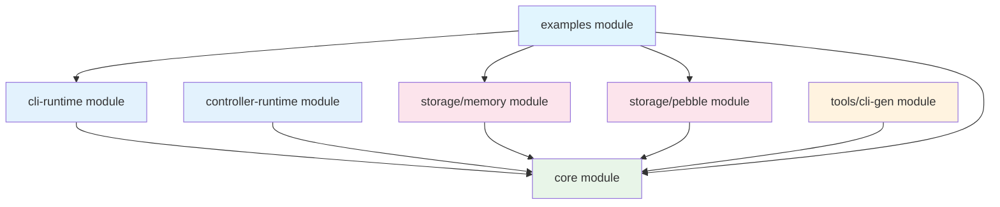

# K1S Project Structure

**Related Documentation:**
- [Architecture](Architecture.md) - Complete system architecture with visual diagrams
- [Implementation Plan](Implementation-Plan.md) - Development roadmap and phases

## Go Workspace Layout

K1s uses a Go workspace with multiple modules for clean separation and optional dependencies.

```
k1s/
├── go.work                    # Workspace configuration
├── go.work.sum               # Workspace dependencies
│
├── core/                     # Core k1s functionality
│   ├── go.mod               # Main module
│   ├── runtime/             # Type system & orchestration
│   ├── client/              # Client interface implementation
│   ├── storage/             # Multi-tenant storage interface & factory
│   ├── codec/               # Serialization
│   ├── registry/            # Resource management
│   ├── validation/          # Validation engine
│   ├── defaulting/          # Defaulting engine
│   ├── events/              # ✅ Kubernetes event system (COMPLETED)
│   ├── informers/           # Informer factory for CLI-optimized queries
│   └── types/               # Core types and scheme definitions
│
├── cli-runtime/              # CLI builders, factories, formatters
│   └── go.mod               # CLI runtime module
│
├── controller-runtime/       # Controller-runtime package
│   └── go.mod               # Controller runtime module
│
├── storage/                  # Storage backend modules
│   ├── memory/
│   │   ├── go.mod           # Memory storage module
│   │   └── memory.go
│   └── pebble/              # Pebble module (primary persistent backend)
│       ├── go.mod
│       └── pebble.go
│
├── tools/                    # Development tools
│   └── cli-gen/             # Code generation tool
│       └── go.mod           # CLI-gen module
│
└── examples/                 # Examples and demos
    ├── go.mod               # Examples module
    ├── api/v1alpha1/        # Example CRDs
    └── cmd/k1s-demo/        # Demo CLI application
```

## Module Dependencies



## Module Descriptions

### Core Module (`core/`)

**Purpose:** Main k1s runtime and API interfaces

**Key Packages:**
- `runtime/` - Type system, scheme, orchestration
- `client/` - Kubernetes-compatible client interface
- `storage/` - Storage abstraction and factory
- `events/` - ✅ Kubernetes event system (COMPLETED)
- `types/` - Core type definitions and scheme
- `registry/` - Resource management
- `validation/` - Validation engine
- `defaulting/` - Defaulting engine
- `codec/` - Serialization and encoding

**Dependencies:** Standard library + k8s.io packages

### Storage Modules (`storage/*/`)

**Purpose:** Pluggable storage backend implementations

**Modules:**
- `storage/memory/` - In-memory storage for development/testing (>10,000 ops/sec)
- `storage/pebble/` - LSM-tree persistent storage with high performance (>3,000 ops/sec)

**Dependencies:** Core module + respective database libraries

### CLI Runtime Module (`cli-runtime/`)

**Purpose:** kubectl-compatible CLI operations and builders

**Components:**
- CLI operation builders with fluent API
- Output formatters (table, JSON, YAML, custom columns)
- Selector and filtering support
- Watch and streaming operations

**Dependencies:** Core module + CLI libraries

### Controller Runtime Module (`controller-runtime/`)

**Purpose:** Simplified controller-runtime for k1s

**Components:**
- Manager interface for controller lifecycle
- Controller and Reconciler interfaces
- Builder API for controller configuration
- Integration with k1s client and informers

**Dependencies:** Core module + controller-runtime patterns

### Tools Module (`tools/cli-gen/`)

**Purpose:** Development and code generation tools

**Components:**
- kubebuilder-compatible code generator
- Schema generation for IDE integration
- Validation strategy generation
- Resource metadata generation

**Dependencies:** Core module + code generation libraries

### Examples Module (`examples/`)

**Purpose:** Example implementations and demos

**Components:**
- `api/v1alpha1/` - Example CRD definitions (Items, Categories)
- `cmd/k1s-demo/` - Complete CLI application demo
- Integration testing and documentation

**Dependencies:** Core + storage modules

## Workspace Configuration

### go.work File

```go
go 1.25.1

use (
    ./cli-runtime
    ./controller-runtime
    ./core
    ./examples
    ./storage/memory
    ./storage/pebble
    ./tools/cli-gen
)
```

### Benefits of Multi-Module Structure

1. **Optional Dependencies:** Applications can import only needed storage backends
2. **Clean Separation:** Core functionality independent from storage implementations
3. **Independent Versioning:** Each module can evolve at its own pace
4. **Reduced Binary Size:** Only used storage backends compiled into final binary
5. **Testing Isolation:** Each module tested independently
6. **Development Flexibility:** Teams can work on modules independently

## Import Patterns

### Application Using Core + Memory Storage

```go
import (
    "github.com/dtomasi/k1s/core/pkg/runtime"
    "github.com/dtomasi/k1s/core/pkg/client"
    "github.com/dtomasi/k1s/storage/memory"
)
```

### CLI Application Using CLI-Runtime

```go
import (
    "github.com/dtomasi/k1s/cli-runtime"
    "github.com/dtomasi/k1s/core/runtime"
    "github.com/dtomasi/k1s/storage/pebble"
)
```

### Controller Application

```go
import (
    "github.com/dtomasi/k1s/controller-runtime"
    "github.com/dtomasi/k1s/core/runtime"
    "github.com/dtomasi/k1s/storage/pebble"
)
```

This modular structure enables flexible usage while maintaining clean separation of concerns and optional dependencies.