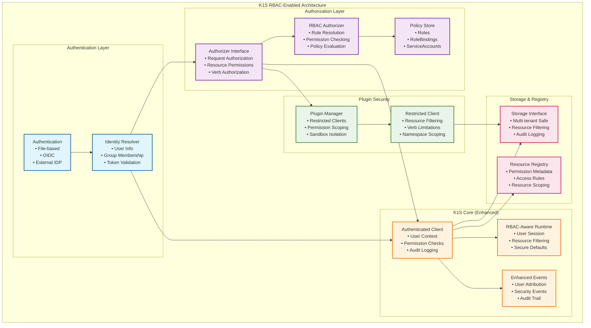

# K1S RBAC Architecture

**Related Documentation:**
- [Architecture](Architecture.md) - Complete k1s system architecture
- [Core Resources Architecture](Core-Resources-Architecture.md) - Core resources integration with RBAC
- [Kubernetes Compatibility](Kubernetes-Compatibility.md) - Kubernetes interface compatibility
- [Controller-Runtime Package](Controller-Runtime-Package.md) - Controller runtime integration

## Overview

K1S includes an RBAC (Role-Based Access Control) layer designed from the ground up to support multi-user CLI scenarios, plugin security, and enterprise integration. The architecture is **forward-compatible** and can be enabled progressively without breaking existing functionality.

## Design Principles

### 1. **Progressive Enablement**
- RBAC disabled by default (single-user CLI scenarios)
- Can be enabled via configuration without code changes
- Backward compatibility for existing applications

### 2. **Kubernetes-Compatible**
- Standard RBAC concepts (Roles, RoleBindings, ServiceAccounts)
- Compatible with existing Kubernetes RBAC tools and patterns
- Familiar APIs for Kubernetes developers

### 3. **CLI-Optimized**
- Optimized for short-lived processes
- File-based authentication for simplicity
- Integration with external identity providers (OIDC, LDAP)

### 4. **Plugin-Security Ready**
- Granular permissions for external plugins
- Process-level isolation
- Resource-scoped access control

## Core Architecture

### RBAC Layer Integration



## Core Integration with K1S Resources

### Authentication and Core Resources Integration

K1S RBAC integrates seamlessly with core resources, particularly:

- **ServiceAccount**: Provides identity for automated processes and CLI tools
- **Secret**: Stores authentication tokens, certificates, and credentials  
- **ConfigMap**: Stores RBAC configuration and policy data
- **Event**: Records authentication and authorization events for audit
- **Namespace**: Provides scoping for RBAC policies and resources

### Core Authentication Interfaces

```go
// core/pkg/auth/interfaces.go  
package auth

import (
    "k8s.io/apimachinery/pkg/types"
    corev1 "github.com/dtomasi/k1s/core/pkg/resources/v1"
)

// UserInfo represents authenticated user information (Kubernetes-compatible)
type UserInfo struct {
    Name   string            `json:"name"`
    UID    string            `json:"uid"`  
    Groups []string          `json:"groups"`
    Extra  map[string][]string `json:"extra,omitempty"`
}

// Authenticator validates credentials using core resources
type Authenticator interface {
    // Authenticate validates credentials against ServiceAccounts and Secrets
    Authenticate(ctx context.Context, token string) (*UserInfo, error)
    
    // AuthenticateServiceAccount validates using ServiceAccount resource
    AuthenticateServiceAccount(ctx context.Context, sa *corev1.ServiceAccount, token string) (*UserInfo, error)
    
    // Name returns the authenticator name for logging
    Name() string
}

// ServiceAccountTokenAuthenticator authenticates using ServiceAccount tokens
type ServiceAccountTokenAuthenticator struct {
    client     client.Client
    tokenCache map[string]*UserInfo // Simple token cache
}

func (sa *ServiceAccountTokenAuthenticator) Authenticate(ctx context.Context, token string) (*UserInfo, error) {
    // Extract ServiceAccount information from token
    saNamespace, saName, err := sa.parseServiceAccountToken(token)
    if err != nil {
        return nil, fmt.Errorf("invalid service account token: %w", err)
    }
    
    // Fetch ServiceAccount resource
    serviceAccount := &corev1.ServiceAccount{}
    key := types.NamespacedName{Namespace: saNamespace, Name: saName}
    
    if err := sa.client.Get(ctx, key, serviceAccount); err != nil {
        return nil, fmt.Errorf("service account not found: %w", err)
    }
    
    // Validate token against ServiceAccount secrets
    if !sa.validateToken(serviceAccount, token) {
        return nil, fmt.Errorf("token validation failed")
    }
    
    // Create UserInfo from ServiceAccount
    return &UserInfo{
        Name:   fmt.Sprintf("system:serviceaccount:%s:%s", saNamespace, saName),
        UID:    string(serviceAccount.UID),
        Groups: []string{
            "system:serviceaccounts",
            fmt.Sprintf("system:serviceaccounts:%s", saNamespace),
        },
    }, nil
}
```

### 2. Authorization Layer

```go
// core/pkg/auth/authorization.go
package auth

// Authorizer makes authorization decisions
type Authorizer interface {
    // Authorize determines if the given attributes are allowed
    Authorize(ctx context.Context, attrs AuthorizationAttributes) (Decision, string, error)
    
    // Name returns authorizer name for logging
    Name() string
}

// AuthorizationAttributes describes an authorization request
type AuthorizationAttributes struct {
    // User performing the request
    User UserInfo `json:"user"`
    
    // Verb is the kubernetes verb being requested (get, list, create, update, delete)
    Verb string `json:"verb"`
    
    // Resource is the resource being requested
    Resource schema.GroupVersionResource `json:"resource"`
    
    // Name is the name of the resource being requested (optional)
    Name string `json:"name,omitempty"`
    
    // Namespace is the namespace of the resource being requested (optional) 
    Namespace string `json:"namespace,omitempty"`
    
    // Subresource is the subresource being requested (optional)
    Subresource string `json:"subresource,omitempty"`
    
    // Extra attributes for custom authorization
    Extra map[string]interface{} `json:"extra,omitempty"`
    
    // Plugin context if request comes from plugin
    Plugin *PluginContext `json:"plugin,omitempty"`
}

// Decision represents an authorization decision
type Decision int

const (
    DecisionAllow Decision = iota
    DecisionDeny
    DecisionNoOpinion
)

// PluginContext provides plugin-specific authorization context
type PluginContext struct {
    Name         string            `json:"name"`
    Version      string            `json:"version"`
    Capabilities []string          `json:"capabilities"`
    Config       map[string]string `json:"config,omitempty"`
}
```

### 3. Kubernetes RBAC Types Integration

**K1S directly uses standard Kubernetes RBAC resources without custom wrappers:**

```go
// core/pkg/auth/rbac/types.go
package rbac

// Import standard Kubernetes RBAC types directly
import (
    rbacv1 "k8s.io/api/rbac/v1"
    metav1 "k8s.io/apimachinery/pkg/apis/meta/v1"
)

// Type aliases for standard Kubernetes RBAC resources
// This provides familiarity while allowing future customization if needed
type (
    // PolicyRule is the standard Kubernetes PolicyRule
    PolicyRule = rbacv1.PolicyRule
    
    // Role is the standard Kubernetes Role
    Role = rbacv1.Role
    
    // ClusterRole is the standard Kubernetes ClusterRole
    ClusterRole = rbacv1.ClusterRole
    
    // Subject is the standard Kubernetes Subject
    Subject = rbacv1.Subject
    
    // RoleRef is the standard Kubernetes RoleRef
    RoleRef = rbacv1.RoleRef
    
    // RoleBinding is the standard Kubernetes RoleBinding
    RoleBinding = rbacv1.RoleBinding
    
    // ClusterRoleBinding is the standard Kubernetes ClusterRoleBinding
    ClusterRoleBinding = rbacv1.ClusterRoleBinding
)

// NewRole creates a standard Kubernetes Role
func NewRole(namespace, name string, rules []PolicyRule) *Role {
    return &rbacv1.Role{
        TypeMeta: metav1.TypeMeta{
            APIVersion: "rbac.authorization.k8s.io/v1",
            Kind:       "Role",
        },
        ObjectMeta: metav1.ObjectMeta{
            Namespace: namespace,
            Name:      name,
        },
        Rules: rules,
    }
}

// NewClusterRole creates a standard Kubernetes ClusterRole
func NewClusterRole(name string, rules []PolicyRule) *ClusterRole {
    return &rbacv1.ClusterRole{
        TypeMeta: metav1.TypeMeta{
            APIVersion: "rbac.authorization.k8s.io/v1",
            Kind:       "ClusterRole",
        },
        ObjectMeta: metav1.ObjectMeta{
            Name: name,
        },
        Rules: rules,
    }
}

// NewRoleBinding creates a standard Kubernetes RoleBinding
func NewRoleBinding(namespace, name string, roleRef RoleRef, subjects []Subject) *RoleBinding {
    return &rbacv1.RoleBinding{
        TypeMeta: metav1.TypeMeta{
            APIVersion: "rbac.authorization.k8s.io/v1",
            Kind:       "RoleBinding",
        },
        ObjectMeta: metav1.ObjectMeta{
            Namespace: namespace,
            Name:      name,
        },
        RoleRef:  roleRef,
        Subjects: subjects,
    }
}

// NewClusterRoleBinding creates a standard Kubernetes ClusterRoleBinding
func NewClusterRoleBinding(name string, roleRef RoleRef, subjects []Subject) *ClusterRoleBinding {
    return &rbacv1.ClusterRoleBinding{
        TypeMeta: metav1.TypeMeta{
            APIVersion: "rbac.authorization.k8s.io/v1",
            Kind:       "ClusterRoleBinding",
        },
        ObjectMeta: metav1.ObjectMeta{
            Name: name,
        },
        RoleRef:  roleRef,
        Subjects: subjects,
    }
}
```

### 4. RBAC Authorizer Implementation

```go
// core/pkg/auth/rbac/authorizer.go
package rbac

// RBACAuthorizer implements the Authorizer interface using RBAC
type RBACAuthorizer struct {
    policyStore PolicyStore
    resolver    SubjectResolver
}

// PolicyStore provides access to standard Kubernetes RBAC resources
type PolicyStore interface {
    // GetRole retrieves a standard Kubernetes Role by namespace and name
    GetRole(namespace, name string) (*rbacv1.Role, error)
    
    // GetClusterRole retrieves a standard Kubernetes ClusterRole by name
    GetClusterRole(name string) (*rbacv1.ClusterRole, error)
    
    // ListRoleBindings lists standard Kubernetes RoleBindings for a namespace
    ListRoleBindings(namespace string) ([]*rbacv1.RoleBinding, error)
    
    // ListClusterRoleBindings lists all standard Kubernetes ClusterRoleBindings
    ListClusterRoleBindings() ([]*rbacv1.ClusterRoleBinding, error)
    
    // GetSubjectRoles returns all roles for a given subject using standard types
    GetSubjectRoles(subject rbacv1.Subject) ([]*rbacv1.Role, []*rbacv1.ClusterRole, error)
}

// SubjectResolver resolves user info to standard Kubernetes RBAC subjects
type SubjectResolver interface {
    // GetSubjects returns all standard Kubernetes RBAC subjects for a user
    GetSubjects(user auth.UserInfo) []rbacv1.Subject
}

func (r *RBACAuthorizer) Authorize(ctx context.Context, attrs auth.AuthorizationAttributes) (auth.Decision, string, error) {
    // Get standard Kubernetes RBAC subjects for the user
    subjects := r.resolver.GetSubjects(attrs.User)
    
    // Check each subject's permissions using standard Kubernetes logic
    for _, subject := range subjects {
        roles, clusterRoles, err := r.policyStore.GetSubjectRoles(subject)
        if err != nil {
            return auth.DecisionDeny, fmt.Sprintf("error getting roles: %v", err), nil
        }
        
        // Check standard Kubernetes Roles
        for _, role := range roles {
            if r.checkRolePermissions(role.Rules, attrs) {
                return auth.DecisionAllow, fmt.Sprintf("allowed by role %s", role.Name), nil
            }
        }
        
        // Check standard Kubernetes ClusterRoles
        for _, clusterRole := range clusterRoles {
            if r.checkRolePermissions(clusterRole.Rules, attrs) {
                return auth.DecisionAllow, fmt.Sprintf("allowed by cluster role %s", clusterRole.Name), nil
            }
        }
    }
    
    return auth.DecisionDeny, "no matching role found", nil
}

// checkRolePermissions validates permissions using standard Kubernetes PolicyRules
func (r *RBACAuthorizer) checkRolePermissions(rules []rbacv1.PolicyRule, attrs auth.AuthorizationAttributes) bool {
    for _, rule := range rules {
        if r.ruleMatches(rule, attrs) {
            return true
        }
    }
    return false
}

// ruleMatches implements standard Kubernetes RBAC rule matching logic
func (r *RBACAuthorizer) ruleMatches(rule rbacv1.PolicyRule, attrs auth.AuthorizationAttributes) bool {
    // Check verb using standard Kubernetes logic
    if !contains(rule.Verbs, attrs.Verb) && !contains(rule.Verbs, "*") {
        return false
    }
    
    // Check API group using standard Kubernetes logic
    if !contains(rule.APIGroups, attrs.Resource.Group) && !contains(rule.APIGroups, "*") {
        return false
    }
    
    // Check resource using standard Kubernetes logic
    if !contains(rule.Resources, attrs.Resource.Resource) && !contains(rule.Resources, "*") {
        return false
    }
    
    // Check resource name (if specified) using standard Kubernetes logic
    if len(rule.ResourceNames) > 0 && attrs.Name != "" {
        if !contains(rule.ResourceNames, attrs.Name) {
            return false
        }
    }
    
    return true
}

// contains checks if slice contains string (standard Kubernetes utility)
func contains(slice []string, item string) bool {
    for _, s := range slice {
        if s == item {
            return true
        }
    }
    return false
}
```

## Integration with K1S Core

### 1. Enhanced Client Interface

```go
// core/pkg/client/authenticated.go
package client

// AuthenticatedClient wraps the standard client with RBAC
type AuthenticatedClient struct {
    Client
    userInfo   auth.UserInfo
    authorizer auth.Authorizer
    auditor    audit.Interface // Optional audit logging
}

func NewAuthenticatedClient(base Client, userInfo auth.UserInfo, authorizer auth.Authorizer) *AuthenticatedClient {
    return &AuthenticatedClient{
        Client:     base,
        userInfo:   userInfo,
        authorizer: authorizer,
    }
}

func (c *AuthenticatedClient) Get(ctx context.Context, key ObjectKey, obj Object) error {
    // Check authorization
    attrs := auth.AuthorizationAttributes{
        User:      c.userInfo,
        Verb:      "get",
        Resource:  c.getGVR(obj),
        Name:      key.Name,
        Namespace: key.Namespace,
    }
    
    decision, reason, err := c.authorizer.Authorize(ctx, attrs)
    if err != nil {
        return fmt.Errorf("authorization error: %w", err)
    }
    
    if decision != auth.DecisionAllow {
        // Audit denied request
        if c.auditor != nil {
            c.auditor.LogDenied(ctx, attrs, reason)
        }
        return fmt.Errorf("forbidden: %s", reason)
    }
    
    // Audit allowed request
    if c.auditor != nil {
        c.auditor.LogAllowed(ctx, attrs)
    }
    
    return c.Client.Get(ctx, key, obj)
}

// Similar for List, Create, Update, Delete, Patch
```

### 2. Runtime Integration

```go
// core/pkg/runtime/rbac.go
package runtime

// RBACConfig configures RBAC for the runtime
type RBACConfig struct {
    // Enabled determines if RBAC is active
    Enabled bool `yaml:"enabled" json:"enabled"`
    
    // AuthConfig configures authentication
    AuthConfig AuthConfig `yaml:"auth" json:"auth"`
    
    // PolicyStore configures policy storage
    PolicyStore PolicyStoreConfig `yaml:"policyStore" json:"policyStore"`
    
    // DefaultPolicy for unauthenticated requests
    DefaultPolicy string `yaml:"defaultPolicy" json:"defaultPolicy"` // "allow", "deny"
}

type AuthConfig struct {
    // Type of authenticator ("file", "oidc", "none")
    Type string `yaml:"type" json:"type"`
    
    // Config contains authenticator-specific configuration
    Config map[string]interface{} `yaml:"config" json:"config"`
}

type PolicyStoreConfig struct {
    // Type of policy store ("file", "storage", "memory")
    Type string `yaml:"type" json:"type"`
    
    // Path to policy files (for file-based store)
    Path string `yaml:"path" json:"path"`
}

// Enhanced Runtime with RBAC
type Runtime struct {
    // ... existing fields
    
    // RBAC components (optional)
    authenticator auth.Authenticator
    authorizer    auth.Authorizer
    rbacConfig    RBACConfig
}

func (r *Runtime) GetClient() client.Client {
    if !r.rbacConfig.Enabled {
        return r.baseClient
    }
    
    // Return authenticated client wrapper
    // User context comes from CLI session or token
    return client.NewAuthenticatedClient(
        r.baseClient,
        r.getCurrentUser(), // From context or session
        r.authorizer,
    )
}
```

### 3. Plugin Security Integration

```go
// core/pkg/controller/plugins/security.go
package plugins

// SecurePluginManager wraps plugin manager with RBAC
type SecurePluginManager struct {
    base       PluginManager
    authorizer auth.Authorizer
    auditor    audit.Interface
}

func (m *SecurePluginManager) LoadPlugin(config PluginConfig) error {
    // Create restricted client for plugin
    restrictedClient := &RestrictedPluginClient{
        base:       m.base.GetClient(),
        authorizer: m.authorizer,
        pluginCtx: auth.PluginContext{
            Name:         config.Name,
            Capabilities: config.AllowedCapabilities,
        },
        allowedResources:  config.AllowedResources,
        allowedVerbs:      config.AllowedVerbs,
        allowedNamespaces: config.AllowedNamespaces,
    }
    
    plugin := newPluginInstance(config, restrictedClient)
    return m.base.registerPlugin(plugin)
}

type RestrictedPluginClient struct {
    base              client.Client
    authorizer        auth.Authorizer
    pluginCtx         auth.PluginContext
    allowedResources  []string
    allowedVerbs      []string
    allowedNamespaces []string
}

func (c *RestrictedPluginClient) Get(ctx context.Context, key client.ObjectKey, obj client.Object) error {
    // Check plugin-specific permissions
    if !c.isResourceAllowed(obj) {
        return fmt.Errorf("plugin %s not allowed to access resource %T", c.pluginCtx.Name, obj)
    }
    
    if !c.isVerbAllowed("get") {
        return fmt.Errorf("plugin %s not allowed to perform 'get' operations", c.pluginCtx.Name)
    }
    
    if !c.isNamespaceAllowed(key.Namespace) {
        return fmt.Errorf("plugin %s not allowed to access namespace %s", c.pluginCtx.Name, key.Namespace)
    }
    
    // Additional RBAC check if user context available
    if c.authorizer != nil {
        attrs := auth.AuthorizationAttributes{
            User:     getUserFromContext(ctx), // Plugin runs under user context
            Verb:     "get",
            Resource: c.getGVR(obj),
            Name:     key.Name,
            Namespace: key.Namespace,
            Plugin:   &c.pluginCtx,
        }
        
        decision, reason, err := c.authorizer.Authorize(ctx, attrs)
        if err != nil || decision != auth.DecisionAllow {
            return fmt.Errorf("plugin authorization failed: %s", reason)
        }
    }
    
    return c.base.Get(ctx, key, obj)
}
```

## Configuration Examples

### 1. Basic RBAC Configuration

```yaml
# k1s-config.yaml
rbac:
  enabled: true
  defaultPolicy: "deny"  # Secure by default
  
  auth:
    type: "file"
    config:
      usersFile: "./rbac/users.yaml"
      
  policyStore:
    type: "file"
    path: "./rbac/policies/"
```

### 2. User Configuration

```yaml
# rbac/users.yaml
users:
- name: "admin"
  passwordHash: "$2a$10$hash..."
  groups: ["system:masters"]

- name: "developer"
  passwordHash: "$2a$10$hash..."
  groups: ["developers"]

- name: "viewer"
  passwordHash: "$2a$10$hash..."
  groups: ["viewers"]
  
# Service accounts for automation
serviceAccounts:
- name: "ci-pipeline"
  namespace: "ci-cd"
  groups: ["ci-automation"]
```

### 3. RBAC Policies

```yaml
# rbac/policies/cluster-roles.yaml
apiVersion: rbac.authorization.k8s.io/v1
kind: ClusterRole
metadata:
  name: cluster-admin
rules:
- apiGroups: ["*"]
  resources: ["*"]
  verbs: ["*"]
---
apiVersion: rbac.authorization.k8s.io/v1
kind: ClusterRole
metadata:
  name: developer
rules:
- apiGroups: ["inventory.k1s.dev"]
  resources: ["items", "categories"]
  verbs: ["get", "list", "create", "update", "delete"]
- apiGroups: [""]
  resources: ["configmaps"]
  verbs: ["get", "list"]
---
apiVersion: rbac.authorization.k8s.io/v1
kind: ClusterRole
metadata:
  name: viewer
rules:
- apiGroups: ["*"]
  resources: ["*"]
  verbs: ["get", "list"]
```

```yaml
# rbac/policies/cluster-role-bindings.yaml
apiVersion: rbac.authorization.k8s.io/v1
kind: ClusterRoleBinding
metadata:
  name: cluster-admin-binding
roleRef:
  apiGroup: rbac.authorization.k8s.io
  kind: ClusterRole
  name: cluster-admin
subjects:
- kind: Group
  apiGroup: rbac.authorization.k8s.io
  name: system:masters
---
apiVersion: rbac.authorization.k8s.io/v1
kind: ClusterRoleBinding
metadata:
  name: developer-binding
roleRef:
  apiGroup: rbac.authorization.k8s.io
  kind: ClusterRole
  name: developer
subjects:
- kind: Group
  apiGroup: rbac.authorization.k8s.io
  name: developers
```

## Progressive Implementation Strategy

### Phase 1: Foundation (v0.1)
```go
// Interfaces and basic implementation
// - Authentication interface
// - Authorization interface  
// - RBAC types
// - File-based auth (simple)
// - Always-allow authorizer (default)
```

### Phase 2: Basic RBAC (v0.2) 
```go
// Core RBAC functionality
// - RBAC authorizer implementation
// - File-based policy store
// - AuthenticatedClient wrapper
// - Plugin restrictions
```

### Phase 3: Advanced Features (v0.5)
```go
// Enterprise features
// - OIDC authentication
// - External policy stores
// - Audit logging
// - Advanced plugin security
```

### Phase 4: Full Enterprise (v1.0)
```go
// Complete RBAC system
// - LDAP integration
// - Policy as Code (OPA)
// - Network-based authorization
// - Advanced audit and monitoring
```

## Benefits of This Architecture

### 1. **Backward Compatibility**
- RBAC disabled by default
- Existing applications work unchanged
- Progressive enablement

### 2. **Forward Compatibility** 
- Kubernetes-standard APIs
- Clean interfaces for future extensions
- Pluggable authentication/authorization

### 3. **Security by Design**
- Secure defaults when enabled
- Granular permission control
- Plugin sandboxing ready

### 4. **Enterprise Ready**
- Standard RBAC concepts
- External identity integration
- Audit and compliance support

## Super Lightweight Design Philosophy

### 1. **Direct Kubernetes Compatibility**
- **Zero custom RBAC types** - Uses `k8s.io/api/rbac/v1` directly
- **Standard behavior** - Implements Kubernetes RBAC semantics exactly
- **Familiar APIs** - Developers use well-known Kubernetes RBAC resources
- **Tool compatibility** - Standard kubectl RBAC commands work with k1s

### 2. **Minimal Implementation Overhead** 
- **Type aliases** - Provides k1s-specific names while using standard types
- **Helper constructors** - Simple functions for creating standard resources
- **Direct imports** - No complex wrapper layers or adapters
- **Standard serialization** - Uses Kubernetes JSON/YAML formats exactly

### 3. **File-Based Policy Management**
```yaml
# Standard Kubernetes RBAC files work directly with k1s
apiVersion: rbac.authorization.k8s.io/v1
kind: ClusterRole
metadata:
  name: k1s-admin
rules:
- apiGroups: ["inventory.k1s.dev"]
  resources: ["items", "categories"]
  verbs: ["*"]
```

### 4. **Progressive Enhancement Path**
- **Phase 1**: File-based authentication + standard RBAC types
- **Phase 2**: Enhanced policy store with caching
- **Phase 3**: External identity providers (OIDC)
- **Phase 4**: Advanced features (audit, policy-as-code)

### 5. **Zero Migration Burden**
- Existing Kubernetes RBAC configurations work unchanged
- Standard kubectl RBAC management commands compatible
- No learning curve for Kubernetes developers
- Direct integration with existing Kubernetes tooling

Diese super lightweight Architektur nutzt die bewährten Kubernetes RBAC resources direkt, ohne custom types oder komplexe wrapper. Wir bekommen maximale Kompatibilität mit minimalem Implementation aufwand.